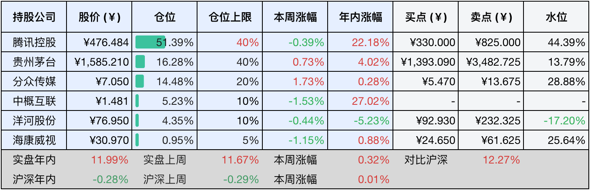
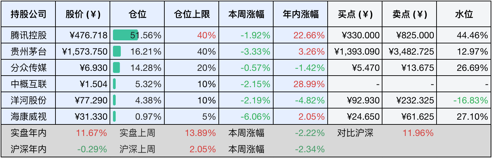

__微信公众号文章地址：[老罗投资周记-20250329](https://mp.weixin.qq.com/s/TdDtlrjTtWWLHKDnOTxmJA)__

```
老罗投资周记，每周六更新。专注于股权投资、阅读、学习与个人成长，知行合一、日拱一卒、投资人生。微信公众号【老罗投资】，文章均首发于公众号。
```

### 1. 本周交易

无

### 2. 目前持仓

当前持有的股票包括：腾讯控股51.39%、贵州茅台16.28%、分众传媒14.48%、中概互联5.23%、洋河股份4.35%、海康微视0.95%。

此外还有少量现金，加上少量的恒瑞医药、上海机场、宋城演义等股票，其份额较少，仅作为观察仓不进行记录。

本周旗下公司整体涨跌<span class="red">+0.32%</span>，年内的收益<span class="red">+11.99%</span>。

**注1：表底为截止到今日，老罗和沪深300指数今年的收益率。**

**注2：表格中港股已按汇率换算为人民币。**



### 3. 上周数据



### 4. 本周事项

+ 腾讯恢复回购
+ 腾讯90亿人民币投资育碧子公司
+ 飞天茅台报价继续下跌

==只对持股和交易感兴趣的朋友，读到这里就可以退出了。后面是对上述事件的展开，无新内容。==

#### 4.1 腾讯恢复回购

根据最新公告，在财报发布完解除静默期之后，腾讯就连续5个交易日执行了回购操作，本周回购金额约25亿港元，均价稳定在505-511港元区间。

+ 3月24日：回购98万股，金额5.01亿港元，均价510.74港元每股。
+ 3月25日：回购98.9万股，金额5亿港元，均价506.10港元每股。
+ 3月26日：回购99万股，金额5亿港元，均价505.88港元每股。
+ 3月27日：回购98.1万股，金额5亿港元，均价510.29港元每股。
+ 3月28日：回购98.2万股，金额约5亿港元，均价509.79港元每股。

腾讯本周恢复回购是今年800亿港元计划的延续，意图在通过回购对冲市场波动，传递股价低估的信号，同时平衡股东回报。

今年余下的交易日，每天回购5亿港币可能完不成全年800亿港币的回购目标，但不排除股价下跌腾讯加大单日的回购额度，希望之后腾十亿还能重出江湖。

#### 4.2 腾讯90亿人民币投资育碧子公司

腾讯以11.6亿欧元，约合90亿元人民币注资育碧新成立的子公司，获得25%股权。该子公司整合了育碧旗下三大核心IP《刺客信条》《彩虹六号》《孤岛惊魂》和相关的开发团队，投前估值达40亿欧元，相当于育碧23-25财年平均销售额的4倍，交易预计会在25年底完成，投入的资金将用于降低育碧母公司负债。

​腾讯这次投资育碧的布局逻辑，第一是补足主机游戏短板，腾讯移动游戏收入占比超70%，但缺乏3A级的主机游戏内容，这次绑定国际顶级IP可提升自身的全球竞争力。第二是推动长青游戏战略，和育碧共同探索游戏即服务模式，加速内容迭代、引入免费机制，构建单次付费+长期订阅的混合变现体系。第三是规避监管风险，通过少数股权合作而不是全资收购，避免触发欧盟的反垄断审查。

​​育碧为什么接受腾讯的投资，第一个原因是财务纾困，育碧24-25财年上半年净亏损2.52亿欧元，腾讯注资可以优化资产负债表。第二是破解创作僵局，拆分三大IP成立独立的子公司，通过轻资产运营释放团队创意潜力，摆脱罐头游戏的标签。第三是探索新模式，通过腾讯的社交基因和服务型游戏经验，推动IP向多平台、高频更新的长青生态转型。

​​这次合作标志着中资游戏巨头从资本出海向生态共建的进阶，但能不能改写全球3A游戏的格局，还需要一定时间的检验。​
​
#### 4.3 飞天茅台报价继续下跌

3月29日报价，25年飞天散瓶价格从3月28日的2160元每瓶降至2150元每瓶，单日跌幅10元，原箱价还是稳定在2170元每瓶。同时年份酒分化，23年飞天原箱从2300元跌至2280元，22年原箱从2390元跌至2370元，老酒市场同样承受压力，例如18年飞天原箱价格维持在2650元每瓶，但交易量大减。​生肖酒波动，蛇年生肖原箱价格下跌10元至2480元每瓶，兔年、虎年等近年生肖酒价格趋稳，但流通性比较差。​

飞天茅台报价持续下跌的原因，一方面是由于24年经销商库存高达1.2万吨，大约2400万瓶，导致25年去库存压力巨大，部分经销商以低于成本价10%抛售，在2150-2250元每瓶。​

​同时​消费疲软，在宏观经济放缓背景下，地产、工程等核心客户采购量腰斩。还有电商的冲击，京东自营的春酒节补贴价低至2199元每瓶，抖音直播间通过分佣模式变相降价至2230元每瓶，打破了传统渠道的价格体系。​

​还有​投资逻辑逆转，大约70%的茅台酒没有被饮用而是囤积，但经济下行导致越陈越值钱预期崩塌，24年端午节期间，数万黄牛集中抛货，单日市场流通量激增30%，直接击穿了2200元心理防线。还存在一些灰色渠道的扰动，比如欧洲免税版茅台，大约1850元每瓶，和内部员工价，大约1899元每瓶，这些酒流入市场，虽然占比只有3-5%，但加剧了价格混乱。​​

​总结本轮飞天茅台下跌是供给过剩+需求萎缩+金融属性瓦解三重压力共同作用的结果，虽然价格下跌到了2150元区间，但对比1169元的出厂价，中间还存在近1000元的利润，这种好生意还是独此一份的。

### 5. 本周读书

#### 5.1 《凤凰项目：一个IT运维的传奇故事》

本书讲述了一位IT经理在行业动荡期，紧急接手濒临破产的百年汽车配件企业，通过运用独创的三步工作法，在董事会新成员，一位类似扫地僧角色的全程支持下，逐步解决生产线数字化改造难题的故事。

小说通过IT部门与车间管理的交叉叙事，不仅展现了现代技术团队与传统制造体系的矛盾调和之道，更引导职场人重新审视日常工作场景，那些看似琐碎的流程问题，实际上是组织效能的隐藏密码。

本书像是运维工程师写的爽文，主角开了挂并且有高人指点，但本书确实对互联网或传统企业的IT运维工作有很大帮助，值得一读。

评分四星⭐️⭐️⭐️⭐️

### 6. 本周运动

本周家中有事无运动，健康是第一要务，年纪越大越觉得这句话的正确性。

如果觉得本文还不错，那就点个赞或者『在看』吧，祝大家周末愉快！

```
老罗投资周记，每周六更新。专注于股权投资、阅读、学习与个人成长，知行合一、日拱一卒、投资人生。微信公众号【老罗投资】，文章均首发于公众号。
免责声明：本公众号只作为本人的投资日志记录，本文中提及的个股都有腰斩或血本无归的风险，本人不做任何投资建议，投资请坚持独立思考。
```

__微信公众号文章地址：[老罗投资周记-20250329](https://mp.weixin.qq.com/s/TdDtlrjTtWWLHKDnOTxmJA)__