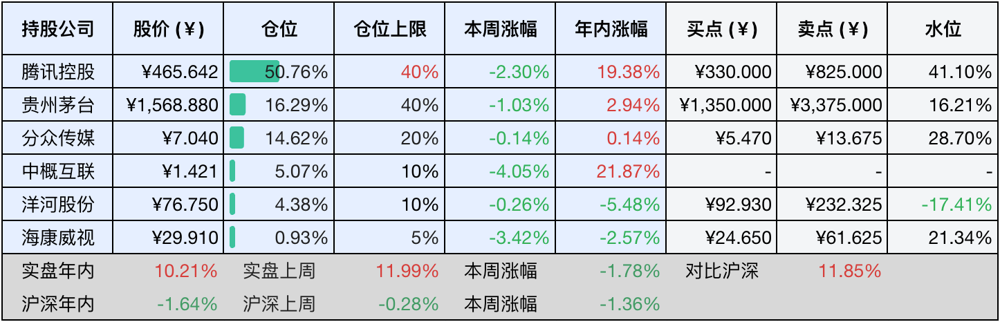
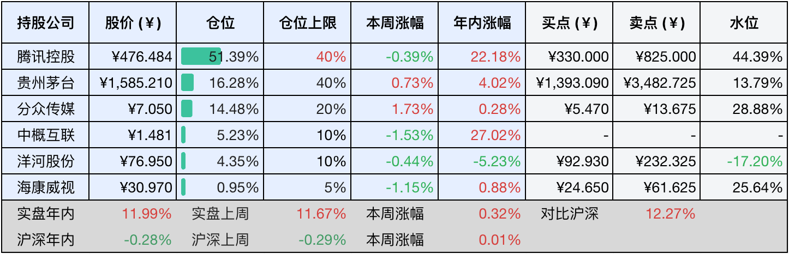

__微信公众号文章地址：[老罗投资周记-20250405](https://mp.weixin.qq.com/s/WscmftVBn8I-2YpR0MZhOg)__

```
老罗投资周记，每周六更新。专注于股权投资、阅读、学习与个人成长，知行合一、日拱一卒、投资人生。微信公众号【老罗投资】，文章均首发于公众号。
```

### 1. 本周交易

无

### 2. 目前持仓

当前持有的股票包括：腾讯控股50.76%、贵州茅台16.29%、分众传媒14.62%、中概互联5.07%、洋河股份4.38%、海康微视0.93%。

此外还有少量现金，加上少量的恒瑞医药、上海机场、宋城演义等股票，其份额较少，仅作为观察仓不进行记录。

本周旗下公司整体涨跌<span class="green">-1.78%</span>，年内的收益<span class="red">+10.21%</span>。

**注1：表底为截止到今日，老罗和沪深300指数今年的收益率。**

**注2：表格中港股已按汇率换算为人民币。**



### 3. 上周数据



### 4. 本周事项

+ 茅台发布24年财报
+ 遇事不抱怨

==只对持股和交易感兴趣的朋友，读到这里就可以退出了。后面是对上述事件的展开，无新内容。==

#### 4.1 茅台发布24年财报

贵州茅台24年的财务表现依然稳健​​，营业收入​​1708.99亿元(+15.71%)，茅台酒贡献1459.28亿元(+15.28%)，系列酒贡献246.84亿元(+19.65%)。净利润​​862.28亿元(+15.38%)，扣非净利润862.41亿元(+15.37%)。毛利率​​92.01%(同比-0.1pct)，茅台酒毛利率94.06%(-0.06pct)，系列酒79.87%(+0.11pct)​​，经营活动现金流净额924.64亿元(+38.85%)，投资活动现金流净流出收窄(-17.85亿，2023年数据是-97.24亿)。

经营亮点​​，渠道结构​​方面，直销收入748.43亿元(+11.32%)，占比43.8%；批发代理收入957.69亿元(+19.73%)。​​产能布局​​方面，新增茅台酒产能1,800吨(2025年释放)、系列酒产能8,000吨(2025年释放)。​​国际化​​方面，出口收入51.89亿元(+19.27%)，占营收3.04%。分红​​方面，拟派现346.71亿元(含税)，分红率约40%，每股大约能分到27元。

关键关注点​​，销售费用增长较多​​，同比+21.31%(市场推广费用增加)，需要关注投入产出的效率。​​合同负债下降​​。年末预收款95.92亿元(-32.09%)，反映出经销商预付减少。存货增长​​，库存量31万吨(+5.52%)，需要观察库存周转率变化。关联交易​​，前五大客户中关联方占比3.85%，需要关注定价的公允性。

然后是盈利预测，贵州茅台财报中预计25年营收增长目标为9%，比较保守，上一次收入个位数增长预期还是在2016年，老罗拍个脑袋，估计茅台每年还是有10%的利润增长。​​2024年净利润​​：862.28亿元(基准)​​，2025年：862.28×1.10=948.5亿元，​​2026年：948.5×1.10=1043.35亿元，​​2027​​年：1043.35×1.10=1147.68亿元​。历史PE约30倍，假设27年PE30倍，2027年市值：1147.68亿×30约等于34000亿元​。总股本12.56亿股，对应合理股价约2700元，安全边际调整后买点1350(老规矩打五折+向下取整)，卖点调整为3375元人民币。主要是因为利润增速调整为了10%，所以买点和卖点都做了向下调整，目前的价格属于不高不低，还需要耐心持有。

贵州茅台凭借稀缺性、品牌力与产能扩张，在高端白酒赛道中仍然具不可替代性。尽管面临短期增速放缓压力，长期稳健增长逻辑未变，27年估值具备上行空间，需要持续跟踪渠道改革和消费复苏的进度。

#### 4.2 遇事不抱怨

遇事不抱怨、专注于解决问题的态度，是个人成长与成功的关键。抱怨会强化负面情绪，形成痛苦、抱怨、更痛苦的恶性循环。心理学研究表明，抱怨时大脑会释放压力激素，抑制理性思考能力，而积极行动则能激活多巴胺系统，增强解决问题的动力。

例如在《不抱怨的世界》书中提到，抱怨如同自我催眠，会让人陷入无力感，而停止抱怨能释放能量用于行动。中国传统文化强调不怨天，不尤人，倡导通过自省和行动化解困境。例如塞翁失马的故事，讲述了福祸相依的辩证思维，而天道酬勤则强调通过努力而非抱怨赢得回报。

海伦·凯勒14岁失去视力和听力，却以接受现实并行动的态度成为作家和教育家。她曾说：虽然世界充满苦难，但也充满克服苦难的方法。苏格拉底面对质疑和审判，他选择用理性对话而非抱怨应对，留下我唯一知道的就是我一无所知的谦逊智慧。

现实中解决问题的实用方法有三点，一是认知重构，转换视角，比如将为什么是我？替换为这件事能教会我什么？感恩练习，每天记录三件值得感激的事，培养积极思维。二是行动策略，拆分问题，将大问题分解为可执行的小步骤，避免被压力压倒，例如程序员通过迭代优化代码而非抱怨技术难题。三是环境管理，远离抱怨源，减少与习惯性抱怨者的接触，保持积极圈子。静默模式，当想抱怨时，先深呼吸并保持沉默，冷静后再行动。

不抱怨的本质是将能量从情绪消耗转向问题解决，无论是海伦·凯勒的坚韧、还是传统文化中的和而不同，都展示了同一个真理：抱怨是弱者的逃避，行动是强者的选择。正如威尔·鲍温(《不抱怨的世界》作者)所言：当你停止抱怨，世界会为你打开新的可能。

### 5. 本周读书

#### 5.1 《月牙儿》

《月牙儿》是老舍于1935年创作的中篇小说，小说以月牙儿为线索，通过母女两代人沦落的经历，反映了旧社会中国城市贫民悲惨的生存状态。老舍在这本书中并不是单纯地批判当时社会人性的丑恶，而是呈现了丑陋的现实如何一步步泯灭纯真之心的过程。

评分四星⭐️⭐️⭐️⭐️

#### 5.2 《素书》

《素书》由黄石公所著，全书以道家思想为宗旨，还融合了儒、法、兵的思想，讲述了宇宙万物自然运转的理数，并以此来认识事务，处理事务。

评分四星⭐️⭐️⭐️⭐️

#### 5.3 《心经》

《心经》是般若经的浓缩版，缘起性空是这本书的核心思想，全书一共就332字，几分钟就可读完。

评分三星半⭐️⭐️⭐️⭐️

#### 5.4 《菜根谭》

一念错，便觉百行皆非。万善全，始得一生无愧。

文章做到极处，无有他奇，只是恰好。人品做到极处，无有他异，只是本然。

作人无一点真恳的念头，便成个花子，事事皆虚。涉世无一段圆活的机趣，便是个木人，处处有碍。

评分五星⭐️⭐️⭐️⭐️⭐️

### 6. 本周运动

本周仅遛弯一次，锻炼强度还是不够，考虑要不要买个动感单车在家里锻炼了。

如果觉得本文还不错，那就点个赞或者『在看』吧，祝大家周末愉快！

```
老罗投资周记，每周六更新。专注于股权投资、阅读、学习与个人成长，知行合一、日拱一卒、投资人生。微信公众号【老罗投资】，文章均首发于公众号。
免责声明：本公众号只作为本人的投资日志记录，本文中提及的个股都有腰斩或血本无归的风险，本人不做任何投资建议，投资请坚持独立思考。
```

__微信公众号文章地址：[老罗投资周记-20250405](https://mp.weixin.qq.com/s/WscmftVBn8I-2YpR0MZhOg)__