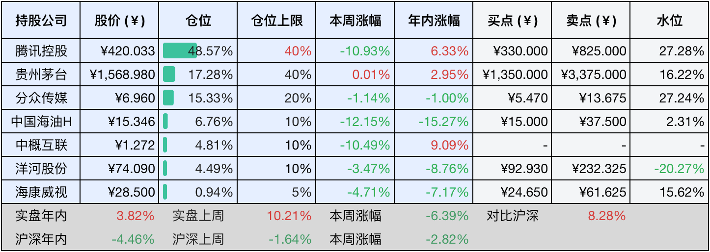
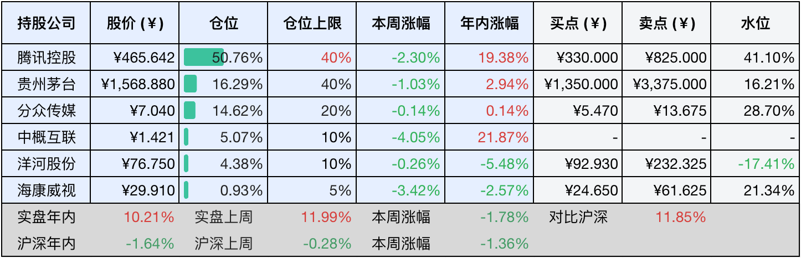

__微信公众号文章地址：[老罗投资周记-20250412](https://mp.weixin.qq.com/s/u-mWsuDq-4WmQqRdUPMXGw)__

```
老罗投资周记，每周六更新。专注于股权投资、阅读、学习与个人成长，知行合一、日拱一卒、投资人生。微信公众号【老罗投资】，文章均首发于公众号。
```

### 1. 本周交易

周一(4月7日)买入中国海油H(00883)，买入价格为15.087、15.068、15.05、14.918、14.861、14.767、14.579元人民币。

### 2. 目前持仓

当前持有的股票包括：腾讯控股48.57%、贵州茅台17.28%、分众传媒15.33%、中国海油H6.76%、中概互联4.81%、洋河股份4.49%、海康微视0.94%。

此外还有少量现金，加上少量的恒瑞医药、上海机场、宋城演义等股票，其份额较少，仅作为观察仓不进行记录。

本周旗下公司整体涨跌<span class="green">-6.39%</span>，年内的收益<span class="red">+3.82%</span>。

**注1：表底为截止到今日，老罗和沪深300指数今年的收益率。**

**注2：表格中港股已按汇率换算为人民币。**



### 3. 上周数据



### 4. 本周事项

+ 按计划买入中国海油H
+ 分众传媒拟收购新潮传媒

==只对持股和交易感兴趣的朋友，读到这里就可以退出了。后面是对上述事件的展开，无新内容。==

#### 4.1 按计划买入中国海油H

在周一受美国总统对华加征关税的突发政策冲击下，港股开盘就遭到了系统性地抛售，中国海油H股(00883.HK)当日天竞价阶段就已经跌破了16港币的买入位置，盘中最低下探到了15.5港币。

老罗在集合竞价阶段通过港股通通道启动了分批建仓，首笔委托设定在16港元左右，随后调整挂单价，分别在15.80、15.70、15.50港币等位置设置了阶梯式买入。下午随着恐慌情绪的缓和，最终全天成交均价在15.9港币以内，买入的仓位超过总仓位的6%，基本达到了预期。

这次操作的核心逻辑建立在三重维度的交叉验证上。第一，​​估值安全边际​​，中国海油H股动态市盈率仅5.09倍，显著低于A股的8.35倍，AH溢价率高达60%，反映H股存在明显的低估。第二，​​股息防御属性​​的强化，按照24年每股分红1.4港元计算，扣税后股息率仍然达到了7.6%，远远超过同期的国债收益率和大多数蓝筹股。第三，​​公司24年财报显示其资产负债率只有29%，净现金储备达到了729亿人民币，财务的稳健性为下行风险提供了较大的缓冲。

对于后续的计划，如果股价进一步下跌10%，到14.5港币左右(13.6人民币)，还会启动渐进式的加仓策略，这个价格对应的动态PE将降到4.58倍，股息率升至8.97%，接近历史极值水平。

但还是需要注意两点，一是观察布伦特原油能否守住60美元每桶的关键支撑，当前机构预测2025年均价是80美元。二是需要追踪公司新油田开发进展，27年830百万桶油的产量目标如果能够如期推进，将对长期估值有较大的提振。

需要警惕的风险主要集中于政策方面，如果中美贸易摩擦升级导致油气进口关税调整，或者国内碳中和政策加速压缩传统能源估值空间，但是考虑到中国海油已经布局了风电、光伏等新能源业务，转型预期可以部分对冲此类风险。

作为应对波动加剧的长期策略，计划将中国海油H目标配置比例维持在10%，通过股息再投资实现复利累积，慢慢等待估值修复与能源周期共振的戴维斯双击。

#### 4.2 分众传媒拟收购新潮传媒

4月9日，分众传媒宣布以83亿元估值并购新潮传媒100%股权。这场被称为梯媒世纪并购的交易，不仅终结了两家长达七年的市场角力，更将重塑户外广告行业的竞争格局与商业模式。

分众传媒作为行业龙头，已经覆盖了300个城市，超过300万媒体终端的规模占据了核心商务场景，而新潮传媒则以智能屏资源深耕下沉市场和中小广告主。双方合并后将会形成商务楼宇+社区场景的全域覆盖网络，触达的人群将从4亿扩展至近6亿，媒体终端总量突破380万台。这种资源整合既避免了重复的点位投入，又能通过互补场景提升广告主投放效率，预计每年可降低运营成本超过10亿元。

18年新潮传媒发起的五折抢客价格战，曾经导致了分众的毛利率从68%腰斩到了36%，而这次的并购使行业恶性竞争画上了句号。根据测算，分众智能屏单点年收入约6000元，新潮仅为2700元，整合后通过优化定价策略，新潮点位收入存翻倍空间。市场普遍预期，合并后企业针对物业方的议价能力将会提升20%-30%，对广告主的议价能力可能会上升15%以上。

这次并购标志着梯媒行业进入集约化发展阶段，通过整合双方20亿现金储备与729亿净资产的财务优势，分众可加速海外拓展与新能源场景布局。有券商预测，合并后净利润有望在三年内增长40%，股息率将稳定在6%以上，合并后的新分众，或将成为价值2000亿的线下流量超级平台。

### 5. 本周读书

#### 5.1 《兄弟俩》

这部由肖复兴创作的长篇少年成长小说，讲述了来自外乡的大河、小河兄弟的都市生活故事。兄弟二人随父母在京漂泊，栖身于老北京住户欧阳太的仓库中，哥哥以体育见长，弟弟以学业出众，形成一文一武的互补格局。他们既有手足相依的温情，又暗含少年特有的较劲心理，在嬉笑打闹间演绎出既童趣盎然又暗流涌动的成长轨迹。

然而父亲突然遭遇工伤致残的变故，如同投入湖面的巨石，彻底打破了这个家庭的平静，经济支柱的崩塌让童年滤镜瞬间粉碎，生存压力与精神困境双重袭来。在这种危局中，房东欧阳太从日常关怀升华为命运守护者，不仅持续资助学业，更在生命终点前为兄弟俩铺就未来之路。

评分四星⭐️⭐️⭐️⭐️

### 6. 本周运动

本周遛弯两次，这周的工作日天气不错，但到了周六就因为大风预警没有出门，最近一到周末就刮风没法出去玩。北京春天除了风比较大，还有点飘柳絮，算是一年中最好的季节了。

如果觉得本文还不错，那就点个赞或者『在看』吧，祝大家周末愉快！

```
老罗投资周记，每周六更新。专注于股权投资、阅读、学习与个人成长，知行合一、日拱一卒、投资人生。微信公众号【老罗投资】，文章均首发于公众号。
免责声明：本公众号只作为本人的投资日志记录，本文中提及的个股都有腰斩或血本无归的风险，本人不做任何投资建议，投资请坚持独立思考。
```

__微信公众号文章地址：[老罗投资周记-20250412](https://mp.weixin.qq.com/s/u-mWsuDq-4WmQqRdUPMXGw)__