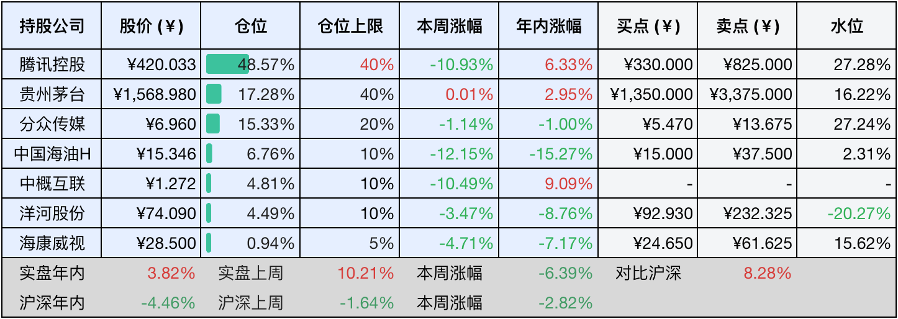

__微信公众号文章地址：[老罗投资周记-20250419](https://mp.weixin.qq.com/s/zr8j3OdYyxc__pKun4-rbg)__

```
老罗投资周记，每周六更新。专注于股权投资、阅读、学习与个人成长，知行合一、日拱一卒、投资人生。微信公众号【老罗投资】，文章均首发于公众号。
```

### 1. 本周交易

无

### 2. 目前持仓

当前持有的股票包括：腾讯控股48.7%、贵州茅台16.81%、分众传媒15.44%、中国海油H6.81%、中概互联4.69%、洋河股份4.33%、海康微视0.91%。

此外还有少量现金，加上少量的恒瑞医药、上海机场、宋城演义等股票，其份额较少，仅作为观察仓不进行记录。

本周旗下公司整体涨跌<span class="red">+2.12%</span>，年内的收益<span class="red">+5.94%</span>。

**注1：表底为截止到今日，老罗和沪深300指数今年的收益率。**

**注2：表格中港股已按汇率换算为人民币。**


### 3. 上周数据



### 4. 本周事项

+ ​​腾讯控股几件事
+ 茅台发布375ML1935酒
+ 海康威视​业绩低迷

==只对持股和交易感兴趣的朋友，读到这里就可以退出了。后面是对上述事件的展开，无新内容。==

#### 4.1 ​​腾讯控股几件事

第一件，腾讯参加全球数字生态大会与AI布局​​，腾讯在成都召开全球数字生态大会，宣布已经助力文旅、金融、制造等行业的超6万家企业完成数智化转型。并低调推出AI助手元宝优化微信场景交互，用户可以直接添加元宝为好友进行沟通，老罗试用了下，目前功能还较为中规中矩，可能还需要等待一段时间使其慢慢进化。另外，腾讯云与成都政府合作的蓉政通平台，每天能处理公文2.3万件，未来还将结合大模型技术实现城市治理从被动转向主动。

第二件，​​国际化战略深化​​，腾讯云本周宣布在日本、中东、印尼等地新建数据中心，强调本地化即全球化战略，微信支付与Stripe合作，在20个国家接入线下收款服务，推动人民币支付场景扩展，这次合作覆盖了澳大利亚、加拿大、法国、德国、意大利、新加坡、英国、美国等主要市场。通过接入微信支付，Stripe支持的企业不仅可以在线无缝接入微信支付，还可以通过Stripe Terminal实现线下收款，为全球用户提供更便捷的支付体验。

第三件，史上最大规模的校招计划​​，腾讯启动三年内新增2.8万个校招岗位的计划，25年将招聘1万名实习生，其中60%面向技术人才，聚焦AI、大模型等领域。同时推出青云计划，为入选者提供定制化培养方案。互联网公司最终还是拼的人才与创新，在这方面加大投入是好事。
​​
#### 4.2 茅台发布375ML1935酒
​​
​​4月18日，375ML1935酒在i茅台APP启动独家首销，官方定价818元一瓶。这次发售采取1935瓶每天限量投放机制，单用户天限购12瓶，活动周期从4月18日到4月22日。

新品沿袭茅台1935标志性的设计语言，瓶体采用朱砂红釉为底，浮雕川盐古道、千古酿艺等叙事性纹样，瓶肩鎏金水纹暗合赤水河粼粼波光，祥云纹盖顶嵌茅台壹九叁五篆刻印章，构建从历史记忆到地理标识的视觉体系。工艺标准还是严格遵循大曲酱香12987的古法工艺，甄选赤水河核心产区红缨子糯高粱和优质冬小麦，经过十年以上陈酿基酒勾调成型。酒体呈现典型茅香风格，前段酱香喷薄，中段醇厚绵柔，尾韵甘润悠长。

375ML1935的场景定位，主要是针对一人独酌或是三两小聚的轻社交场景，375ML的规格比较标准500ML装降低了30%的单次消费门槛。线上专供模式规避了和线下500ML装的直接竞争，通过1090元每500ML折算价格维持品牌的溢价空间，强化茅台1935在千元这个价格区间白酒的市场话语权。

#### 4.3 海康威视​业绩低迷
​​​​
海康威视于4月18日盘后披露24年度和25年一季度财报，24年利润下滑较多，但在25年一季度呈现弱复苏的态势。24年营收924.86亿元，同比增长3.52%，净利润119.59亿元，同比下降15.23%。25Q1实现营收185亿元，同比增长4%，归母净利润20亿元，同比增长6.4%。尽管通过供应链库存优化及研发人员规模收缩实现费用管控，但利润回升仍受制于下游需求疲软，主营业务毛利率同比持续收窄。

其中国内主业承压，24H2三大事业群全线失速，其中公共服务事业群PBG同比双位数下滑创五年新低，EBG/SMBG分别同比-5.3%和-3.8%。发在创新业务有所托底，智能家居、机器人等创新板块维持15%+增速，贡献了超30%的营收增量。海外业务的韧性还算不错，受亚非拉市场拓展驱动，海外收入同比+8.2%，但增速环比收窄了3.7PCT。

面对业绩增长瓶颈，海康威视也开启了三重破局尝试，一是基于自研观澜大模型推出智能计算硬件平台，构建云边端协同体系；二是组织效能方面，研发人员规模首次缩减3.6%，人均创收同比提高9.2%；三是开拓新兴市场，中东、东南亚智慧城市项目签约额同比增长22%。

最后是海康威视​的估值调整，​​这几年安防行业需求下滑，利润增长放缓，按5%利润增涨率来计算未来三年估值。2024年净利润​​：120亿元(基准)​​，2025年：120×1.05=126亿元，​​2026年：126×1.05=132亿元，​​2027​​年：132×1.05=138亿元​。27年市值：138亿×25PE等于3450亿元​。总股本92.3亿股，对应合理股价约37元，安全边际调整后买点18.5元(老规矩打五折+向下取整)，卖点调整为46.25元人民币。

海康​属于二流的生意一流的管理人员，这些年因为最大的甲方手头也不宽裕，对安防的投入减少，海康连续两年利润下滑。这几年老罗对海康的估值也一降再降，目前价格离合理股价不是太远，占不到明显的便宜，短期内不会有买入的计划，对海康的持仓上限还是维持在5%。

### 5. 本周读书

#### 5.1 《查理芒格的人生哲学》

查理芒格的智慧永不过时，常读常新，本书再配合《穷查理宝典》一同服用，效果更佳。

评分四星半⭐️⭐️⭐️⭐️❤️

#### 5.2 《茅台传》

了解了不少新知识，茅台的历史、传承与定位，如果投资了或将要投资茅台，非常值得一读的书。另，老珍酒不好喝，别买。

评分四星⭐️⭐️⭐️⭐️

### 6. 本周运动

本周只遛弯两次，同时继续控制食量减重中。

如果觉得本文还不错，那就点个赞或者『在看』吧，祝大家周末愉快！

```
老罗投资周记，每周六更新。专注于股权投资、阅读、学习与个人成长，知行合一、日拱一卒、投资人生。微信公众号【老罗投资】，文章均首发于公众号。
免责声明：本公众号只作为本人的投资日志记录，本文中提及的个股都有腰斩或血本无归的风险，本人不做任何投资建议，投资请坚持独立思考。
```

__微信公众号文章地址：[老罗投资周记-20250419](https://mp.weixin.qq.com/s/zr8j3OdYyxc__pKun4-rbg)__