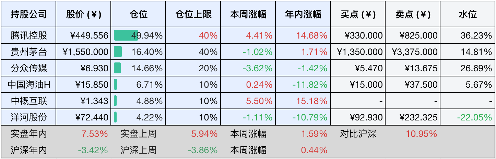
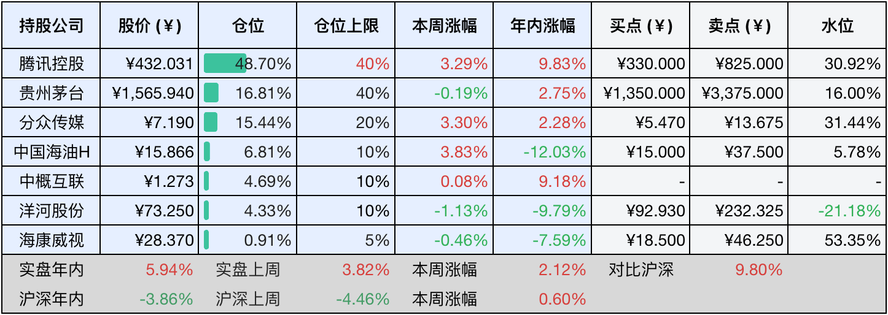

__微信公众号文章地址：[老罗投资周记-20250426](https://mp.weixin.qq.com/s/HsctN0zGU8cmzv72Rb0jNA)__

```
老罗投资周记，每周六更新。专注于股权投资、阅读、学习与个人成长，知行合一、日拱一卒、投资人生。微信公众号【老罗投资】，文章均首发于公众号。
```

### 1. 本周交易

无

### 2. 目前持仓

当前持有的股票包括：腾讯控股49.94%、贵州茅台16.40%、分众传媒14.66%、中国海油H6.71%、中概互联4.88%、洋河股份4.22%。

此外还有少量现金，加上少量的海康微视、恒瑞医药、上海机场、宋城演义等股票，其份额较少，仅作为观察仓不进行记录。其中海康威视是由于持仓比例长期低于1%，降级为观察仓。

本周旗下公司整体涨跌<span class="red">+1.59%</span>，年内的收益<span class="red">+7.53%</span>。

**注1：表底为截止到今日，老罗和沪深300指数今年的收益率。**

**注2：表格中港股已按汇率换算为人民币。**



### 3. 上周数据



### 4. 本周事项

+ ​公募基金公布十大重仓股
+ 特朗普关税战降温

==只对持股和交易感兴趣的朋友，读到这里就可以退出了。后面是对上述事件的展开，无新内容。==

#### 4.1 公募基金公布十大重仓股

截至到25年3月31日，公募基金持仓市值排名前十的个股为：​腾讯控股​​（693.84亿元，首次登顶）、宁德时代​​（553.69亿元，退居第二）、贵州茅台​​（378.62亿元，重回第三）、阿里巴巴-W​​（新增）、​美的集团​​、​立讯精密​​、​比亚迪​​（新增）、​紫金矿业​​、​​中芯国际​​（新增）和​五粮液​​。

腾讯控股首次登顶，取代了宁德时代，这是最引人注意的关键点，另外阿里巴巴-W、比亚迪和中芯国际新进入前十，而寒武纪、恒瑞医药和北方华创退出。基金经理们普遍增持科技股，尤其是港股互联网和半导体板块，表明一季度公募基金持仓呈现科技主导、资源跟进的特征，港股科技龙头及AI产业链成最大赢家，而新能源板块（比如宁德时代）面临着阶段性调整。

#### 4.2 特朗普关税战降温

4月下旬，特朗普政府又突然宣布将对华关税从最高145%大幅下调至35%，这一政策转向标志着持续半个月的关税大战出现显著降温。这次调整的核心逻辑是分级关税体系，非战略消费品，比如电子配件、日用品税率大幅削减到35%，而半导体、新能源设备等战略领域仍维持100%以上的高关税。

政策转向的直接诱因来自于美国国内的多重压力，3月CPI同比上涨3.8%，并且通胀预期可能会突破4.5%，中低收入家庭年均支出增加超过5000美元，农业州出口下滑15%，沃尔玛等零售巨头因为60%商品依赖中国而集体抗议。国际货币基金组织更是将美国25年经济增长预期从2.7%下调至1.8%，直言关税战将导致全球供应链中断和企业的投资意愿下降。

深层次看，这场政策反转本质上是美国霸权衰落的缩影，东大精准反制措施，稀土出口管制使得F35战机生产受阻，大豆采购转向南美冲击共和党票仓，暂停波音订单引发产业链震动，直接瓦解了特朗普的施压筹码。国际社会的集体反制同样加速了美国孤立，欧盟拒绝配合对华脱钩，东盟深化与东大产业链绑定，日本在美日贸易谈判中倒戈，连越南等国面对美国3500%光伏关税威胁仍然坚持对华合作。

这种内外交困迫使特朗普不得不承认关税不可持续，但其声称降税非单方面让步的表态，仍然暴露了特朗普试图将妥协包装成谈判筹码的策略。特朗普的关税战，不是看东大能承受多高的税率，我们的态度已经很明确了：打奉陪到底，谈大门敞开。其实特朗普能加多少关税，是要看美国国内人民能承受多高的税率，关税战的最终结果只能造成物价上涨和通货膨胀。

### 5. 本周读书

#### 5.1 《万般滋味，都是生活》

当一个人面对变幻莫测的世界时，怀揣的不是无处可逃的感慨，而是不如清心、不如喜悦、不如释然的智慧，以葆有童心的姿态生活。这样的人，必是深谙生活真味者，更是内心至为坚韧之人。

这本书全面收录了《渐》《大账簿》《梦痕》《给孩子们》等40篇丰子恺的经典散文，在纷繁世界里，让浮躁的心静下来，细品日常中的一箪食、一瓢饮、一豆羹，安享生活中的万般滋味......

评分三星半⭐️⭐️⭐️❤️

### 6. 本周运动

本周遛弯两次，同时继续控制食量，但体重没什么变化。

如果觉得本文还不错，那就点个赞或者『在看』吧，祝大家周末愉快！

```
老罗投资周记，每周六更新。专注于股权投资、阅读、学习与个人成长，知行合一、日拱一卒、投资人生。微信公众号【老罗投资】，文章均首发于公众号。
免责声明：本公众号只作为本人的投资日志记录，本文中提及的个股都有腰斩或血本无归的风险，本人不做任何投资建议，投资请坚持独立思考。
```

__微信公众号文章地址：[老罗投资周记-20250426](https://mp.weixin.qq.com/s/HsctN0zGU8cmzv72Rb0jNA)__