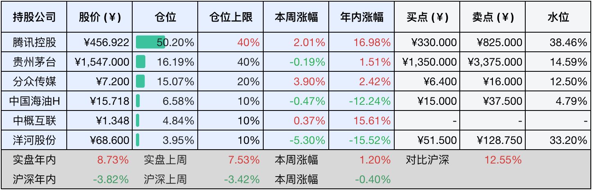
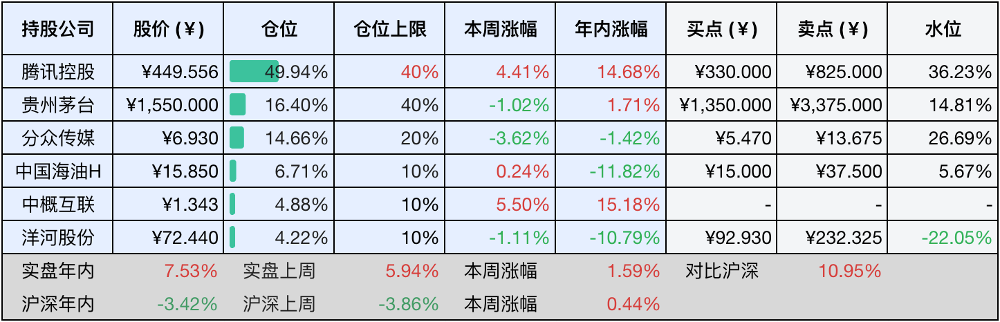
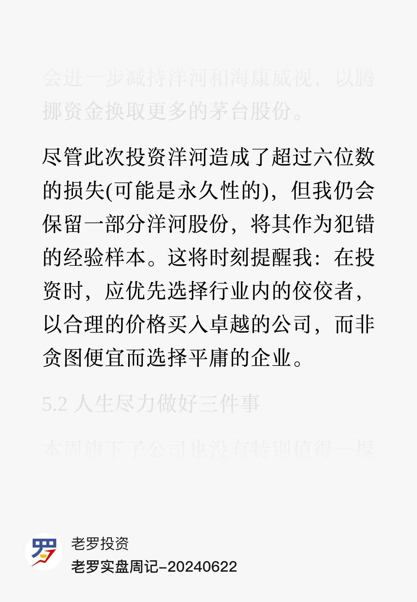

__微信公众号文章地址：[老罗投资周记-20250503](https://mp.weixin.qq.com/s/bPIckuJeJ3FgIlmgTLBaxw)__

```
老罗投资周记，每周六更新。专注于股权投资、阅读、学习与个人成长，知行合一、日拱一卒、投资人生。微信公众号【老罗投资】，文章均首发于公众号。
```

### 1. 本周交易

无

### 2. 目前持仓

当前持有的股票包括：腾讯控股50.20%、贵州茅台16.19%、分众传媒15.07%、中国海油H6.58%、中概互联4.84%、洋河股份3.95%。

此外还有少量现金，加上少量的海康微视、恒瑞医药、上海机场、宋城演义等股票，其份额较少，仅作为观察仓不进行记录。其中海康威视是由于持仓比例长期低于1%，降级为观察仓。

本周旗下公司整体涨跌<span class="red">+1.20%</span>，年内的收益<span class="red">+8.73%</span>。

**注1：表底为截止到今日，老罗和沪深300指数今年的收益率。**

**注2：表格中港股已按汇率换算为人民币。**



### 3. 上周数据



### 4. 本周事项

+ ​分众传媒年报
+ 洋河股份年报
+ 贵州茅台一季报
+ 巴菲特股东大会

==只对持股和交易感兴趣的朋友，读到这里就可以退出了。后面是对上述事件的展开，无新内容。==

#### 4.1 分众传媒年报

分众传媒24年年报显示，公司在宏观经济复苏放缓的背景下仍然实现了稳健增长，全年营业收入122.62亿元，同比增长3.01%，归母净利润51.55亿元，同比增长6.80%，这一成绩主要得益于楼宇媒体业务的持续深耕和海外市场的拓展。分众通过优化媒体点位布局，将三线及以下城市的电梯电视设备量同比提升169.44%，同时境外设备规模增至17.6万台，覆盖东南亚、中东等10个国家，形成了国内下沉市场与海外扩张的双重驱动。

从业务结构看，日用消费品行业客户占比提升至61.9%，贡献了75.91亿元收入，同比增长13.4%，尤其是化妆品和衣着类品牌投放增长显著。然而互联网行业广告收入同比下降19%，反映出广告主预算的结构性调整。

公司通过收购新潮传媒补足社区场景资源，整合后媒体点位将覆盖4.5万住宅小区，预计协同效应可提升屏效15%以上。不过此次并购也带来了整合风险，新潮传媒单屏营收仅为分众的54%，且24年前三季度仍然亏损509万元。

财务层面，分众的高分红策略成为亮点，全年累计派现47.66亿元，占净利润的92.45%，上市以来累计分红及回购金额达320亿元，股息率约4.8%。但现金流质量有所下降，经营活动净现金流同比下降13.5%至66.42亿元，应收账款周转天数延长至61天，合同负债减少36.69%，显示客户预付款减少且账期放宽。如果剔除设备折旧费用下降带来的1.46%成本缩减，实际净利率反而下降了0.92%，盈利质量还是存在一定的隐患。

技术革新方面，公司加速推进AIGC营销垂类大模型应用，实现广告创意生成效率提升40%，并通过五码关联技术将扫码率提升到了40%，数字化投放占比增至38%。但投资端表现不佳，89.3亿元的金融资产投资收益为负，暴露出了分众资金运用效率低的短板。

最后是估值，分众这种典型的周期型公司使用席勒估值法，近10年的利润分别为：15年33.89亿、16年44.51亿、17年60.05亿、18年58.23亿、19年18.75亿、20年40.04亿、21年60.63亿、22年27.9亿、23年48.27亿、24年51.55亿。10年合计利润443.82亿，10年平均值为44.382亿，合理估值在9.2元，买入位置在6.4元，卖出位置在16.0元，都做了上调处理。

#### 4.2 洋河股份年报

看完表现不错的好学生，再来看看差生。洋河股份24年的年报，在白酒行业深度调整的背景下，呈现出了非常复杂的情况，公司全年实现营业收入288.76亿元，同比下滑12.83%，归母净利润66.73亿元，同比下降33.37%，这一业绩不仅创下了近十年首次营收利润双降纪录，更将净利润水平拉回至2017年的规模。第四季度单季亏损19.05亿元，暴露出渠道库存积压和动销乏力的困境。尽管业绩承压，洋河仍然延续了高分红传统，全年累计派发现金红利70亿元，股息率高达9.75%。

从业务结构看，收入占比86%的中高档酒核心板块出现14.79%的下滑，主要是因为梦之蓝系列在千元价格区间突破乏力，手工班等高端产品还没有形成规模效应，而大众价位段的拳头产品海之蓝、天之蓝又遭遇到今世缘、汾酒等品牌的激烈竞争。市场布局方面，省内市场收入下降11.43%，省外市场下滑14.35%，显示出全国化进程遭遇到了很大阻力。

潜在的风险同样不容忽视，经销商库存周期超过3个月，合同负债同比减少6.85%，反映出渠道信心不足，还需要时间修复。销售费用率攀升至19.2亿元，但研发投入却缩减了63.2%，这种重营销轻创新的失衡可能会制约洋河的长期竞争力。当前白酒行业正经历从规模扩张向价值竞争的关键转型，洋河能否凭借储能优势化解库存压力，借助手工班突破高端市场，将成为观察其二次增长的核心变量。

最后是估值，24年净利润66.7亿，三年后0增长或负增长至62.5亿，给25倍正常PE，打五折安全边际：62.5X25X0.5=775亿。总股本15亿，775/15=51.6元，向下取整，买点为51.5元，卖点为128.75元，或者50倍PE+五折安全边际的104元，买点和卖点都有大幅度下调。

一年前老罗也是因为洋河的种种让人看不懂的操作，当时卖出了大部分洋河股份，见下图：



当时还考虑留一点仓位来记住这次投资教训，但今年洋河又经历了更换签字会计师，营收入利润双下滑的情况，看来不得不再次考虑减少持仓了。目前还有不到4%的仓位，计划在有合适的价格时，换成茅台或是中海油H，清仓或将洋河的持仓减少到1%左右。

#### 4.3 贵州茅台一季报

贵州茅台25年第一季度业绩报告显示，公司实现营业收入506.01亿元，同比增长10.54%；归母净利润268.47亿元，同比增长11.56%，延续了双位数增长的稳健态势。

渠道结构持续优化，直销渠道实现收入232.20亿元，同比增长20.19%，批发代理渠道收入273.60亿元，同比增长3.94%，两者形成更为均衡的渠道格局，直销收入占比提升到了45.89%。

产品矩阵方面，系列酒表现尤其亮眼，营收达到了70.22亿元，同比增长18.30%，占整体营收比例提升至13.88%，其中茅台1935通过新增1.935L规格产品、上线375ML装以及全国主题终端店招募等举措，进一步巩固其作为第二增长曲线的地位。文化营销方面，系列酒深度渗透宴席、年会等消费场景，品牌认知度显著提升。

国际化布局成效显著，海外市场实现营收11.19亿元，同比大幅增长37.53%，经销商网络新增5家至109家。数字化战略持续深化，i茅台平台贡献酒类收入58.70亿元，同比增长9.86%，占直销渠道收入的25.3%，通过美团、饿了么、抖音等新零售渠道进一步拓展年轻消费群体。

财务健康度方面，期末现金及现金等价物余额攀升至1765.48亿元，比年初增长了3.87%，预收账款（合同负债+其他流动负债）稳定在98.78亿元，显示经销商打款意愿保持强劲。经营活动现金流净额达88.09亿元，销售回款能力持续增强。

在白酒行业整体承压的背景下，贵州茅台通过精准的价格调控（比如稳定飞天茅台批发价）和终端网络建设（全国超过6000家的主题终端），有效地维持供需动态平衡。尽管25年营收增速目标设定仅为9%，但一季度实际增速已达10.67%，为全年业绩目标的实现奠定坚实基础，展现出了龙头企业应对行业周期的强大韧性。

#### 4.4 巴菲特股东大会

25年的巴菲特股东大会于今天在美国奥马哈举行，这场被喻为投资界春晚的盛会恰逢巴菲特收购伯克希尔60周年，在94岁高龄的巴菲特确认全程参与但接班人阿贝尔角色升级的背景下，呈现出历史性转折的深刻印记。

会议释放出五大核心信号：在3340亿美元现金储备创纪录的当下，伯克希尔将重点布局日本五大商社并探索东南亚新兴市场，其持有的日本商社市值已达235亿美元，股息收益率达3.45%，而近期发行的900亿日元债券被视为加码亚洲投资的先兆。面对美国经济0.3%的季度萎缩和关税政策冲击，巴菲特虽重申不做空美国但坦承关税是战争行为，同时通过减持苹果、美银等高价资产将股票组合久期压缩至5.8年，显示出对美股高估值的警惕，标普500预期市盈率25倍远超历史均值，而伯克希尔A股市净率1.7倍创2007年来新高。

接班人阿贝尔的首次深度亮相成为焦点，这位主导能源转型的准CEO或许将打破三项传统：推动伯克希尔能源板块的可再生能源装机量突破6100兆瓦，探索电网升级和碳捕捉技术；在股东压力下考虑适度分红，改变巴菲特坚守68年的零股息策略；通过双轨制投资体系引入科技赛道敏感度，其主导的日本投资年化回报率达19%已印证战略眼光。同时，巴菲特子女苏茜和霍华德在董事会的话语权提升，形成家族与职业经理人共治格局，而巴菲特修改遗嘱将1280亿美元个人财富交由子女慈善基金会管理。

腾讯自选股今晚7点开始直播，老罗也不多啰嗦了，看直播去了。希望有朝一日老罗也能亲临奥马哈，现场听股神的布道（但今年可能是巴菲特最后一次出现在股东大会了）。

### 5. 本周读书

#### 5.1 《妈妈的银行账户》

书中对子女的养育观念值得学习，平等尊重，陪同成长，而不是老想着高高在上地操纵孩子。以身作则，事事主动，要考虑到子女的感受。

评分四星⭐️⭐️⭐️⭐️

#### 5.2 《我要按自己喜欢的方式去生活》

很有意思的一本漫画，其中有一段印象很深：天气好极了，钱几乎没有。但这次想反过来说：钱几乎没有，但天气好极了。

评分四星⭐️⭐️⭐️⭐️

### 6. 本周运动

本周遛弯两次，由中午改成了晚上不吃饭，体重变化并不太大，持续坚持。

如果觉得本文还不错，那就点个赞或者『在看』吧，祝大家周末愉快！

```
老罗投资周记，每周六更新。专注于股权投资、阅读、学习与个人成长，知行合一、日拱一卒、投资人生。微信公众号【老罗投资】，文章均首发于公众号。
免责声明：本公众号只作为本人的投资日志记录，本文中提及的个股都有腰斩或血本无归的风险，本人不做任何投资建议，投资请坚持独立思考。
```

__微信公众号文章地址：[老罗投资周记-20250503](https://mp.weixin.qq.com/s/bPIckuJeJ3FgIlmgTLBaxw)__