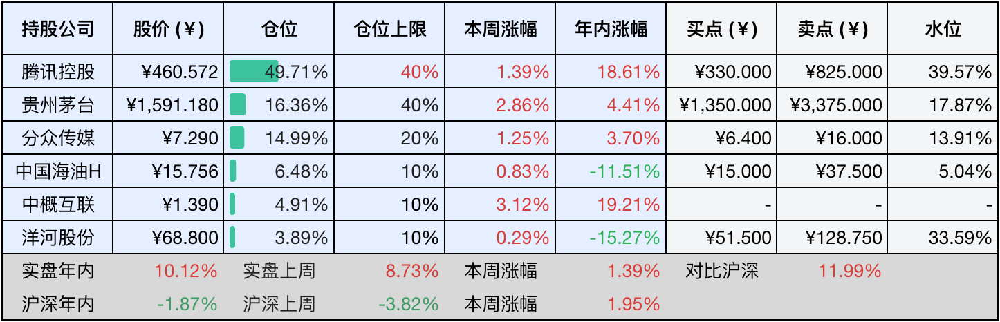
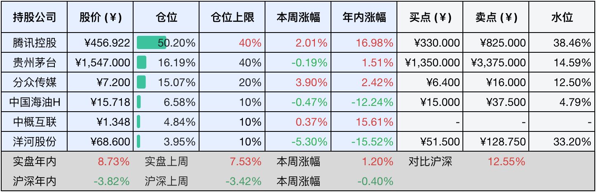

__微信公众号文章地址：[老罗投资周记-20250510](https://mp.weixin.qq.com/s/Ezz9Y3la_tYMeyu2cwLj9Q)__

```
老罗投资周记，每周六更新。专注于股权投资、阅读、学习与个人成长，知行合一、日拱一卒、投资人生。微信公众号【老罗投资】，文章均首发于公众号。
```

### 1. 本周交易

无

### 2. 目前持仓

当前持有的股票包括：腾讯控股49.71%、贵州茅台16.36%、分众传媒14.99%、中国海油H6.48%、中概互联4.91%、洋河股份3.89%。

此外还有少量现金，加上少量的海康微视、恒瑞医药、上海机场、宋城演义等股票，其份额较少，仅作为观察仓不进行记录。其中海康威视是由于持仓比例长期低于1%，降级为观察仓。

本周旗下公司整体涨跌<span class="red">+1.39%</span>，年内的收益<span class="red">+10.12%</span>。

**注1：表底为截止到今日，老罗和沪深300指数今年的收益率。**

**注2：表格中港股已按汇率换算为人民币。**



### 3. 上周数据



### 4. 本周事项

+ ​降息
+ 茅台累计回购超30亿

==只对持股和交易感兴趣的朋友，读到这里就可以退出了。后面是对上述事件的展开，无新内容。==

#### 4.1 降息

在5月7日的国务院新闻办公室发布会上，中国人民银行行长潘功胜宣布实施多维度货币政策调整：政策利率下调10个基点至1.4%，带动贷款市场报价利率LPR同步下调约10个基点。个人住房公积金贷款利率也进行了下调，首套房5年期以上利率从2.85%降至2.6%，预计每年可以为居民节省利息支出超过200亿元。以100万元30年期贷款为例，累计利息支出可减少约4.76万元，实质上降低住房消费的门槛，又释放超过700亿元规模的居民消费潜力。

在4月制造业PMI又一次跌破荣枯线、商品房销售面积同比下滑12.1%、汽车消费刺激效应边际递减的背景下，政策上着力破解实际利率水平偏高抑制内需的问题，通过降低企业融资成本激发市场主体投资活力，公积金利率调降撬动住房消费市场，配合5000亿元设备更新再贷款等结构性工具推动产业升级。

目前10年期国债收益率，降至了2.25%的历史低位，反映出市场对后续宽松政策的持续期待，预计年内还有可能继续实施25到50个基点的降准，同时可能还会配合特别国债发行等财政工具，形成货币政策的继续宽松。

#### 4.2 茅台累计回购超30亿

贵州茅台本周发布公告，4月份公司累计回购股份93.48万股，占公司总股本的比例为0.0744%，购买的最高价为1575元每股、最低价为1468.01元每股，支付的金额为14.4亿元，相较于前三月月均4.9亿元的投入明显有所加速，显示出管理层对市值管理的积极姿态。

今年茅台已经累计回购股份201.75万股，占公司总股本的比例为0.16%，购买的最高价为1584.06元每股、最低价为1417.01元每股，已支付的总金额为30.39亿元。

目前回购金额已经超过之前公布的回购金额下限，作为茅台的首次回购，老罗只觉得步子还可以迈得再大一点，茅台的股价再降一点，争取把60亿回购金额全部使用掉。

### 5. 本周读书

#### 5.1 《慢慢变富2：普通人的成功投资》

这本书关于价值投资部分讲得都挺好的，只是实践起来实在是做不到那么集中的持仓，作者近九成仓位在贵州茅台，不是一般人能可以到的。还有一点小瑕疵是引用内容有点多，有点像在水稿费？总体上来说价值投资入门值得一读。

评分四星⭐️⭐️⭐️⭐️

#### 5.2 《新浪微博二次崛起的5大运营心得》

与其说这是一本书，更像是一场演讲的PPT文字稿，仅6千余字，20分钟便可阅读完成。

评分三星⭐️⭐️⭐️

### 6. 本周运动

本周遛弯两次，健身环大冒险一次，体重不降反升了，下周得控制住嘴了。

如果觉得本文还不错，那就点个赞或者『在看』吧，祝大家周末愉快！

```
老罗投资周记，每周六更新。专注于股权投资、阅读、学习与个人成长，知行合一、日拱一卒、投资人生。微信公众号【老罗投资】，文章均首发于公众号。
免责声明：本公众号只作为本人的投资日志记录，本文中提及的个股都有腰斩或血本无归的风险，本人不做任何投资建议，投资请坚持独立思考。
```

__微信公众号文章地址：[老罗投资周记-20250510](https://mp.weixin.qq.com/s/Ezz9Y3la_tYMeyu2cwLj9Q)__