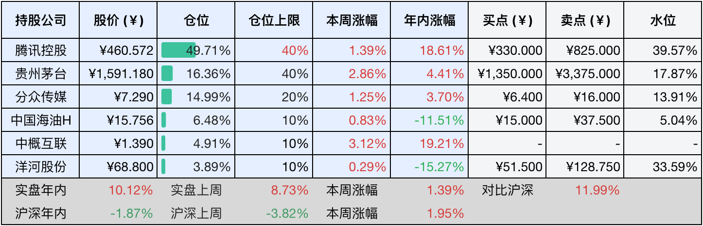

__微信公众号文章地址：[老罗投资周记-20250517](https://mp.weixin.qq.com/s/1DwnMjBEzCNpoyVC15eCgQ)__

```
老罗投资周记，每周六更新。专注于股权投资、阅读、学习与个人成长，知行合一、日拱一卒、投资人生。微信公众号【老罗投资】，文章均首发于公众号。
```

### 1. 本周交易

无

### 2. 目前持仓

当前持有的股票包括：腾讯控股49.92%、贵州茅台16.36%、分众传媒14.90%、中国海油H6.45%、中概互联4.92%、洋河股份3.81%。

此外还有少量现金，加上少量的海康微视、恒瑞医药、上海机场、宋城演义等股票，其份额较少，仅作为观察仓不进行记录。其中海康威视是由于持仓比例长期低于1%，降级为观察仓。

本周旗下公司整体涨跌<span class="red">+1.57%</span>，年内的收益<span class="red">+11.69%</span>。

**注1：表底为截止到今日，老罗和沪深300指数今年的收益率。**

**注2：表格中港股已按汇率换算为人民币。**


### 3. 上周数据



### 4. 本周事项

+ 腾讯控股25年一季度财报发布
+ 微信成立电商产品部
+ 贵州茅台业绩说明会

==只对持股和交易感兴趣的朋友，读到这里就可以退出了。后面是对上述事件的展开，无新内容。==

#### 4.1 腾讯控股25年一季度财报发布

腾讯最新发布的25年一季度财报发布，依旧能打，当季营收站上1800亿元，同比稳增13%，各业务线都在发力。最亮眼的是毛利润首次突破了千亿大关，达到1005亿元，同比上涨20%，比营收增速快出7个百分点，可见公司既会赚钱也懂省钱的本事，调整后的经营利润同比增长18%至693亿元，核心业务依然强劲。

在科技创新上，腾讯是用真金白银砸研发，这季度189亿元的研发投入同比多出21%，重点都押注在人工智能落地应用上，微信腾讯元宝智能助手用户量突破2000万。为支撑全球布局，公司在中东阿联酋、印尼雅加达等地开建新一代数据中心，6.5亿美元的投资为海外云服务打下基础。

游戏业务依然是顶梁柱，国内《王者荣耀》靠着新赛季玩法升级，带动本土游戏收入同比大涨24%；《和平精英》推出的玩家自制地图功能，把用户粘性玩出了新高度。海外市场表现也不错，《无畏契约》在东南亚电竞圈火爆出圈，国际游戏收入增长23%至166亿元。研发团队用AI工具生成游戏角色，效率直接提升四成，科技正在改写游戏开发规则。

战略布局上，腾讯玩的是双线作战，一边稳住游戏、社交这些现金奶牛业务，另一边猛攻人工智能和云计算等新赛道。随着海外数据中心陆续建成，企业级AI产品开始变现，这家科技巨头已经织就了一张从技术研发到商业落地的完整网络。这种传统业务保根基，创新业务拓疆土的双轮驱动战略，或许正是腾讯能长期保持增长活力的秘诀所在。

#### 4.2 微信成立电商产品部

微信最近在电商领域下了一步大棋，专门成立电商部门来做微信里的电商生意，带着团队做出小程序、微信支付的技术老将曾鸣，这次被张小龙点将，统管新设立的电商产品部。这可不是拍脑袋的决定，去年光视频号带货就大幅度上涨，成交额几乎涨了两倍，小程序买东西的交易量更是飙升到三万亿。

现在逛微信就像逛商场，买卖功能无孔不入：刷视频号直播，底下挂着的小黄车点开就能买，翻朋友圈突然蹦出个商品卡片，连公众号文章里都藏着微信小店入口。最新推出的拼团助手更绝，商家在微信群里发起拼单，满员自动成团，把拉人头的社交玩法直接变成真金白银的生意。说白了，微信正把12亿用户每天刷手机的习惯，悄悄变成掏钱包的契机。

这次调整藏着微信的算盘，把电商部门安插在开放平台体系里，明摆着要让买卖和小程序、支付这些基本功打配合战。曾鸣现在既要搞电商创新，又要管底层技术，说不定哪天朋友圈广告和商城数据就打通了，让商家看清每分钱广告费到底带来多少回头客。面对抖音、快手这些后起之秀，微信正在用自己最拿手的连点成线打法，比如把公众号的种草内容和视频号直播拔草串起来。

现在传统电商平台增长见顶，微信里的熟人关系网成了商家的新金矿：做生意的用企业微信攒下客户，转头就可以在视频号直播激活老客。用户在小程序买过东西，刷朋友圈时智能推送的相关商品，很可能就是下一单。这种玩法既可以让商家自己经营客户池子，又能依靠着微信的大数据精准推荐。如今电商部门统管全局，这个超级APP正把聊天、刷视频、看文章这些日常动作，都变成生意的入口。

腾讯几年前曾经涉足过电商领域并不成功，这次微信加强对电商的投入，看看能不能对阿里、京东、拼夕夕这种传统电商平台带来冲击。

#### 4.3 贵州茅台业绩说明会

贵州茅台本周召开了业绩说明会，在白酒消费回归理性、市场加速向头部集中的背景下，企业正从跑得快转向做得精。25年9%的增长目标背后，藏着三张底牌：新增近2万吨产能的硬实力，精准调控的市场战术，以及出口、出海、国际化的全球化路线。

这家白酒巨头在战略布局上展现出守与攻的平衡：既严守传统酿造工艺，延续工匠培养的生命线，又通过i茅台数字化平台打通线上线下，用茅台1935等新品抢占细分市场，同时跨界文旅产业讲好文化故事。

茅台出海路线已从简单的产品外销升级为文化输出，但目前中国白酒在国外的认可度不高，如何在欧美市场让消费者理解茅台工艺的价值，在海外烈酒竞争中找准价格定位，仍然困难重重。当国内市场渐趋饱和，能否把中国茅台变成世界茅台，或许决定着企业未来十年的增长空间。

### 5. 本周读书

#### 5.1 《阿甘正传》

与电影《阿甘正传》区别还是很大的，很多书中内容电影并没有体现：从职业摔跤手到国际象棋大师，从太空宇航员到食人族脱险，原著中阿甘的奇幻漂流远比电影跌宕起伏三十倍，非常值得一读。

评分五星⭐️⭐️⭐️⭐️⭐️

#### 5.2 《在巴东》

裸辞县委书记第一人陈行甲的故事，是《在峡江的转弯处：陈行甲人生笔记》一书的节选，看完就一个感受，你把人民放在心上，人民就会把你高高举起。

评分四星半⭐️⭐️⭐️⭐️❤️

### 6. 本周运动

本周遛弯一次，健身操一次，健身环大冒险一次，最近膝盖不太舒服，可能是体重大，并且久坐造成的，体重必须尽快减下来了。

如果觉得本文还不错，那就点个赞或者『在看』吧，祝大家周末愉快！

```
老罗投资周记，每周六更新。专注于股权投资、阅读、学习与个人成长，知行合一、日拱一卒、投资人生。微信公众号【老罗投资】，文章均首发于公众号。
免责声明：本公众号只作为本人的投资日志记录，本文中提及的个股都有腰斩或血本无归的风险，本人不做任何投资建议，投资请坚持独立思考。
```

__微信公众号文章地址：[老罗投资周记-20250517](https://mp.weixin.qq.com/s/1DwnMjBEzCNpoyVC15eCgQ)__