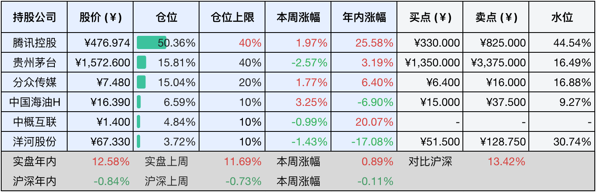

__微信公众号文章地址：[老罗投资周记-20250524](https://mp.weixin.qq.com/s/HDQGI8ha05ek2BJPU0XRfA)__

```
老罗投资周记，每周六更新。专注于股权投资、阅读、学习与个人成长，知行合一、日拱一卒、投资人生。微信公众号【老罗投资】，文章均首发于公众号。
```

### 1. 本周交易

无

### 2. 目前持仓

当前持有的股票包括：腾讯控股50.36%、贵州茅台15.81%、分众传媒15.04%、中国海油H6.59%、中概互联4.84%、洋河股份3.72%。

此外还有少量现金，加上少量的海康威视、恒瑞医药、上海机场、宋城演义等股票，其份额较少，仅作为观察仓不进行记录。

本周旗下公司整体涨跌<span class="red">+0.89%</span>，年内的收益<span class="red">+12.58%</span>。

**注：**

1. 表格底部数据为老罗与沪深300指数年内收益率对比。
2. 港股持仓已按实时汇率换算为人民币。



### 3. 上周数据


### 4. 本周事项

+ 茅台股东大会
+ 腾讯恢复回购
+ 海康威视分红到账
+ 分众传媒股东大会
+ 恒瑞医药正式登陆港交所
+ 存贷款利率双降

==只对持股和交易感兴趣的朋友，读到这里就可以退出了。后面是对上述事件的展开，无新内容。==

#### 4.1 茅台股东大会

本周一茅台召开了股东大会，因为报名人数太多，超过1400人报名参加，股东大会地点改到了茅台会议中心，说明热度还是非常高。董事长张德芹和其他高管都出席了，还有知名投资人林园到场。

可能是响应新禁酒令的号召，茅台股东大会降低了招待标准，大会前夜的晚宴首次没有提供飞天茅台酒，取而代之的是子公司生产的悠蜜蓝莓复合果汁，售价约21元一瓶。传统的圆桌宴席被自助餐取代，现场减少了茅台中层领导的陪同安排，降低了餐饮成本，自助餐人均成本通常会低于桌餐。​​伴手礼从往年的50毫升的飞天茅台酒替换成为蓝莓果汁或者是简约笔记本。


可惜老罗还得上班，不然也想报名参加参加股东大会，作为“纳米股东”凑个热闹。

#### 4.2 腾讯恢复回购

发布Q1财报之后，本周一起腾讯开始恢复股票回购，平均每天消费5亿港元，回购数量在97万股左右，本周回购价格区间在​​503-520港元。25年一季度累计回购的金额同比大增15.67%，全年预计对股东总回报，包括分红和回购，将超过​​1210亿港元​​，创历史新高。

本周还累计注销了388.3万股，占总股本的0.042%，从2021年末以来，腾讯总股本已经减少了近4亿股，直接提升了每股收益。


最近腾讯股价并不便宜，短期可能回不到去年腾十亿回购的水平。投资就是这样，最无聊的时候就是没有什么明显的便宜可占，旗下公司又远远没到卖点的阶段。这种时候适合慢慢储备资金，等待下一次的机会。

#### 4.3 海康威视分红到账

分红共64.35亿元，每股分红0.7元，分红占净利润的53.73%。截止到今年4月末，海康威视回购金额达20+亿元用于注销，累计回购股份4653.91万股，占公司总股本的0.5%。总回报超过84亿元，占净利润的70%。

分红到账的钱暂时没有计划，放股票账户中收货币基金收益。

#### 4.4 分众传媒股东大会

股东大会几件事值得记录下：

江南春连任董事长，孔微微、殷可分别获任副董事长及其他职务，江南春兼任总裁及CEO，孔微微任副总裁、CFO及董事会秘书。

修订《分红管理制度》获94.72%支持，强化股东回报机制，2024年分红比例达净利润的30%以上，10派3.3元。

公司拟通过发行股份及支付现金方式收购成都新潮传媒100%股权，已经完成了监事会审议，后续需监管部门批准，这一举措将巩固分众传媒在社区媒体市场的垄断地位。

#### 4.5 恒瑞医药正式登陆港交所

5月23日恒瑞医药正式在港交所上市，以​​44.05港元​​的发行价上限定价，公开发售获​​得了454倍的超额认购​​，国际配售也超过了17倍。最终募资总额达到了​​98.9亿港元​​，成为了近五年来，港股医药板块最大的IPO。

尽管相比较A股折价了近25%，但相比行业平均的折价率27.4%，仍然显示出资本市场对其创新药龙头地位的认可。上市首日大涨33%，中一签收益接近3000港币。

另外，5月22日恒瑞医药股息也已经到账，钱比较少，还是丢在股票账户里暂时不做处理。

#### 4.6 存贷款利率双降

5月20日，六大国有银行及部分股份行牵头开启今年首轮存款挂牌利率下调。其中活期存款利率下调5个基点；定期整存整取三个月期、半年期、一年期、二年期均下调15个基点，三年期和五年期均下调25个基点；7天期通知存款利率下调15个基点。LPR下调10BP，五年期以上利率3.5%；一年期定存利率从1.15%降至0.95%，三年期利率1.25，五年期1.3%。


以20万元三年期定存为例，降息25个基点后，利率从1.5%降到1.25%，三年利息减少20万×0.25%×3=1500元。

此次双降进一步压缩了无风险收益，依赖存款利息的躺平策略成本大幅攀升。预计部分资金将寻求更高回报，可能流向股市高股息蓝筹股或核心城市的楼市，从某某书上的文章就可以看出，当前购买高息股的文章明显增多。

### 5. 本周读书

#### 5.1 《不拘一格：网飞的自由与责任工作法》

网飞的企业文化就一句话：超高人才密度，坦诚文化，及时反馈。感觉作者围绕这一句话，洋洋洒洒，水了一本书。

评分三星⭐️⭐️⭐️

### 6. 本周运动

本周遛弯两次，同时继续节食中，体重没什么变化。

如果觉得本文还不错，那就点个赞或者在看吧，祝大家周末愉快！

```
老罗投资周记，每周六更新。专注于股权投资、阅读、学习与个人成长，知行合一、日拱一卒、投资人生。微信公众号【老罗投资】，文章均首发于公众号。
免责声明：本公众号只作为本人的投资日志记录，本文中提及的个股都有腰斩或血本无归的风险，本人不做任何投资建议，投资请坚持独立思考。
```

__微信公众号文章地址：[老罗投资周记-20250524](https://mp.weixin.qq.com/s/HDQGI8ha05ek2BJPU0XRfA)__