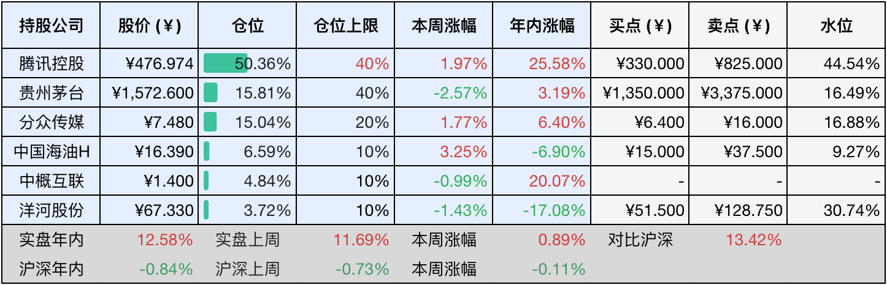

__微信公众号文章地址：[老罗投资周记-20250531-端午安康](https://mp.weixin.qq.com/s/lHR0XrCbhlounm6NcjDypw)__

```
老罗投资周记，每周六更新。专注于股权投资、阅读、学习与个人成长，知行合一、日拱一卒、投资人生。微信公众号【老罗投资】，文章均首发于公众号。
```

### 1. 本周交易

无

### 2. 目前持仓

当前持有的股票包括：腾讯控股49.39%、贵州茅台15.66%、分众传媒15.38%、中国海油H 6.83%、中概互联4.79%、洋河股份3.72%。

此外还有少量现金，加上少量的海康威视、恒瑞医药、上海机场、宋城演艺等股票，其份额较少，仅作为观察仓不进行记录。

本周投资组合整体涨跌<span class="green">-3.21%</span>，年内收益<span class="red">+9.37%</span>。

**注：**

1. 表格底部数据为老罗与沪深300指数年内收益率对比。
2. 港股持仓已按实时汇率换算为人民币。


### 3. 上周数据



### 4. 本周事项

+ 腾讯股息到账时间
+ 茅台端午敬麦仪式启动制曲生产

==只对持股和交易感兴趣的朋友，读到这里就可以退出了。后面是对上述事件的展开，无新内容。==

#### 4.1 腾讯股息到账时间

腾讯的股息发放日为5月30日，但通过港股通持有的股票，由于需要中国结算进行换汇和清算，一般延迟三个港股交易日到账，因此港股通用户预计应该是在​​6月3日周二，收到人民币形式的股息。

港股通投资者需要缴纳20%的红利税，实际到账金额为分红金额的80%，即每股4.5×80%=3.6港元。不足1股的零碎股息按除权价折算为现金发放，小于一分的尾数直接舍去。如果持有1000股腾讯，理论分红1000×4.5=4500港元，税后金额4500×80%=3600港元，兑换人民币时按结算日汇率折算（如汇率是0.92），到手约3312元人民币。

由于计划买入的贵州茅台、中国海油H和中国平安H都没有到买入价格，分红到手之后还是存在股票账户中，暂时不做处理。

#### 4.2 茅台端午敬麦仪式启动制曲生产

5月31日，茅台在茅酒之源遗址举行了端午敬麦仪式，首席酿造师等人参与祭天、取麦、熏仓等传统环节，开启了新一年的制曲周期。端午节是茅台镇一年之中制曲的最好时节，这个时候，制曲车间的门上爬满了曲蚊，这是制曲所需要的最好的微生物环境，气温也处于一年中的最高点。

大曲以小麦为原料，先将小麦粉碎，加入水和母曲搅拌，女性工人用脚不停地踩。小麦经过踩曲做成曲块，用谷草包起来，进行装仓，大约10天后再进行翻仓，就是把曲块进行上下翻转，让每一面都能充分接触微生物。此外还会有几道工序，生产一块合格的酒曲至少要3到5个月。

到了下半年的重阳节再进行下沙，从重阳下沙开始，就进入了一年一次的酿酒周期：两次投料、九次蒸煮、八次发酵、七次取酒，这就是酱香酒特有的12987工艺。端午制曲，重阳下沙，经过四季的不断更替，一瓶瓶酱香酒在时光中慢慢酝酿。

最近茅台还有点小福利，5月30日到6月30日期间，茅台机场还开启了乘坐飞机抽取购酒资格活动。在活动期间，实际乘坐活动航线航班的旅客可参与抽取购酒资格，中签率为100%。抽中后可以按1499元一瓶的价格预约购买53度飞天茅台酒一瓶。

### 5. 本周读书

#### 5.1 《鞋狗：耐克创始人菲尔奈特亲笔自传》

菲尔奈特：懦夫从不启程，弱者死于路中，只剩我们前行。

评分四星⭐️⭐️⭐️⭐️

### 6. 本周运动

本周遛弯五次，继续节食中，今年减肥进度滞后，需要提速了。

如果觉得本文还不错，那就点个赞或者在看吧，祝大家端午安康，儿童节+周末愉快！

```
老罗投资周记，每周六更新。专注于股权投资、阅读、学习与个人成长，知行合一、日拱一卒、投资人生。微信公众号【老罗投资】，文章均首发于公众号。
免责声明：本公众号只作为本人的投资日志记录，本文中提及的个股都有腰斩或血本无归的风险，本人不做任何投资建议，投资请坚持独立思考。
```

__微信公众号文章地址：[老罗投资周记-20250531-端午安康](https://mp.weixin.qq.com/s/lHR0XrCbhlounm6NcjDypw)__