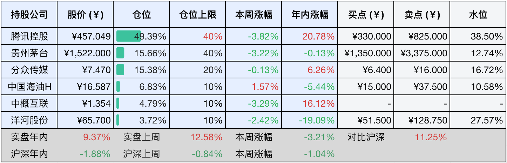

__微信公众号文章地址：[老罗投资周记-20250607](https://mp.weixin.qq.com/s/nJdmBEEcYbooJe878_s4_g)__

```
老罗投资周记，每周六更新。专注于股权投资、阅读、学习与个人成长，知行合一、日拱一卒、投资人生。微信公众号【老罗投资】，文章均首发于公众号。
```

### 1. 本周交易

无

### 2. 目前持仓

当前持有的股票包括：腾讯控股50.12%、贵州茅台15.26%、分众传媒14.77%、中国海油H 6.78%、中概互联4.83%、洋河股份3.74%。

此外还有少量现金，加上少量的海康威视、恒瑞医药、上海机场、宋城演艺等股票，其份额较少，仅作为观察仓不进行记录。

本周投资组合整体涨跌<span class="red">+1.81%</span>，年内收益<span class="red">+11.18%</span>。

**注：**

1. 表格底部数据为老罗与沪深300指数年内收益率对比。
2. 港股持仓已按实时汇率换算为人民币。


### 3. 上周数据



### 4. 本周事项

+ 腾讯股息到账
+ 茅台​​国际化新品发布
+ 中国海洋石油更换董事长
+ 买房还是买股

==只对持股和交易感兴趣的朋友，读到这里就可以退出了。后面是对上述事件的展开，无新内容。==

#### 4.1 腾讯股息到账

腾讯股息6月3日晚上到账，每股分得3.297RMB，这些到账的资金上周已经说过，暂时不做处理，静待机会。红利税确实扣得肉疼啊，期待在不久的将来，长期持有某家公司的港股通账户能免红利税啊！

还有一个有意思的新闻，全球首位256级QQ用户6月7日诞生，昵称“爱芥末”的用户成为全球首个QQ等级突破256级的用户，解锁全新的时光企鹅图标，腾讯为他赠送了终身SVIP会员和限量礼物，这个账号注册于2000年，坚持登录了22年，QQ空间访问量达到2140万，反映QQ用户生态的长期活力还是相当不错的。

看了这个新闻老罗也登录好久不用的QQ，看了一眼等级，90来级，果然手机离线挂机的日子，QQ的等级还在一直慢慢增涨。

#### 4.2 茅台​​国际化新品发布

茅台在日本大阪世博会茅台主题日推出走进希腊、意大利、英国、法国、日本5国10款新品，每国两款，规格以375ML为主，售价1619到1719元一瓶。这是19年后首次更新走进系列，目前通过i茅台平台进行销售。6月5日i茅台平台上线新品，一秒钟就售罄了当日的配额，显示市场热度还是相当不错。

24到25年飞天茅台本周价格微调不到10元，但20到23年的准老酒、生肖酒及年份酒价格相对稳定，43度飞天原箱价逆势上涨了10元到840元，消费需求韧性还是相当地坚挺。

#### 4.3 中国海洋石油更换董事长

6月6日，张传江接任董事长、党组书记，免去其中国大唐集团有限公司董事、总经理、党组副书记职务，相关职务任免按有关法律和章程的规定办理。

公开资料显示，张传江，1968年出生，湖北荆门人，1990年毕业于大庆石油学院，之后便进入到石油和煤炭化工领域，曾任职于中国大唐集团、国家能源集团、中国神华煤制油化工有限公司、荆门石油化工总厂等公司。

更换董事长对中海油有何影响，还需要进一步观察。

#### 4.4 买房还是买股

最近北京二手房暴跌，某些区域出现了大量200多万一套两居室刚需房出售，这些房子月租金大约在4000元，年租金=4000元×12=4.8万元，名义回报率=4.8万÷200万×100%=2.4%​。如果是出租，做为房东还要负责物业费，取暖费等费用，一年大约在6000多元，净回报率=4.2万÷200万×100%=2.1%，净回报率仅2.1%左右。对比参考​​国内房产平均的回报率1.5%到2.5%，一线城市普遍小于2%，三四线城市可达3%到4%，国际合理水平3.5%到5%，租售比1:200至1:300。年化2.1%处于国内偏低水平，在一线城市还可以，但显著低于国际上的安全线。

但这些房产位于​​非核心地段，并且需贷款​​，净回报率仅2%左右，​​显著低于无风险收益​​，持有价值极低。如果为​​核心资产且全款持有​​，需要接受短期低回报，并寄望于长期增值——但需警惕日本式停滞（房价阴跌+租金疲软）风险。更为理性选择​​是置换为金融资产或高租售比区域实体房产，避免资金沉淀于低效资产。这几年老罗光股票分红收益率：23年3.37%，24年2.21%，25年估计大于2%，同时A股港股都属于历史较低的位置，大概率享受股价增值。

当然如果购买房产是为了解决硬性居住问题，当前房价下降的背景下，首付比例和贷款利率都算比较不错，入手后将来大概率也不会后悔。

### 5. 本周读书

本周阅读《邓小平时代》，还未读完。

### 6. 本周运动

本周遛弯四次，同时继续节食中。

如果觉得本文还不错，那就点个赞或者在看吧，祝大家周末愉快！

```
老罗投资周记，每周六更新。专注于股权投资、阅读、学习与个人成长，知行合一、日拱一卒、投资人生。微信公众号【老罗投资】，文章均首发于公众号。
免责声明：本公众号只作为本人的投资日志记录，本文中提及的个股都有腰斩或血本无归的风险，本人不做任何投资建议，投资请坚持独立思考。
```

__微信公众号文章地址：[老罗投资周记-20250607](https://mp.weixin.qq.com/s/nJdmBEEcYbooJe878_s4_g)__