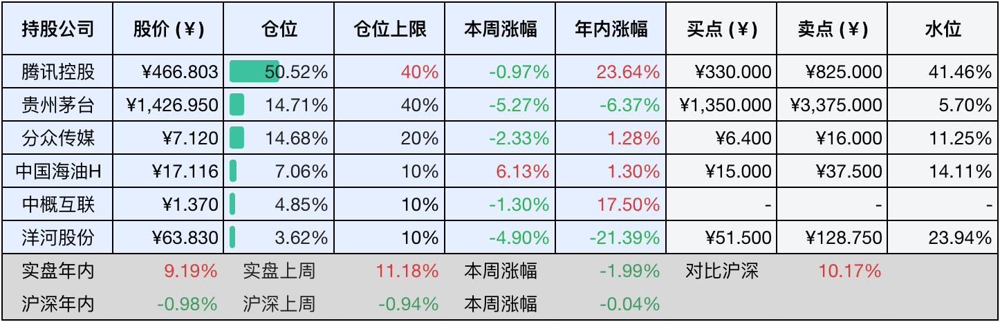
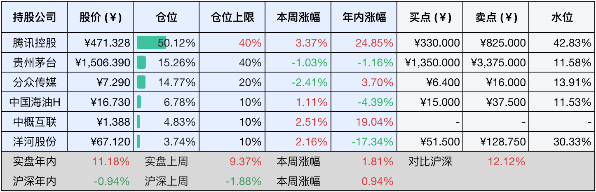

__微信公众号文章地址：[老罗投资周记-20250614](https://mp.weixin.qq.com/s/BH6n_R0fhxEoZquGc_Goig)__

```
老罗投资周记，每周六更新。专注于股权投资、阅读、学习与个人成长，知行合一、日拱一卒、投资人生。微信公众号【老罗投资】，文章均首发于公众号。
```

### 1. 本周交易

无

### 2. 目前持仓

当前持有的股票包括：腾讯控股50.52%、贵州茅台14.71%、分众传媒14.68%、中国海油H 7.06%、中概互联4.85%、洋河股份3.62%。

此外还有少量现金，加上少量的海康威视、恒瑞医药、上海机场、宋城演艺等股票，其份额较少，仅作为观察仓不进行记录。

本周投资组合整体涨跌<span class="green">-1.99%</span>，年内收益率<span class="red">+9.19%</span>。

**注：**

1. 表格底部数据为老罗与沪深300指数年内收益率对比。
2. 港股持仓已按实时汇率换算为人民币。



### 3. 上周数据



### 4. 本周事项

+ 茅台持续大手笔回购股份
+ 洋河​​年度股东大会
+ 腾讯音乐收购喜马拉雅

==只对持股和交易感兴趣的朋友，读到这里就可以退出了。后面是对上述事件的展开，无新内容。==

#### 4.1 茅台持续大手笔回购股份

截止到5月底，茅台在今年已经累计回购了331万股，总金额达到了51亿元，仅仅在5月单月就回购股份129.26万股，共支付金额20.61亿元，创下阶段性高点，充分表明了茅台的现金流实力与股价维稳决心。

茅台之前公布的计划，全年回购金额上限为60亿元，目前已经完成约85%，预计6月中旬将完成剩余的回购，并进入股份注销阶段。

茅台回购的资金全部来源于公司自有资金，没有动用专项贷款或者其他的融资工具。截止今年Q1，公司总资产达3123.69亿元，资产负债率仅14%，不得不说茅台真是的现金充裕，为回购提供了坚实的基础。

#### 4.2 洋河​​年度股东大会

6月12日，洋河股份2024年度股东大会在宿迁召开，大会审议通过了包括《2024年度董事会工作报告》、《2024年度监事会工作报告》、《关于公司2024年度利润分配的议案》在内的六项议案。股东大会通过了每股现金分红2.317元的利润分配方案，估计将会于本月实施（参考去年6月25日的分红时间）。

在股东大会召开之前的6月10日，​​董事杨卫国因为工作调动辞去董事及战略委员会委员职务，不再担任公司任何职位，此前被视为潜在董事长的接任人选。

洋河本周收盘价63.83元，主力资金连续5日净流出3.39亿元，一周跌去了4.9%，创近一年的新低，股息率也升到了7.3%。7.3%股息率在白酒行业极为罕见，已经超过五粮液5.2%和泸州老窖4.9%，但高股息也可能隐含市场对企业增长的悲观预期。

当一家公司因太会分红而被质疑成长性时，资本将会用脚投票。洋河当前的困境，本质是在白酒消费周期中，次高端白酒商业模式韧性的压力测试，希望洋河能够平安渡过危机，再创辉煌吧。

#### 4.3 腾讯音乐收购喜马拉雅

6月10日，腾讯音乐在纽交所、港交所发布公告，宣布和喜马拉雅及其股东签订并购协议，计划以​​12.6亿美元现金加股权组合的方式​​全资收购喜马拉雅。包括现金支付12.6亿美元（约合90.6亿元人民币），同时向喜马拉雅股东发行不超过腾讯音乐总股本5.1986%的A类普通股和创始人激励股，后续分批授予创始股东不超过总股本0.37%的A类普通股。

喜马拉雅经历过4次冲击IPO折戟沉沙，员工数也从4342人裁至1500人，24年净利润仅仅为5亿元，同时估值大幅度缩水，从50亿美元的峰值降至约15亿美元。种种因素，可能迫使喜马拉雅接受了腾讯音乐的并购，被腾讯音乐收购属于断臂求生。

腾讯音乐目前月活达到了6.44亿，但面临内容同质化的问题，需要拓展有声书、播客等长音频场景。同时凭借腾讯AI声纹识别技术和喜马拉雅680万小时语音数据库，可以开发全场景的智能伴随服务，比如车载续听、AI内容精炼等。

腾讯音乐已经占在线音乐市场78.3%的份额，如果再吞并喜马拉雅（目前占音频市场25%），可能触发《反垄断法》的红线，重蹈腾讯虎牙斗鱼合并被叫停的覆辙。

### 5. 本周读书

#### 5.1 《邓小平时代》

小时候家附近有一家国营的棉纺织厂，每天放学我都会从厂区里路过回家，在厂区的宣传栏里悬挂着一个巨幅的老人头像，下面标着一行字：我们的总设计师。

每次路过我都会停下注视一会，当时的我天真的以为这个老人是棉纺厂的总工程师之类的，或者是厂里的大领导，总之印象非常深刻。一直到我到高年级了，才知道这个人是中国改革开放的总设计师--邓小平。

“我是中国人民的儿子，我深情地爱着我的祖国和人民。”  为国为民，余晖燃尽。

评分五星⭐️⭐️⭐️⭐️⭐️

### 6. 本周运动

本周遛弯三次，每次五公里，同时继续节食中。

如果觉得本文还不错，那就点个赞或者在看吧，祝大家周末愉快！

```
老罗投资周记，每周六更新。专注于股权投资、阅读、学习与个人成长，知行合一、日拱一卒、投资人生。微信公众号【老罗投资】，文章均首发于公众号。
免责声明：本公众号只作为本人的投资日志记录，本文中提及的个股都有腰斩或血本无归的风险，本人不做任何投资建议，投资请坚持独立思考。
```

__微信公众号文章地址：[老罗投资周记-20250614](https://mp.weixin.qq.com/s/BH6n_R0fhxEoZquGc_Goig)__