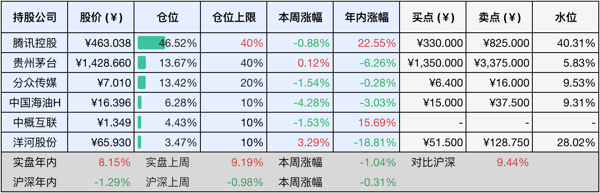
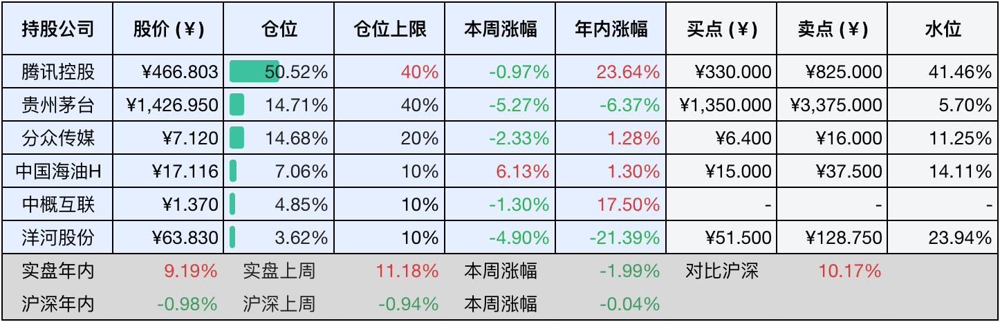

__微信公众号文章地址：[老罗投资周记-20250621](https://mp.weixin.qq.com/s/ScrNnQddDzKZ2vil_evVbg)__

```
老罗投资周记，每周六更新。专注于股权投资、阅读、学习与个人成长，知行合一、日拱一卒、投资人生。微信公众号【老罗投资】，文章均首发于公众号。
```

### 1. 本周交易

无

### 2. 目前持仓

当前持有的股票包括：腾讯控股46.52%、贵州茅台13.67%、分众传媒13.42%、中国海油H 6.28%、中概互联4.43%、洋河股份3.47%。

此外还有少量现金，加上少量的海康威视、恒瑞医药、上海机场、宋城演艺等股票，其份额较少，仅作为观察仓不进行记录。

本周投资组合整体涨跌<span class="green">-1.04%</span>，年内收益率<span class="red">+8.15%</span>。

**注：**

1. 表格底部数据为老罗与沪深300指数年内收益率对比。
2. 港股持仓已按实时汇率换算为人民币。



### 3. 上周数据



### 4. 本周事项

+ 腾讯收购游戏开发商和二次上市
+ 飞天茅台价格持续下跌
+ 分众传媒收购新潮传媒进展延迟

==只对持股和交易感兴趣的朋友，读到这里就可以退出了。后面是对上述事件的展开，无新内容。==

#### 4.1 腾讯收购游戏开发商和二次上市

传腾讯希望以150亿美元的价格收购韩国游戏开发商Nexon，Nexon代表作有《地下城与勇士》《泡泡堂》《冒险岛》《跑跑卡丁车》《反恐精英Online》等，都是小时候经常玩的游戏，腾讯这次收购的意图非常明显，希望强化其在全球游戏的IP布局。

腾讯和Nexon有接近20年的合作历史，早在2019年的时候就曾经谈过收购的事宜，但没有成功。之后Nexon公司创始人去世了，因为韩国的遗产税高达50%，创始人的遗孀和子女因为交不起巨额遗产税，只好把公司股份抵押给韩国政府，韩国政府想要把股票变现，但一直没有达成满意的交易价格。在这个背景下，近期又传出腾讯准备收购，不过这个出价和公司目前的市值差不多，没有什么溢价，能不能收购成功也不能百分百确定。

但不管怎么说，腾讯这是一改之前的收缩架势，又转向到了对外扩张的路上，“腾克希尔哈撒讯”可能又回来了。

另一件事，深圳新规允许港股上市的大湾区企业在深交所二次上市，也叫红筹股H+A模式，腾讯被视为首要的目标企业，相关的规则正在制定之中。目前已经有红筹企业在A股二次上市的案例，主要集中在上交所，比如中国移动、中芯国际等。

红筹企业H+A上市一直热度不太高，主要有两点原因，一是两地上市的成本比较高，二是A股上市标准更为严苛，尤其是对于红筹架构的企业。不过，相比于港股来说，A股估值更高，流动性也更强，只是融资需要审批，没有港股便利。

腾讯如果直接在深交所二次上市，以后购买股票的成本可能会有所降低，主要是那个分红税，扣得实在是太多了，令人肉疼。

#### 4.2 飞天茅台价格持续下跌

飞天茅台的终端价格最近持续下跌，根据数据显示，6月15日，散瓶飞天茅台的批发价跌至每瓶1930元，单日下跌了30元，而原箱装的价格也报至每瓶1990元，双双创下今年的新低。导致这一波价格下滑的因素主要是消费淡季的到来、近期备受关注的所谓禁酒令的影响，以及电商平台的低价投放策略加大了对市场价格的冲击。

说到这个“禁酒令”，虽然讨论得沸沸扬扬，但需要澄清的是，这些禁令涉及的范围比较广泛，并非仅仅针对酒类。那么禁酒令对白酒行业有影响吗？客观来说，肯定存在一些影响，但影响范围其实非常有限，因为当前政务消费在整个白酒市场中的占比已经不足2%，几乎可以忽略不计。以茅台为例，短期内禁令可能对市场情绪造成一定的负面冲击，产生一些实际影响，但如果把时间拉长来看，这种影响几乎可以视作不存在。

每当股价下跌，市场上就会出现各种各样的鬼故事，比如现在年轻人都不喝白酒了。这种论调其实并不新鲜，每个时代的年轻人都可能不太喜欢白酒，也或许是暂时还消费不起高端白酒，但随着年龄的增长，步入中年之后，他们将成为社会消费主力，情况往往会发生改变。况且茅台在整个白酒市场中的份额还不到1%，即使未来饮酒的人数真的减半，对茅台的实际业绩也很难构成实质性影响。长远来看，少喝酒，喝好酒很可能成为消费趋势，这对于定位高端的茅台反而是一种利好。

现在终端价格跌破2000元，需要理性看待，注意这里说的不是建议零售价1499元（这个价格只要一放出就是瞬间被抢光），更不是那遥不可及的1169元出厂价。这仅仅意味着经销商的利润空间有所压缩，从过去每瓶暴赚上千元，到现在每瓶赚几百元。但对于茅台酒厂本身而言，其经营模式并没有发生改变，生产出来多少就能卖出多少，给厂家的价格（出厂价）是稳定不变的。至少到目前为止，茅台的业绩基本面并没有受到终端价格波动的直接影响。

展望未来，消费者对茅台品牌的喜爱程度没有改变，白酒在中国人的社交润滑作用没有改变，其作为一种情绪调节剂的角色也没有改变，基于这些根本性的前提，茅台的利润在可预见的未来大概率仍将保持稳健增长。当前的市场价格，从长期价值投资者的角度看，已经显得颇具吸引力。只要上述这些支撑茅台价值的核心逻辑没有发生根本变化，我会持续看好并选择买入持有。

茅台分红应该是6月26日到账，每股分得27.673元人民币（税前）。同时，在周一卖出了部分的指数基金，计划在合适价位买入贵州茅台或五粮液，资金有限，就看这两个公司谁先跌到买入价格了。

#### 4.3 分众传媒收购新潮传媒进展延迟

分众传媒收购新潮传媒交易仍然处于尽职调查和反垄断申报阶段，交易涉及50个交易方，包括京东、百度等关联公司，还未完成全部交割，属于好事多磨。

同时在阿里拍卖平台显示，新潮传媒有两笔合计1121万股的股权将在7月1日进行司法拍卖，起拍价合计约7亿元。分众传媒此前公告显示，相关股东已承诺将采取措施解除标的股权的质押和冻结状态，确保交易顺利进行。

分众传媒与新潮传媒在电梯广告市场的合并后，两者的合计市场份额将显著提升，在户外视频广告领域的市占率接近23.8%，引发垄断担忧。2009年分众与新浪的并购就曾因为涉嫌垄断被叫停，这次交易也面临类似的监管风险。

### 5. 本周读书

#### 5.1 《黄永玉：人中要笑，就没有输》

黄永玉确实是鬼才，一个长寿、乐观、江湖气的老头。读了本书才了解到阿诗玛、雷锋画像、庚申年猴票都是黄永玉所画。

评分三星半⭐️⭐️⭐️❤️

#### 5.2 《我和我的母亲》

本书是选自陈行甲的作品《在峡江的转弯处：陈行甲人生笔记》，母亲确实是一个人最初的老师，优秀的母亲对孩子的影响是终其一生的，赞美伟大的母亲。

评分四星半⭐️⭐️⭐️⭐️❤️

### 6. 本周运动

本周健走三次，每次五公里，同时继续节食中。

如果觉得本文还不错，那就点个赞或者在看吧，祝大家周末愉快！

```
老罗投资周记，每周六更新。专注于股权投资、阅读、学习与个人成长，知行合一、日拱一卒、投资人生。微信公众号【老罗投资】，文章均首发于公众号。
免责声明：本公众号只作为本人的投资日志记录，本文中提及的个股都有腰斩或血本无归的风险，本人不做任何投资建议，投资请坚持独立思考。
```

__微信公众号文章地址：[老罗投资周记-20250621](https://mp.weixin.qq.com/s/ScrNnQddDzKZ2vil_evVbg)__