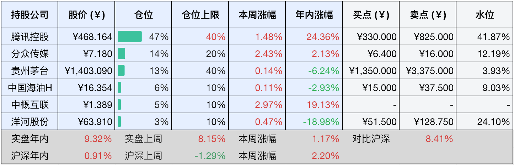
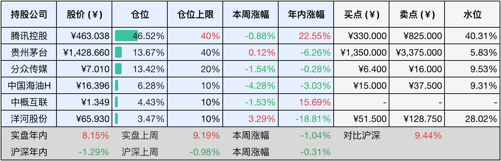

__微信公众号文章地址：[老罗投资周记-20250628](https://mp.weixin.qq.com/s/2QXMkaYMQpI7E2stqOI1xA)__

```
老罗投资周记，每周六更新。专注于股权投资、阅读、学习与个人成长，知行合一、日拱一卒、投资人生。微信公众号【老罗投资】，文章均首发于公众号。
```

### 1. 本周交易

无

### 2. 目前持仓

当前持有的股票包括：腾讯控股47%、分众传媒14%、贵州茅台13%、中国海油H 6%、中概互联5%、洋河股份3%。

此外还有部分现金，加上少量的海康威视、恒瑞医药、上海机场、宋城演艺等股票，其份额较少，仅作为观察仓不进行记录。

本周投资组合整体涨跌<span class="red">+1.17%</span>，年内收益率<span class="red">+9.32%</span>。

**注：**

1. 表格底部数据为老罗与沪深300指数年内收益率对比。
2. 港股持仓已按实时汇率换算为人民币。



### 3. 上周数据



### 4. 本周事项

+ 贵州茅台和洋河股份分红到账
+ 分众传媒股东大会

==只对持股和交易感兴趣的朋友，读到这里就可以退出了。后面是对上述事件的展开，无新内容。==

#### 4.1 贵州茅台和洋河股份分红到账

贵州茅台2024年年度分红每股27.673元，股权登记日是2025年6月25日，现金红利发放日是6月26日。在6月25日晚，分红就已经到账。贵州茅台2024年的分红规模创历史新高，叠加60亿的回购注销，提升了股东回报，体现公司现金流实力与市值管理决心。

洋河股份2024年年度分红方案是每股派发现金红利2.317元人民币，股权登记日是6月26日，除权除息日是6月27日。在6月26日晚，分红就已经到账。股息率高达7.04%，凸显了洋河的估值性价比，但在2024年净利润下滑33.37%的背景下，仍然需要重点关注业绩修复的进展。其实现在不到千亿的市值下，洋河的性价比还可以，就看管理层有何办法扭转净利润持续下滑的困境。

分红到账后，现金继续增加，已占仓位的10%以上，但目前没有明显的好机会，还是继续使用条件单的方式，关注1350元的茅台和105元的五粮液，跌到指定价格将自动买入。

#### 4.2 分众传媒股东大会

6月25日，分众传媒股东大会在上海兆丰世贸大厦举行，股东大会采用现场加网络的形式举行，参会股东共计2003人，代表股份占比约45%。大会12项议案全部通过，包括《2024年利润分配预案》，《境外子公司担保额度》等议案。

分众传媒24年分红率达到92.45%（每股0.33元），并承诺在现金流满足经营的需求下，未来将继续保持高比例的分红，公司目前账面资金充裕，在理财收益下行的背景下，并未影响其分红能力。

​江南春在股东大会上也做了公司未来的战略定调：“不确定中最危险的是盲目多元化，最安全的是在核心战场做到极致”。分众将以电梯媒体为核心，通过技术、并购与全球化构建其千亿级的护城河。

### 5. 本周读书

#### 5.1 《他影响了中国：陈云》

翻阅《他影响了中国：陈云》，内心颇受触动。长久以来，对新中国初期领导人的认知，总聚焦在毛主席、陈毅元帅、彭老总、朱总司令这些教科书里的光辉形象上。直到细细品读《邓小平时代》，才真正留意到陈云这位低调的新中国经济掌舵人。建国前为筹措粮草绞尽脑汁，建国后更在国家财源紧张的当口，运筹帷幄，稳住大局。细数共和国的奠基者，他确实是那宏大画卷中不可或缺、浓墨重彩的一笔！

常言道，前人栽树，后人乘凉，如今置身于这片繁荣景象：万家灯火中温饱无虞，安居乐业时路网通达，校园书声朗朗，街巷安宁祥和。我们这代长在红旗下的普通人，得以享受这丰实安稳的日子，切身体验着一个大国的崛起，怎不心怀感激与自豪？再辉煌的身影也终将归于历史，但这些伟人们铺就的基石，却托举着我们的今日与明天。饮水思源，共和国每一寸发展的热土上，都凝结着无数先辈的汗水与牺牲，这份沉甸甸的馈赠，值得我们永远铭记于心。

评分四星半⭐️⭐️⭐️⭐️❤️

#### 5.2 《我们的鲁迅》

本书述及了余华对鲁迅作品的阅读体验，在三十六岁之前，他几乎厌恶鲁迅的全部文字，视其为唯一难以卒读的作家，认为那些文章枯燥无味。而步入中年后重读，却惊觉字字锋芒，惊为天人。
一个读者与一个作家的真正相遇，有的时候需要时机，鲁迅的叙述在抵达现实时是如此的迅猛，就像子弹穿越了身体，而不是留在了身体里。

评分四星⭐️⭐️⭐️⭐️

#### 5.3 《快乐儿童的7个习惯》

本书介绍的7个习惯：

积极主动，我的生活我做主；
以终为始，做事要有计划；
要事第一，有秩序才能高效能；
双赢思维，每个人都有收获；
知彼解己，先倾听后开口；
统合综效，合作力量大；
不断更新，有朋友真好。

这本书属于童书，内容不错，作为父亲可以先阅读帮孩子把把关，再买给小朋友看。

评分四星⭐️⭐️⭐️⭐️

### 6. 本周运动

本周下雨，只健走两次，每次五公里，同时继续节食中。

如果觉得本文还不错，那就点个赞或者在看吧，祝大家周末愉快！

```
老罗投资周记，每周六更新。专注于股权投资、阅读、学习与个人成长，知行合一、日拱一卒、投资人生。微信公众号【老罗投资】，文章均首发于公众号。
免责声明：本公众号只作为本人的投资日志记录，本文中提及的个股都有腰斩或血本无归的风险，本人不做任何投资建议，投资请坚持独立思考。
```

__微信公众号文章地址：[老罗投资周记-20250628](https://mp.weixin.qq.com/s/2QXMkaYMQpI7E2stqOI1xA)__