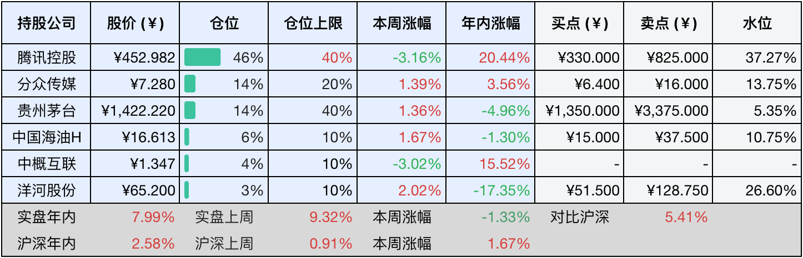

__微信公众号文章地址：[老罗投资周记-20250705](https://mp.weixin.qq.com/s/-7n-ibYic_di30RzTpqHIg)__

```
老罗投资周记，每周六更新。专注于股权投资、阅读、学习与个人成长，知行合一、日拱一卒、投资人生。微信公众号【老罗投资】，文章均首发于公众号。
```

### 1. 本周交易

无

### 2. 目前持仓

当前持有的股票包括：腾讯控股46%、分众传媒14%、贵州茅台14%、中国海油H 6%、中概互联4%、洋河股份3%。

此外还有部分现金，加上少量的海康威视、恒瑞医药、上海机场、宋城演艺等股票，其份额较少，仅作为观察仓不进行记录。

本周投资组合整体涨跌<span class="green">-1.33%</span>，年内收益率<span class="red">+7.99%</span>。

**注：**

1. 表格底部数据为老罗与沪深300指数年内收益率对比。
2. 港股持仓已按实时汇率换算为人民币。



### 3. 上周数据


### 4. 本周事项

+ 洋河股份董事长辞职

==只对持股和交易感兴趣的朋友，读到这里就可以退出了。后面是对上述事件的展开，无新内容。==

#### 4.1 洋河股份董事长辞职

张联东离开洋河，表面看是业绩下滑触发的人事调整，深层却暴露了白酒行业转型期的集体困境。曾经稳居行业第三的洋河，2024年遭遇营收、净利润双双大跌超30%，排名滑至第五，被山西汾酒、泸州老窖反超。他在股东会上那句“最大问题在管理层”的反思，成了离任前无奈的注脚。

他力推的双名酒战略虽搭起了品牌架子，却没能解决渠道散乱、效率低的老毛病。主打高端的梦之蓝手工班，面对茅台、五粮液的品牌壁垒始终难以突破，营销费用率反而冲到19.1%，比同行高出一大截，暴露了洋河的效率短板。这场始于改革、终于失速的任期，恰好是白酒行业从粗放扩张转向精细运营过程中矛盾爆发的缩影。离任前一周，他还在为京东定制光瓶酒站台，仓促的交接让本来就不稳的渠道改革和新品布局瞬间失了方向。

接棒的顾宇，这位有政府背景的78后，面临的考验更棘手。洋河复杂的三三三股权结构中，国有资本和元老持股平台蓝色同盟的利益牵扯，过去一直捆住张联东的手脚，顾宇要怎么平衡国资要求和市场化改革？更现实的是，洋河一半以上收入还依赖着江苏本地市场，省外扩张始终打不开局面，这困局怎么破解？再加上2021年推行的骨干持股计划如今浮亏达30%，团队士气低迷，激励体系如何重建？如果新班子继续在体制和市场间拉扯，或者在战略上反复摇摆，洋河的颓势恐怕很难稳住。

实际上，2025年刚过半年，已经有超过20家酒企更换了掌舵人。茅台由张德芹接棒后强调控价稳市，郎酒少帅汪博炜走上前台，水井坊则从快消行业挖来高管。密集的高层变动背后，是行业共识的转向：规模扩张的时代结束了，精耕细作的周期开始了。面对政策调整、消费人群换代和激烈的存量竞争，酒企试图通过换帅打破旧有的路径，已经是普遍选择。

张联东的离任，既是洋河困境的集中体现，也是白酒行业转型的典型信号。它宣告了依赖渠道压货、简单提价的旧模式将彻底失效，逼着企业直面更难的挑战：品牌价值怎么重塑？渠道效率如何提升？治理机制怎样真正市场化？洋河能否翻身，要看新团队敢不敢动真格破除体制积弊，能不能找到差异化路径顶住酱香酒的挤压。而行业的前景，最终取决于这场换人背后，能否真正实现换思路。只有超越人事变动的表象，在经营逻辑和制度革新上落到实处，行业才能找到新出路。

本周旗下其他公司并无大事，就不赘述了。

### 5. 本周读书

#### 5.1 《大医 破晓篇》

马亲王的文笔确实深厚，大医这本书除了主角之外，大部分配角都是历史上的真实人物，马亲王真的特别擅长在历史的小角落，写出引人入胜的故事。36.6万字的长篇，11个小时看完。

评分五星⭐️⭐️⭐️⭐️⭐️

### 6. 本周运动

本周温度太高、湿度又大，没运动，仅节食。

如果觉得本文还不错，那就点个赞或者在看吧，祝大家周末愉快！

```
老罗投资周记，每周六更新。专注于股权投资、阅读、学习与个人成长，知行合一、日拱一卒、投资人生。微信公众号【老罗投资】，文章均首发于公众号。
免责声明：本公众号只作为本人的投资日志记录，本文中提及的个股都有腰斩或血本无归的风险，本人不做任何投资建议，投资请坚持独立思考。
```

__微信公众号文章地址：[老罗投资周记-20250705](https://mp.weixin.qq.com/s/-7n-ibYic_di30RzTpqHIg)__