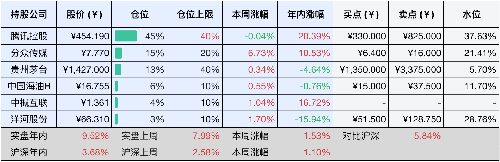

__微信公众号文章地址：[老罗投资周记-20250712](https://mp.weixin.qq.com/s/bga6nUIlwJac5bBsC_Xdpg)__

```
老罗投资周记，每周六更新。专注于股权投资、阅读、学习与个人成长，知行合一、日拱一卒、投资人生。微信公众号【老罗投资】，文章均首发于公众号。
```

### 1. 本周交易

无

### 2. 目前持仓

当前持有的股票包括：腾讯控股 45%、分众传媒 15%、贵州茅台 13%、中国海油H 6%、中概互联 4%、洋河股份 3%。

此外还有部分现金，加上少量的海康威视、恒瑞医药、上海机场、宋城演艺等股票，其份额较少，仅作为观察仓不进行记录。

本周投资组合整体涨跌<span class="red">+1.53%</span>，年内收益率<span class="red">+9.52%</span>。

**注：**

1. 表格底部数据为老罗与沪深300指数年内收益率对比。
2. 港股持仓已按实时汇率换算为人民币。



### 3. 上周数据


### 4. 本周事项

家中有事，并且旗下公司也无重要事项，本周这项就跳过了！另，中国海油H的分红下周应该就到账了。

### 5. 本周读书

#### 5.1 《大医 日出篇》

《大医 破晓篇》的续章，时间跨度从1913年一直到1950年，三人组的故事从青年一直描写到老年，故事连贯流畅，引人入胜。唯一的小瑕疵就是巧合过于的多了，有一点点刻意，但瑕不掩瑜。

评分五星⭐️⭐️⭐️⭐️⭐️

### 6. 本周运动

本周仅户外遛弯一次，体重有所反弹，看来运动强度还是不够，得恢复恢复跑步了。

如果觉得本文还不错，那就点个赞或者在看吧，祝大家周末愉快！

```
老罗投资周记，每周六更新。专注于股权投资、阅读、学习与个人成长，知行合一、日拱一卒、投资人生。微信公众号【老罗投资】，文章均首发于公众号。
免责声明：本公众号只作为本人的投资日志记录，本文中提及的个股都有腰斩或血本无归的风险，本人不做任何投资建议，投资请坚持独立思考。
```

__微信公众号文章地址：[老罗投资周记-20250712](https://mp.weixin.qq.com/s/bga6nUIlwJac5bBsC_Xdpg)__