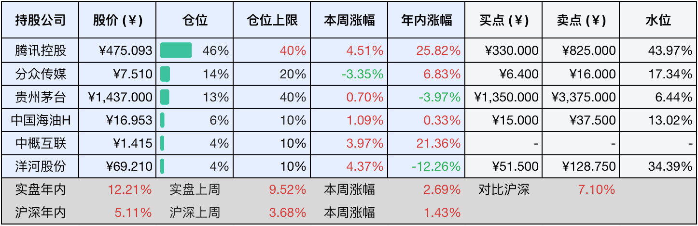
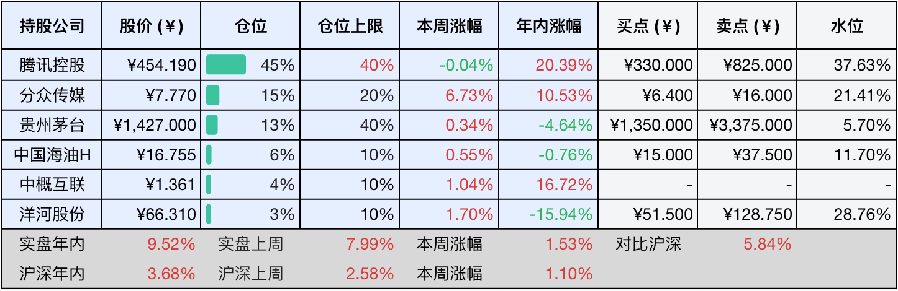

__微信公众号文章地址：[老罗投资周记-20250719](https://mp.weixin.qq.com/s/JLNOkNarnUheOl_wOWiBaQ)__

```
老罗投资周记，每周六更新。专注于股权投资、阅读、学习与个人成长，知行合一、日拱一卒、投资人生。微信公众号【老罗投资】，文章均首发于公众号。
```

### 1. 本周交易

无

### 2. 目前持仓

当前持有的股票包括：腾讯控股 46%、分众传媒 14%、贵州茅台 13%、中国海油H 6%、中概互联 4%、洋河股份 4%。

此外还有部分现金，加上少量的海康威视、恒瑞医药、上海机场、宋城演艺等股票，其份额较少，仅作为观察仓不进行记录。

本周投资组合整体涨跌<span class="red">+2.69%</span>，年内收益率<span class="red">+12.21%</span>。

**注：**

1. 表格底部数据为老罗与沪深300指数年内收益率对比。
2. 港股持仓已按实时汇率换算为人民币。



### 3. 上周数据



### 4. 本周事项

+ 腾讯控股大股东继续减持
+ 贵州茅台机场专卖店推出飞天茅台套餐

==只对持股和交易感兴趣的朋友，读到这里就可以退出了。后面是对上述事件的展开，无新内容。==

#### 4.1 腾讯控股大股东继续减持

7月18日，腾讯控股主要股东Prosus宣布减持37.1万股，每股平均成交价格为516港元，共计套现约1.9亿港元。这次减持之后，Prosus所持腾讯股份比例由23.00%微降至22.99%。

这次是Prosus本年度内第二次减持腾讯股份，前次减持发生于1月6日，当时减持规模为36.7万股，每股均价为409港元。尽管这轮减持消息在18日早盘一度引发腾讯股价小幅震荡，但市场反应整体平稳，并没有导致股价下行。

Prosus方面曾多次明确表示，其减持行为属于长期、有序的资金管理策略，核心目标在于修复自身股票估值水平，并非基于对腾讯发展前景的负面判断。如果Prosus自身股价相对资产净值的折价率能够收窄至10%以内，后续减持腾讯的动机或许将减弱。

从本周腾讯股价表现看，周度涨幅达4.51%，一定程度上反映出市场对Prosus减持行为的消化能力，腾讯持续进行的股份回购计划以和稳健的业绩增长，共同构成了抵御大股东减持影响的双重缓冲。

还是那句话，投资不是盯着其他人的口袋，而只需要关注公司的核心盈利能力与护城河是否依然存在。

#### 4.2 贵州茅台机场专卖店推出飞天茅台套餐

贵州茅台机场专卖店推出飞天茅台套餐政策，通过捆绑销售高毛利产品，比如生肖酒和年份酒，释放平价飞天茅台配额。

​这次活动包括：兔年生肖套餐​，购买1瓶单价3479元的兔年茅台，可以配售3瓶1499元飞天茅台，总价7976元​，限购1套。珍品年份酒套餐​，购买1瓶市场价约4000元的珍品茅台或者市场价约5000元的茅台15年，可以配售3瓶1499元飞天茅台，不限购。品鉴活动​，38元品鉴10ml飞天茅台单杯。

​​​茅台机场套餐本质是​​以溢价酒补贴平价酒的折中策略，短期通过捆绑销售化解供需矛盾，长期试水精准营销模式。对于消费者而言，需要理性计算实际的购买成本。对茅台而言，成败关键在于能否实现去黄牛化与开瓶率提升的双重目标。​

​当前​白酒行业深陷周期律与禁令，有些酒企发布的半年预报利润都有大幅度的下跌，一片萧条之声。在这种环境下，更能体现一家好企业抵御周期的能力，尽管近期遇到了很多困难，但茅台无疑是最有可能是笑到最后的赢家。

### 5. 本周读书

#### 5.1 《显微镜下的大明》

本书亦是马伯庸所著，最近看亲王的书上瘾。本书所讲述的是深藏在故纸堆里的明代基层政治事件，包括六个章节：徽州丝绢案、婺源龙脉保卫战、杨干院律政风云、大明第一档案库的前世今生、彭县小吏舞弊案和正统年间的四条冤魂。

想要读懂中国古代政治，不可以只注目于朝堂，也要听到最底层的呐喊，在一个个普通人的遭遇中，才蕴藏着最真实的历史规律。

评分四星⭐️⭐️⭐️⭐️

#### 5.2 《项链》

小门小户的姑娘向往大门大户的生活，去参加一场盛大的舞会，借了朋友的钻石项链结果给弄丢了，为了赔这条价值不菲的项链付出了10年艰苦生活，最后还清债务才得知，弄丢的项链居然是仿品。

人的一生变化无常，切不可为了虚荣心，做一些不匹配自身能力的事，那样终将付出惨重的代价。

评分五星⭐️⭐️⭐️⭐️⭐️

#### 5.3 《地久天长》

本书讲的是在特殊年代里，两个男生和一个女生的友谊故事，非happy ending，叙述方式很王小波。

评分四星⭐️⭐️⭐️⭐️

### 6. 本周运动

本周运动五次，体重一直反复，看来不上强度很难减下去。

如果觉得本文还不错，那就点个赞或者在看吧，祝大家周末愉快！

```
老罗投资周记，每周六更新。专注于股权投资、阅读、学习与个人成长，知行合一、日拱一卒、投资人生。微信公众号【老罗投资】，文章均首发于公众号。
免责声明：本公众号只作为本人的投资日志记录，本文中提及的个股都有腰斩或血本无归的风险，本人不做任何投资建议，投资请坚持独立思考。
```

__微信公众号文章地址：[老罗投资周记-20250719](https://mp.weixin.qq.com/s/JLNOkNarnUheOl_wOWiBaQ)__