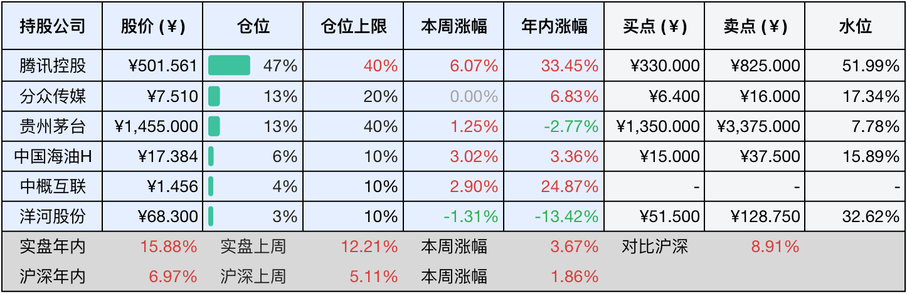
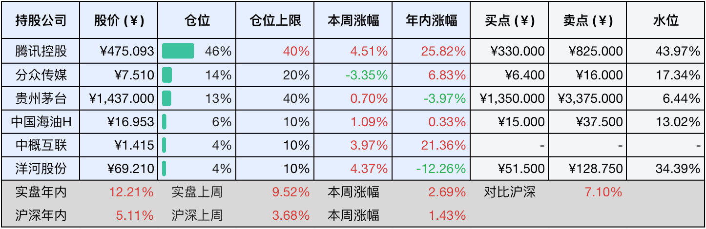

__微信公众号文章地址：[老罗投资周记-20250726](https://mp.weixin.qq.com/s/Q7Od13m8MiaZtS3NwnI8vA)__

```
老罗投资周记，每周六更新。专注于股权投资、阅读、学习与个人成长，知行合一、日拱一卒、投资人生。微信公众号【老罗投资】，文章均首发于公众号。
```

### 1. 本周交易

无

### 2. 目前持仓

当前持有的股票包括：腾讯控股 47%、分众传媒 13%、贵州茅台 13%、中国海油H 6%、中概互联 4%、洋河股份 3%。

此外还有部分现金，加上少量的海康威视、恒瑞医药、上海机场、宋城演艺等股票，其份额较少，仅作为观察仓不进行记录。

本周投资组合整体涨跌<span class="red">+3.67%</span>，年内收益率<span class="red">+15.88%</span>。

**注：**

1. 表格底部数据为老罗与沪深300指数年内收益率对比。
2. 港股持仓已按实时汇率换算为人民币。



### 3. 上周数据



### 4. 本周事项

+ 腾讯市值创四年新高​
+ 分众传媒调整收购新潮传媒方案

==只对持股和交易感兴趣的朋友，读到这里就可以退出了。后面是对上述事件的展开，无新内容。==

#### 4.1 腾讯市值创四年新高​

本周腾讯的股价以强势表现冲上了550港元，创下自2021年6月以来的新高，腾讯市值重新站上5万亿港元大关，约合4.56万亿元人民币。对投资者而言，这不仅是一次股价的回归，更是一场蛰伏四年后的价值重估，从2022年200港元的最低谷至今（老罗最低的买入成本是22年10月25日的199.8港币），腾讯的股价累计涨幅已经超过160%。

游戏始终是腾讯的压舱石，2025年一季度，《王者荣耀》《穿越火线手游》双双创下流水历史新高，推动本土游戏收入同比增长24%，国际市场收入增长23%。更重要的是新势力的崛起，战术射击游戏《三角洲行动》DAU峰值突破1200万，成为近三年国内新游的现象级爆款，海外版《Delta Force》上线后横扫了多国的游戏下载榜，体现了腾讯全球化+精品化战略的穿透力。

而腾讯的野心不止于此，将年流水超40亿元、DAU超过500万的产品定义为长青游戏，这类游戏数量已从2023年的12款增长至14款。从《和平精英》除夕单日8000万DAU，到《金铲铲之战》连续八季度双位数增长的韧性，长青游戏的扩容，让腾讯摆脱了爆款游戏的依赖症。

2024年腾讯研发支出达706.9亿元，资本开支同比暴增221%至767亿元，重金押注AI算力基建，高投入换来高效率：广告业务，AI动态素材较传统素材将广告点击率提升28%，微信搜一搜接入DeepSeek后，广告定向精度跃升，推动一季度广告收入同比增长20%。游戏生态方面，在《和平精英》中，DeepSeek大模型驱动的AI队友使玩家平均时长增长16%，用户黏性显著增强。企业服务方面，零售业成为AI落地先锋。绝味食品的AI会员智能体提升转化率25%，五粮液用AI质检将瓶盖缺陷识别提速至毫秒级。腾讯云更以离产业最近的AI为旗，推出了行业大模型商店，向量数据库支持千亿级数据毫秒检索，技术基建的扎实，让腾讯在B端战场占得先机。

同时，市场信心的重塑，离不开腾讯强大的回购攻势。2024年公司斥资1120亿港元共计回购了3.07亿股，2025年承诺再投至少800亿港元进行回购。25年年内回购额已经超过400亿港元，相当于每个交易日砸下近5亿港元托市。这种现金流反哺股价的策略，被大道段永平直白评价：买腾讯肯定比存银行好。

当前的高光并未让腾讯放缓脚步，二季度视频号Adsload（广告加载率）从3%提升至7%，离抖音的15%仍有上调空间。《王者荣耀世界》开启先锋测试，开放世界赛道或许将开辟新的增长极。混元大模型在700多个业务场景的深度渗透，正推动腾讯从流量驱动转向AI驱动的新模式。

但挑战同样存在，AI推理成本仍然高于竞品30%，字节跳动与阿里巴巴的模型加速竞争，当前消费疲软对支付业务的拖累。这些暗礁，将是腾讯冲击下一座高峰必须跨越的障碍。

腾讯的四年轮回，就像中国科技产业的缩影：从流量红利到硬核创新，从规模扩张到精益运营，市值重返5万亿港元，不仅仅是资本市场的认可，这家互联网流量之王，正在以一场深刻的蜕变，完成自身的高质量增长。
​
#### 4.2 分众传媒调整收购新潮传媒方案

本周分众传媒发布公告，收购新潮传媒的方案突遭调整，原来交易方顾家集团因股权司法拍卖离场，美的少东家何剑锋控制的盈峰集团火线接盘，以竞拍的形式拿下新潮传媒8.58%的股权，跻身关键的交易对手之列。这场价值83亿元的梯媒整合大戏，在临门一脚时却上演了戏剧性的换角。

江南春的并购逻辑非常的清晰，用新潮的75万块社区屏幕，互补分众162万写字楼点位的空白，两者之间的重合度不到5%。合并后分众传媒户外广告市占率将达17.2%，形成对竞争对手的碾压优势。

并购新潮传媒的风险：一是新潮23年巨亏2.79亿，24年净利只有6356万，估值对比净资产溢价达到了138%，溢价138%收购相当于23.5倍PE，比分众自身PE（16倍）高出了47%。二是交易罕见的没有设置盈利补偿条款，如果整合失败，分众年50+亿净利润可能会遭到稀释。三是部分交易方股权仍然处于质押冻结的状态，需要在交割前解除司法限制。

分众这次收购，既要借助新潮来填补社区场景的空白，又得消化新潮的盈利波动。既要安抚新股东盈峰集团，又得提防数字广告巨头的降维打击。机遇和挑战并存，后续终将如何，还需继续关注。

### 5. 本周读书

#### 5.1 《冲向火星》

本书是关于马斯克和他的SpaceX公司初创的故事，可能是翻译的问题吧，人物众多有点记不住，叙事又有点像记流水账，阅读起来略显枯燥。

评分三星半⭐️⭐️⭐️❤️

### 6. 本周运动

本周运动七次，主要是跳操和遛弯，加上晚上不吃晚餐，一周减重了一公斤。前一阵体重一直在反复，减肥的信心都有点动摇了。

其实，当你的体重纹丝不动才是真正开始瘦的时候，表面上体重风平浪静，实则你的脂肪正在痛苦地哀嚎，它们就快要撑不住了，长时间没有补给的折磨让它们身处炼狱之中。

你的脂肪之所以还在苦苦支撑，就是它们还在用最后一招诡计打算骗过你的大脑，这招诡计就是努力让身体吸附水分，保持体重不变、反复，从而使你的大脑感到沮丧，努力让大量的饥饿感加馋瘾让你的大脑破防，最终功亏一篑。

如果你意志坚定，心如铁石，势必要杀它们个片甲不留，那么它们将在坚守一阵子之后就迅速溃败，你整个人都瘦了一大圈。你前面掉的那些体重不算什么，纹丝不动的时候你的脂肪才开始着急害怕，一想到你的脂肪们正在痛苦哀嚎，你还觉得难受吗？

如果觉得本文还不错，那就点个赞或者在看吧，祝大家周末愉快！

```
老罗投资周记，每周六更新。专注于股权投资、阅读、学习与个人成长，知行合一、日拱一卒、投资人生。微信公众号【老罗投资】，文章均首发于公众号。
免责声明：本公众号只作为本人的投资日志记录，本文中提及的个股都有腰斩或血本无归的风险，本人不做任何投资建议，投资请坚持独立思考。
```

__微信公众号文章地址：[老罗投资周记-20250726](https://mp.weixin.qq.com/s/Q7Od13m8MiaZtS3NwnI8vA)__