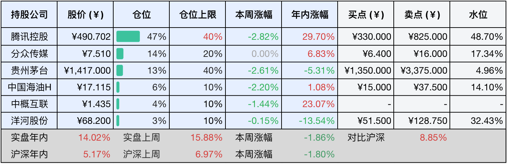

__微信公众号文章地址：[老罗投资周记-20250809](https://mp.weixin.qq.com/s/QN6Dh9asWwPAxwAK-9toSQ)__

```
老罗投资周记，每周六更新。专注于股权投资、阅读、学习与个人成长，知行合一、日拱一卒、投资人生。微信公众号【老罗投资】，文章均首发于公众号。
```

### 1. 本周交易

无

### 2. 目前持仓

当前持有的股票包括：腾讯控股 48%、分众传媒 14%、贵州茅台 13%、中国海油H 6%、中概互联 4%、洋河股份 3%。

此外还有部分现金，加上少量的海康威视、恒瑞医药、上海机场、宋城演艺等股票，其份额较少，仅作为观察仓不进行记录。

本周投资组合整体涨跌<span class="red">+3.37%</span>，年内收益率<span class="red">+17.39%</span>。

**注：**

1. 表格底部数据为老罗与沪深300指数年内收益率对比。
2. 港股持仓已按实时汇率换算为人民币。


### 3. 上周数据



### 4. 本周事项

+ 腾讯Q2业绩预测
+ 分众传媒增发15亿股
+ 如何面对挫折或生活中的低谷

==只对持股和交易感兴趣的朋友，读到这里就可以退出了。后面是对上述事件的展开，无新内容。==

#### 4.1 腾讯Q2业绩预测

腾讯将于下周三发布2025年第二季度财报，市场普遍对这份成绩单持乐观态度。预计营收将达到1,790亿元，同比增长11%-13%，经调整净利润约为643亿元，同比增幅12%左右，这一预期主要得益于游戏业务反弹，以及广告技术的效率提升。

腾讯游戏在面对2024年同期《DNF手游》上线带来的高基数压力时，仍然展现出强大的势头。在国内市场中，《王者荣耀》在今年4月再次荣登全球手游收入榜首，而《三角洲行动》则成为了一个现象级的爆款，其日活跃用户峰值超过1200万，并且在6月的MAU达到了3863万，位列手游活跃度排名第四的位置。在海外市场，《PUBG Mobile》和《Call of Duty: Mobile》也取得了稳定的流水增长，新游《沙丘：觉醒》在Steam上也取得了不错的营收成绩。部分机构预计第二季度游戏总收入将同比增长16%，其中国内和海外市场的增幅分别为16%和18%，海外收入的占比首次超过30%的大关。

在腾讯游戏生态中，AI也扮演了重要的角色，通过AI队友功能，《和平精英》增加了用户的游戏时长16%，而《王者荣耀》则利用AI生成内容以压缩开发成本。技术红利正从降本增效逐渐转向创造增量，为下半年即将推出的游戏如《无畏契约手游》和《王者荣耀：世界》等提供了良好的基础。

预计广告收入同比增长18%，尽管比第一季度增长20%的速度略有放缓，但仍然显著高于行业平均增速的6.8%。核心动力来自于视频号的商业化深化，当前的广告加载率仅3%至5%，而抖音已经达到15%，仍有提升空间。每日直播带货的GMV已经突破2亿元，微信小店加速了品牌广告投放的迁移。

AI技术成为了提高广告效果的关键，通过AI技术的优化，动态广告素材的CTR（点击率）提升了28%。这种技术溢价正逐渐走向规模化。例如，QQ浏览器经过Agent化改造后，用户渗透率翻倍。元宝的日活跃率激增20倍，并且深度嵌入了微信搜一搜、小程序等功能。

然而腾讯在AI领域的出色增长在一定程度上也给利润带来了压力，第一季度，腾讯在AI相关领域进行了大量投入（同比增加91%，达到275亿元），并且计划全年投入1000亿，提升算法算力基础设施的建设。短期内GPU的折旧可能会抑制净利润率，预计在经过调整后的第二季度，腾讯的净利润率微降至34.9%，同比下降了0.7个百分点。

目前，腾讯的动态PE约为17倍，远低于卖点估值，流量驱动向技术驱动转型中的腾讯，游戏全球化已经突破了30%的收入占比、AI正在重构广告与云服务的经营成本。8月13日，市场关注的重点可能不仅仅是财务数字，而是腾讯能否在AI商业化时代交出一份令人满意的高分答卷。

#### 4.2 分众传媒增发15亿股

分众传媒计划以增发15亿新股（每股5.68元）为主要支付方式，以完成对新潮传媒的83亿收购交易，收购将打破电梯广告行业长达十年的双雄争霸格局，这场交易不仅是财务方面的操作，更是一次对线下流量的战略性占领。

收购的核心是将规模和效率结合起来，分众最初拥有300万个写字楼点位，主要专注于高端品牌，而后来在新市场中开拓了100万个社区屏。通过合并，实现了400万个终端的覆盖，覆盖全国的市场份额从14.5%上升至17.2%，形成绝对垄断，规模效应直接转化为对市场议价的优势，分众已经开始对原来的新市场点位进行降价。

但收购新潮传媒后，整合的平衡是一项隐忧，新潮单屏的年收入只有2700元，净利率不到1%，而分众单屏年收入高达6000元，将分众的高溢价能力复制到下沉市场是最大的挑战。另外新增的46.8亿商誉也是不利因素，如果三年内新潮的收入未能达到预期，被动减值风险可能会显现。

江南春的抱负不仅仅局限于广告，通过与京东、百度等股东的股权绑定，并任命新潮创始人张继学为首席增长官，分众正在将电梯屏幕转变为数字生活入口。未来电梯间可能提供从电影院订票到叫车等一站式服务，估值逻辑可能从广告公司向流量平台转型。近期联合支付宝推出的碰一碰功能，使电梯广告不再只是被动曝光，而是转变为一个交易的入口，用户只需要轻触屏幕就可以获得优惠券，测试显示领取优惠券的比例高达68.6%，而传统扫码只有10%，碰一碰功能使客单价提升50%。这项技术在社区位置尤其有利，未来可能会激发中小型商户的广告投放需求。

在短期内，租金下降和刊例价格上涨将释放利润，但长期来看，是否通过碰一碰等产品创新来颠覆品牌广告无用论的标签才是江南春真正进行的豪赌。如果成功了，每一部电梯都可能成为消费链路的起点。

#### 4.3 如何面对挫折或生活中的低谷

在今年的伯克希尔股东大会上，一个来自上海的年轻人获得机会向巴菲特提问：如何面对挫折或生活中的低谷？

巴菲特表示：查理和我也有过挫折，这是生活的一部分，他不会提前通知你，我没什么好建议。人生总会遇到一些重大挫折，它伴随着你的一生，毕竟死亡就是人人都逃不过的终极挫折。确实有些人运气特别差，也有人运气特别好。通常走运的人都觉得更多是靠自身而非运气，但无论如何你都只能接受。我认为你在医疗和生活各方面已经算幸运了，你生在一个好时代，纵观中国历史，你更愿意出生在什么时候呢？100年前，500年前，1000年前还是现在？答案显而易见，你很幸运！所以与其纠结坏事，不如关注生命中的美好。

巴菲特的回答看似简单，却蕴含着深刻的大智慧。生活从来没有提供躲避困难的指南，挫折就像呼吸一样自然，而死亡则是人们都必须经历的最终归宿，所谓的幸运只是偶然的赐予。当被眼前的困境所困时，他让我们回顾百年来的战争和千年来的饥荒，实际上我们已经站在了人类文明最好的时代。这种清醒的认知是应对不可预测生活的秘诀，人们不需要感激苦难，但要看到时代支撑我们的温柔。真正的勇气，就是在认清了生活的真相之后，仍然深深地热爱着生活。

### 5. 本周读书

#### 5.1 《寄生虫星球》

这是一本知识量非常大、非常有启发性的科普书籍，而非科幻小说。寄生虫并不仅仅是寄生在宿主上，它们也影响着宿主，甚至对整个生物进化产生着影响。

有些描述很恶心，因为全书并没有一张寄生虫的配图，全凭读者的想象，根据文字描述想象着，就会觉得非常恶心，但同时又看得有些上头，边恶心边停不住地往下看，有良好的节食效果。

评分四星⭐️⭐️⭐️⭐️

### 6. 本周运动

本周运动六次，遛弯五次，跳操一次，体重继续下降中。

如果觉得本文还不错，那就点个赞或者在看吧，祝大家周末愉快！

```
老罗投资周记，每周六更新。专注于股权投资、阅读、学习与个人成长，知行合一、日拱一卒、投资人生。微信公众号【老罗投资】，文章均首发于公众号。
免责声明：本公众号只作为本人的投资日志记录，本文中提及的个股都有腰斩或血本无归的风险，本人不做任何投资建议，投资请坚持独立思考。
```

__微信公众号文章地址：[老罗投资周记-20250809](https://mp.weixin.qq.com/s/QN6Dh9asWwPAxwAK-9toSQ)__