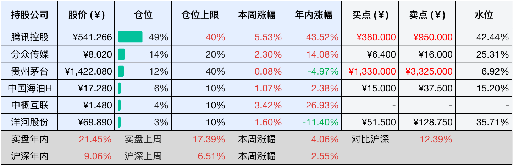
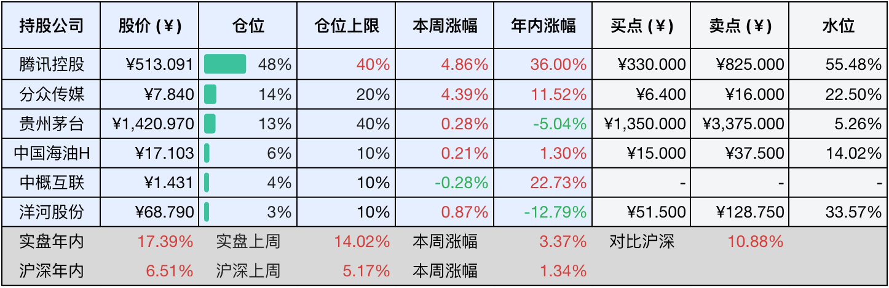

__微信公众号文章地址：[老罗投资周记-20250816](https://mp.weixin.qq.com/s/9XJavsOtK6NPTUwosJxSXw)__

```
老罗投资周记，每周六更新。专注于股权投资、阅读、学习与个人成长，知行合一、日拱一卒、投资人生。微信公众号【老罗投资】，文章均首发于公众号。
```

### 1. 本周交易

无

### 2. 目前持仓

当前持有的股票包括：腾讯控股 49%、分众传媒 14%、贵州茅台 12%、中国海油H 6%、中概互联 4%、洋河股份 3%。

此外还有部分现金，加上少量的海康威视、恒瑞医药、上海机场、宋城演艺等股票，其份额较少，仅作为观察仓不进行记录。

本周投资组合整体涨跌<span class="red">+4.06%</span>，年内收益率<span class="red">+21.45%</span>。

**注：**

1. 表格底部数据为老罗与沪深300指数年内收益率对比。
2. 港股持仓已按实时汇率换算为人民币。
3. 本周估值有调整的腾讯控股和贵州茅台买点与卖点已标红。



### 3. 上周数据



### 4. 本周事项

+ 贵州茅台半年报
+ 腾讯控股Q2财报
+ 分众传媒年度分红下周到账

==只对持股和交易感兴趣的朋友，读到这里就可以退出了。后面是对上述事件的展开，无新内容。==

#### 4.1 贵州茅台半年报

贵州茅台2025年上半年实现营业总收入910.94亿元，同比增长9.16%，归属于上市公司股东的净利润454.03亿元，同比增长8.89%。尽管维持了增长态势，但营收增速为近十年同期首次降至个位数，净利润增幅也创2015年以来新低。

​​业务结构方面​​，茅台酒仍然是核心支柱，收入755.9亿元，同比增长10.24%，增速高于公司整体水平。系列酒收入137.63亿元，仅增长4.69%，第二季度同比下滑6.52%，显示其作为第二增长曲线的潜力尚未充分释放。渠道转型持续推进，直销收入400.1亿元，同比增长18.63%，占总营收44.76%。其中i茅台平台贡献107.6亿元收入，批发代理渠道收入493.43亿元，增速放缓至2.83%。

​​国际化成为亮点​​，海外市场营收28.93亿元，同比增长31.26%，反映茅台通过分级市场策略与国际IP合作（如大阪世博会纪念酒）的成效。但国内经销商合同负债同比大降42.59%至55.07亿元，显示渠道库存压力增大，经销商打款意愿减弱。

​​财务表现存在一定的隐忧​​，经营活动现金流净额131.19亿元，同比下降64.18%，公司解释为财务公司存款结构调整，但市场仍然担忧实际上是销售承受较大压力。销售费用同比增长24.56%至32.6亿元，主要是因为广告投入增加，进一步挤压了利润空间。

​​行业与战略调整​​方面，白酒行业整体面临深度调整，规模以上酒企产量下滑5.8%，价格倒挂现象覆盖60%企业。茅台主动将全年营收增长目标从15%下调至9%，转向商务+礼赠+个人消费的多元场景驱动。产品端推出蛇年生肖酒、1L装飞天等新品，渠道端强化i茅台与即时零售布局，试图通过精细化运营应对市场变化。

​​总结来看​​，茅台在行业寒冬中维持了基本面稳健，但个位数增长与现金流压力反映出渠道动销放缓、系列酒增长乏力等挑战。其战略重心已经从追求高增速转向渠道优化与国际化突破，能否通过产品创新与场景拓展重塑增长动能，仍需要观察中秋、国庆等关键节点的市场反馈。

下面是对茅台的估值调整环节：

+ 营收​​：893.89亿元（同比+9.1%），其中茅台酒755.90亿元（同比+10.24%），系列酒137.63亿元（同比+4.69%）。
+ ​净利润​​：归母净利润454.03亿元（同比+8.89%），日均盈利约2.5亿元。
+ ​现金流​​：经营活动现金流净额131.19亿元（同比-64.18%），主因财务公司存款结构变化。
+ ​渠道结构​​：直销收入400.10亿元（占比44.76%，同比+18.6%），批发代理收入493.43亿元（占比55.24%，同比+2.83%）。
+ ​产能基础​​：茅台酒基酒产量4.37万吨，系列酒基酒产量2.96万吨，质量稳中向好。
+ ​国际化进展​​：海外收入28.93亿元（同比+31.26%），增速显著高于国内（+8.74%）。
+ ​回购计划​​：截至7月底累计回购345.17万股（耗资53.01亿元），均价约为1536元每股。

2024年经营活动现金流净额长期高于净利润，2025H1现金流波动主因财务操作（非经营恶化），利润真实性并没有受损。​利润可持续​​，护城河稳固​，品牌壁垒（毛利率91.3%）、定价权（飞天茅台出厂价与批发价价差）、渠道优化（直销占比提升至45%）。​增长韧性​​，管理层明确2025年的营收增速目标9%，国际化与高附加值产品（生肖酒、文化酒）支撑长期的增长。​无需大量资本投入​​，资本开支依赖自有现金流（资产负债率14.75%），回购与分红（2024年派息300亿）印证其轻资产模式不需要大量资本再投入。

在三大验证前提​​皆为真的前提下，​​2027年净利润​​保守增速调整为862.28×(1.09³)≈1117亿元，​​三年后合理市值​​1117×30=33510亿，​​理想买点(50%)​​为33510×50%=16755亿，股价≈1330元，​​一年内卖点股价≈3325元。

关键风险提示：

+ 上半年净利润增速8.89%创2015年以来新低，合同负债同比下降42.6%，经销商打款意愿减弱。
+ 消费税改革若落地，可能会侵蚀净利率。
+ 其他​​黑天鹅事件。

#### 4.2 腾讯控股Q2财报

8月13日盘后，腾讯控股交出一份超预期的成绩单。2025年第二季度营收达​​1845亿元​​，同比增长15%。经营利润（Non-IFRS）​​692.5亿元​​，同比增长18%。上半年总营收突破​​3645亿元​​，归母净利润​​1034.49亿元​​，同比增长16%。

​​游戏方面：本土稳中有进，海外狂飙​。​本土市场凭借《三角洲行动》的爆发（日活破2000万、跻身流水Top3）及《王者荣耀》《和平精英》的长青化运营，收入同比增长17%至404亿元。国际市场则借力《PUBG MOBILE》《沙丘：觉醒》等爆款，收入飙升35%至188亿元，连续四个季度创历史新高。​​AI技术深度融入游戏开发​​，虚拟队友的拟真交互、AI驱动的玩家定位策略，成为拉新留存的关键因素。

​​广告方面：技术升级激活生态潜力，​​营销服务收入同比增长20%至358亿元，连续11个季度保持两位数的增长。核心驱动力来自​​AI广告平台的精准化升级​​，混元大模型优化了从创意生成、投放策略到效果分析的全链路效率，叠加微信视频号、小程序交易生态的活跃度提升，广告主付费意愿显著增强。

​​企业服务方面：AI变现路径初现，​​金融科技及企业服务收入同比增长10%至555亿元。其中​​GPU租赁与API Token使用​​成为新的增量，反映企业客户对AI算力需求的激增。同时微信支付、理财服务及跨境业务（比如马来西亚DuitNow接入了260万商户）支撑了金融科技的稳健增长。

腾讯当季研发投入​​202.5亿元​​（同比增17%），资本开支更是同比飙升​​119%至191亿元​​，主要用于GPU采购、数据中心扩建及AI基础设施。这一激进投入背后，是混元大模型技术体系的快速迭代。但​​中国用户已经习惯免费使用AI工具，付费转化难度极高​​。公司正探索广告+服务的混合变现路径，例如在元宝中嵌入品牌合作内容，但短期内仍需依赖游戏与广告反哺AI投入。此外国际业务扩张面临地缘挑战，中东数据中心建设、日本办公室设立虽然显示其雄心，但合规成本与竞争压力不容小觑。

财报发布当天，腾讯股价大涨4.74%至586港元，创下四年来新高，市值单日激增超过2200亿港元。上半年腾讯以​​365亿港元回购并注销8186万股​​，传递出对长期价值的坚定信心，不过，当前股价距历史峰值730港元还有差距。

下面是对腾讯的估值调整环节：

​​2025年预测净利润（Non-IFRS）​​，结合Q2超预期表现及券商共识，上修至​​2600亿元​。​三年复合增速​​维持年化10%-12%（基于游戏出海、广告提效、AI商业化潜力）。​合理PE倍数​​：25-30倍（参考历史中枢及AI转型的溢价）。

2027年净利润×25倍PE约为8.5万亿港元，​​理想买点​​合理市值×50%，股价420港币≈380人民币，​一年内卖点​​1050港币≈950人民币。

关键风险提示：

+ AI投入产出比​​，资本开支同比+119%，如果商业化（如广告融合、企业服务）滞后，短期盈利将会承压。​
+ 游戏政策风险​​，版号发放节奏、未成年人防沉迷新规可能影响新游戏上线。
+ ​竞争加剧​​，字节跳动短视频分流用户时长，阿里云、华为云争夺企业客户。

#### 4.3 分众传媒年度分红下周到账

分众传媒的年度分红即将落地，这笔总计33亿元的现金红利将在下周正式到账，股权登记日定为2025年8月21日，除权除息日则是8月22日，只要在8月21日收盘时仍持有分众传媒股票，便能在当晚或者次日通过证券账户收到这笔分红款。

今年的年度分红比较晚，应该是受重大收购的影响，公司此前公告计划收购新潮传媒100%股权，初始方案中股份发行价格定为5.68元每股。但受到这次分红的影响，发行价被调整为5.45元每股，发行股份数量因此从14.4亿股增加至15.01亿股。这一调整意味着新潮传媒的股东将额外获得约7000万股分众股票，按当前股价折算，相当于被动增值5.6亿元。对分众股东而言，这将带来大约0.5%的股权稀释，但这是收购交易条款约束下无法规避的结果。

分红到账后，估计还是看时机买入贵州茅台或五粮液，相较于分众，白酒行业目前更为便宜。

### 5. 本周读书

#### 5.1 《源代码》

本书是比尔盖茨的自传，读起来有点像喝白开水，没有什么波澜，也没有什么让人眼前一亮的爆点。倒不是说本书写得有多差，主要是盖茨本人的魅力值好像没点满，跟乔布斯那种自带现实扭曲力场、一开口就能让人热血沸腾的大佬，或是跟查理芒格那种随便说句人生智慧，都能被当成金句摘抄，行走的智囊相比，他更像个隔壁认真搞技术的学霸，靠谱是很靠谱，但少了点让人疯狂着迷的个人魅力。

不过这书也不是完全没宝藏，就像在平淡的剧情里突然冒出个神转折，它偷偷藏了个成功人士的通关秘籍：专注。

评分三星半⭐️⭐️⭐️❤️

### 6. 本周运动

本周运动五次，遛弯三次，跳操二次，体重继续下降中。

如果觉得本文还不错，那就点个赞或者在看吧，祝大家周末愉快！

```
老罗投资周记，每周六更新。专注于股权投资、阅读、学习与个人成长，知行合一、日拱一卒、投资人生。微信公众号【老罗投资】，文章均首发于公众号。
免责声明：本公众号只作为本人的投资日志记录，本文中提及的个股都有腰斩或血本无归的风险，本人不做任何投资建议，投资请坚持独立思考。
```

__微信公众号文章地址：[老罗投资周记-20250816](https://mp.weixin.qq.com/s/9XJavsOtK6NPTUwosJxSXw)__