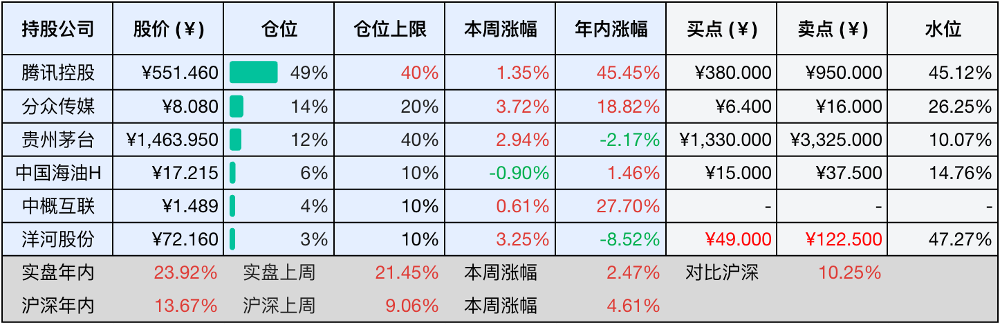

__微信公众号文章地址：[老罗投资周记-20250823](https://mp.weixin.qq.com/s/XRzFcjm7nK-P4ayZBh3KYw)__

```
老罗投资周记，每周六更新。专注于股权投资、阅读、学习与个人成长，知行合一、日拱一卒、投资人生。微信公众号【老罗投资】，文章均首发于公众号。
```

### 1. 本周交易

无

### 2. 目前持仓

当前持有的股票包括：腾讯控股 49%、分众传媒 14%、贵州茅台 12%、中国海油H 6%、中概互联 4%、洋河股份 3%。

此外还有部分现金，加上少量的海康威视、恒瑞医药、上海机场、宋城演艺等股票，其份额较少，仅作为观察仓不进行记录。

本周投资组合整体涨跌<span class="red">+2.47%</span>，年内收益率<span class="red">+23.92%</span>。

**注：**

1. 表格底部数据为老罗与沪深300指数年内收益率对比。
2. 港股持仓已按实时汇率换算为人民币。
3. 本周估值有调整的洋河股份买点与卖点已标红。



### 3. 上周数据


### 4. 本周事项

+ A股首次突破100万亿元大关
+ 洋河25年半年报

==只对持股和交易感兴趣的朋友，读到这里就可以退出了。后面是对上述事件的展开，无新内容。==

#### 4.1 A股首次突破100万亿元大关

8月18日上午10点，A股市场迎来了历史性时刻：总市值第一次站上100万亿元大关。这波标志性突破的背后，本周市场表现也很亮眼，沪指强势往上走，一举冲过3800点，创下近十年来的新高。

在众多板块里，券商股的涨幅最大，其中长城证券已连收4个涨停，同花顺单日涨了14%，市值很快冲到2250亿元。这波行情不是凭空来的，东方财富上半年利润涨了37%，西部证券刚完成对国融的并购重组，行业集中度也在慢慢提升。

百万亿市值背后，市场正在悄悄发生变化，和2015年靠杠杆资金炒起来的疯牛不一样，这轮从4月3040点涨起来、累计涨了20%+的行情里，没再出现配资乱象，监管层也没出手干预。真正托住市场的，是社保、险资这些长期持有的稳定资金，它们的占比从十年前的18%升到了现在的35%。虽说两融余额破了2万亿元，但杠杆率还在安全范围之内。

更值得留意的是，市场看估值的逻辑变了，农业银行以2.19万亿元市值超过贵州茅台，成了A股市值一哥。但看业绩数据，农行上半年利润只涨了4.2%，市场偏爱它，不是因为增速快，而是看重稳定的分红和低估值。另一边宁德时代在创业板的权重占了7.3%，这说明资金更愿意给有技术壁垒的企业投票，不再盲目追规模。这种分化其实是好事，意味着资金不瞎炒概念了，真的开始盯着企业基本面。

眼下市场的底子比以前扎实多了，央行数据显示，7月份居民存款少了1.1万亿元，非银存款却多了2.14万亿元，这背后是老百姓的钱在慢慢往股市搬家。新增开户数到了196万户，比去年同期多了71%，不断给市场添新的活力。往深了看，企业端也有好变化，上半年A股公司研发投入增速达18.7%，是营收增速的三倍。

站在百万亿市值这个节点回头看，市场未来的方向越来越清楚。对散户来说，农行登顶市值第一是个明确信号，跟风炒作的时代过去了，得沉下心研究企业基本面。对监管层而言，怎么平衡500多家排队IPO的企业和退市新规，考验着对市场出清机制的把控能力。

现在的A股，只有制度完善慢慢替代了短期刺激，找好公司替代炒概念成了市场主流，这个迈入百万亿级别的市场，才真的能扛起中国经济未来的担子。

#### 4.2 洋河25年半年报

8月18日晚，洋河股份交出了2025年上半年的成绩单，营收147.96亿元，净利润43.44亿元。单看数字这份成绩不算亮眼，营收同比下滑35%，净利润缩水45%，创下2009年上市以来的最大跌幅。省外市场跌得尤其明显，42.7%的降幅远高于省内的25.8%，曾经扛起业绩大旗的中高端产品线，如今也少了近四成的进账。

行业寒潮下，没有谁能独善其身，全国白酒产量上半年下滑5.8%，消费趋于理性，商务宴请缩减，婚宴用酒也从讲排场转向重实惠。洋河手里的经销商少了257家，库房里还压着192亿的存货，预收货款更是大减43%，这些数字都指向同一个问题，卖酒越来越难了。

在江苏省，洋河的名字几乎和白酒划等号，婚庆市场的餐桌上，梦之蓝水晶版依旧是首选，渠道深入到县城甚至乡镇，连小卖部的冰柜里都常年备着海之蓝。省内71亿的收入虽然比往年少了，但市场份额没丢，稳定的市场份额，成了洋河眼下最珍贵的缓冲带。

海之蓝年销过亿瓶的纪录不是虚名，第七代升级版今年3月推出，酒体里加了五年陈的调味酒，入口更绵甜。定价59元的洋河光瓶酒6月正式上线，48小时卖空一万瓶，冲上京东热卖榜首。新品未必立刻反映在财报上，但至少说明消费者对老牌子仍然抱有信任。

洋河目前账上躺着170亿现金，负债率不到20%，这是洋河敢主动调整的底气。年中还宣布每10股分红46.5元，拿70亿回馈股东，行业寒冬里肯这么撒钱的，要么是真的心大，要么是真有储备有粮不慌，洋河显然是属于后者。

洋河这半年做了两件看似矛盾的事：一边控量稳价，宁可少卖也要守住主导产品的价格体系；一边全力推新品，光瓶酒和升级版海之蓝双管齐下。慢不是躺平，而是腾出手换打法。渠道上，省外经销商减少268家，省内反倒增加11家，呈现出收缩战线、精耕省内的策略。7月份换帅后，新董事长顾宇从地方转战企业，但白酒这行，最终还得靠酒说话，好在洋河窖池里还存着百万吨原酒，其中23万吨是用高端陶坛储藏的。时间酿出的酒，终究要交给时间去兑现。

这份半年报，记录了一家酒企面对行业转折时的清醒，省内基本盘未松，新品试探初显水花，现金储备和分红力度传递着底气。当下白酒行业的竞争，早已经不是比谁跑得快，而是看谁踩得稳。洋河手里那杯酒，一半盛着短期阵痛，一半斟满长期筹码。

以下是对洋河股份估值调整环节：

业绩大幅下滑

+ 营收：147.96亿元（同比-35.32%），其中中高档酒收入126.72亿元（同比-36.52%），普通酒收入18.41亿元（同比-27.24%）。
+ 净利润：43.44亿元（同比-45.34%），毛利率73.4%（同比-0.4%），净利率19.0%（同比-9.6%）。
+ 现金流：经营活动现金流净额6.16亿元（同比-69.85%），合同负债58.78亿元（较年初减少了43%）。

核心问题

+ 渠道库存：渠道去库存持续，销量同比-32.35%，产量同比-51.63%。
+ 区域分化：省内收入71.21亿元（同比-25.8%），省外收入73.92亿元（同比-42.68%）。

估值粗估

+ 三年后净利润：按每年增长5%计算，43.44x(1.05³)≈50亿元。
+ 合理PE区间：30倍，白酒行业默认给30倍PE。
+ 合理市值：50亿x30PE=1500亿元。
+ 理想买点（50%）：1500亿×50%=750亿元（股价50元）。
+ 一年内卖点：股价125元。

核心风险

+ 需求疲软延续：中高端酒占比86%，若消费降级持续则毛利率承压。
+ 省外拓展受阻：省外收入下滑42.7%，全国化战略成效待验证。

转机信号

+ 库存去化：渠道库存降至2个月以下（当前约3个月）。
+ 产品结构优化：梦之蓝M6+批价站稳600元，光瓶酒占比提升至15%。
+ 现金流改善：经营性现金流净额回正，合同负债环比增长。

### 5. 本周读书

#### 5.1 《朱镕基讲话实录 第三卷》

无论身处高位还是居于幕后，人们怀揣的梦想、拥有的智慧、涌动的热血、秉持的壮志以及展现的勇气，终究会被岁月长河渐渐带走，但他们为社会留下的宝贵财富，却永远不会就此中断。朱镕基总理堪称当代中国经济改革的关键掌舵者，他足智多谋、果敢善断，比起古代贤相也毫不逊色。

在复杂的经济局势面前，他凭借卓越的智慧和坚定的决心，主导推动了一系列影响深远的改革举措，像财税改革、国企改革等，为中国经济的腾飞奠定了坚实基础，其功绩在经济发展史上留下了浓墨重彩的一笔。

评分五星⭐️⭐️⭐️⭐️⭐️

### 6. 本周运动

本周运动四次，全部是遛弯，体重本周变化不大。

如果觉得本文还不错，那就点个赞或者在看吧，祝大家周末愉快！

```
老罗投资周记，每周六更新。专注于股权投资、阅读、学习与个人成长，知行合一、日拱一卒、投资人生。微信公众号【老罗投资】，文章均首发于公众号。
免责声明：本公众号只作为本人的投资日志记录，本文中提及的个股都有腰斩或血本无归的风险，本人不做任何投资建议，投资请坚持独立思考。
```

__微信公众号文章地址：[老罗投资周记-20250823](https://mp.weixin.qq.com/s/XRzFcjm7nK-P4ayZBh3KYw)__