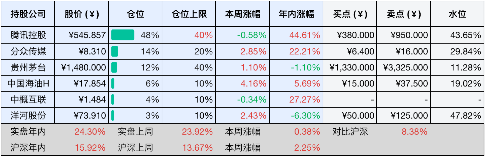
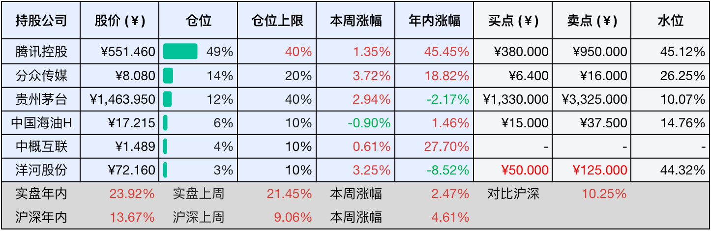

__微信公众号文章地址：[老罗投资周记-20250830](https://mp.weixin.qq.com/s/sQKsC1TlwHLy77_0olLbMQ)__

```
老罗投资周记，每周六更新。专注于股权投资、阅读、学习与个人成长，知行合一、日拱一卒、投资人生。微信公众号【老罗投资】，文章均首发于公众号。
```

### 1. 本周交易

无

### 2. 目前持仓

当前持有的股票包括：腾讯控股 48%、分众传媒 14%、贵州茅台 12%、中国海油H 6%、中概互联 4%、洋河股份 3%。

此外还有部分现金，加上少量的海康威视、恒瑞医药、上海机场、宋城演艺等股票，其份额较少，仅作为观察仓不进行记录。

本周投资组合整体涨跌<span class="red">+0.38%</span>，年内收益率<span class="red">+24.30%</span>。

**注：**

1. 表格底部数据为老罗与沪深300指数年内收益率对比。
2. 港股持仓已按实时汇率换算为人民币。



### 3. 上周数据



### 4. 本周事项

+ 分众传媒半年报
+ ​中国海油半年报

==只对持股和交易感兴趣的朋友，读到这里就可以退出了。后面是对上述事件的展开，无新内容。==

#### 4.1 分众传媒半年报

8月29日，分众传媒发布了2025年半年度报告，交出了一份营收61.12亿元、净利润26.65亿元的成绩单，相比去年同期，这两项数据分别增长了2.43%和6.87%。在整体广告市场低增长、高波动的背景下，分众依然保持着盈利能力，毛利率68.29%，净利率43.36%。同时还宣布派发2025年中期股息每股0.10元（含税），合计派发现金红利14.44亿元，今年两次分红之后，去年赚的钱基本都会分掉。

分众传媒今年上半年的增速确实有所放缓，但从盈利能力来看，毛利率和净利率不仅处于较高水平，较去年同期还有所提升。坚实的盈利能力背后，分众的现金流表现也不错，上半年公司经营活动产生的现金流量净额达34.02亿元，同比增长15.56%，显示出非常强劲的现金流创造能力。

分众传媒的核心业务仍集中在生活圈媒体领域，主要包括楼宇媒体（电梯电视和电梯海报）和影院银幕广告媒体。上半年，楼宇媒体业务收入56.32亿元，占总营收的92.14%，成为绝对的主力业务；影院媒体收入4.69亿元，占比7.67%；其他媒体业务仅占0.19%。从客户结构来看，日用消费品行业占据了半壁江山，占比51.59%；互联网行业则以15.73%的占比位居第二，并且同比增长高达88.82%，成为增长最快的行业类别。

上半年，分众传媒最引人关注的战略动作，莫过于拟以83亿元收购新潮传媒100%股权，这一交易已经获得公司临时股东大会审议通过。如果收购成功，分众和新潮在中国户外广告市场的合计占有率将超过17%，进一步巩固分众在户外广告市场的领导地位。

因为分众传媒属于强周期行业，估值使用近10年利润相加的席勒估值法，代入半年的利润计算后估值变化不大，所以暂时不作调整。

#### 4.2 ​中国海油半年报

中国海油于8月27日正式发布2025年中期业绩报告，上半年公司实现营业收入2076亿元，油气销售收入1717亿元，归属于母公司股东的净利润为695亿元。在国际油价下行的大背景下，布伦特原油现货平均价格同比下降14.5%，中国海油的净利润降幅在三桶油中处于中间水平。同时，中国海油半年报宣布派发2025年中期股息每股0.73港元（含税），分红比率达45.6%，保持了非常稳定的股东回报政策。

尽管业绩同比有所下滑，中国海油在油气产量、成本控制及绿色转型方面仍表现稳健。上半年公司净产量达3.85亿桶，同比增长6.1%，创历史同期新高。其中国内油气净产量为2.67亿桶油当量，同比增长7.6%；海外油气净产量为1.18亿桶油当量，同比增长2.8%。天然气产量大幅提升12%，主要得益于深海一号二期全面投产所带来的产量贡献。该项目全面投产后，高峰年产气量预计超过45亿立方米，成为中国最大的海上气田。

上半年，三桶油业绩整体都承受压力，总利润同比减少290.5亿元，相当于每天少赚约1.6亿元。具体看，中国石油营业收入1.45万亿元，同比下降6.7%，归母净利润839.93亿元，同比下降5.4%。中国石化营业收入1.41万亿元，同比下降10.6%，归母净利润214.83亿元，同比降幅达39.8%，为三桶油中最高。

中国海油同属于周期行业，估值也暂不调整。

### 5. 本周读书

#### 5.1 《隆庆皇帝大传：如何躺赢》

有点货不对版，看完全书也没发现隆庆皇帝是如何躺赢的，很奇怪这本书是如何在微信读书上评为神作的，不建议阅读。

评分三星⭐️⭐️⭐️

#### 5.2 《蜉蝣直上》

这本书真切记录了一个普通人在生活中的跌撞与前行，在困境中不断追寻自我、突破自我的历程。众生皆如蜉蝣，渺小却并不卑微，只要怀抱希望，坚持努力，终会迎来属于自己的高光时刻。

评分四星⭐️⭐️⭐️⭐️

#### 5.3 《从危机中赚钱的人，相信全球金融系统是个纸牌屋》

这感觉都不能称之为一本书，倒有点像某本书的序，一共都不到一万字。本书的核心思路是在黑天鹅事件中如何获得超额收益，属于七英尺高的跨栏，不是我这种凡夫俗子可以驾驭的。

另微信读书的书评价值高于这本书。

评分三星半⭐️⭐️⭐️❤️

### 6. 本周运动

本周运动六次，全部是遛弯，体重减去一公斤。

如果觉得本文还不错，那就点个赞或者在看吧，祝大家周末愉快！

```
老罗投资周记，每周六更新。专注于股权投资、阅读、学习与个人成长，知行合一、日拱一卒、投资人生。微信公众号【老罗投资】，文章均首发于公众号。
免责声明：本公众号只作为本人的投资日志记录，本文中提及的个股都有腰斩或血本无归的风险，本人不做任何投资建议，投资请坚持独立思考。
```

__微信公众号文章地址：[老罗投资周记-20250830](https://mp.weixin.qq.com/s/sQKsC1TlwHLy77_0olLbMQ)__