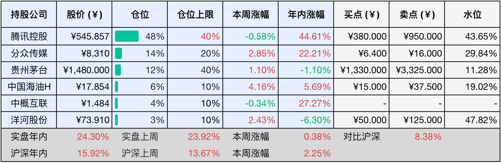

__微信公众号文章地址：[老罗投资周记-20250906](https://mp.weixin.qq.com/s/m6ixbuKB7IMGGNLlA74sHw)__

```
老罗投资周记，每周六更新。专注于股权投资、阅读、学习与个人成长，知行合一、日拱一卒、投资人生。微信公众号【老罗投资】，文章均首发于公众号。
```

### 1. 本周交易

周四(9月4日)买入五粮液(000858)，买入价格为125.00元人民币。

### 2. 目前持仓

当前持有的股票包括：腾讯控股 48%、分众传媒 14%、贵州茅台 12%、中国海油H 6%、中概互联 4%、洋河股份 3%。

此外还有部分现金，加上少量的恒瑞医药、海康威视、五粮液、上海机场、宋城演艺等股票，其份额较少，仅作为观察仓不进行记录。

本周投资组合整体涨跌<span class="red">+1.37%</span>，年内收益率<span class="red">+25.67%</span>。

**注：**

1. 表格底部数据为老罗与沪深300指数年内收益率对比。
2. 港股持仓已按实时汇率换算为人民币。


### 3. 上周数据



### 4. 本周事项

+ 买入五粮液

==只对持股和交易感兴趣的朋友，读到这里就可以退出了。后面是对上述事件的展开，无新内容。==

#### 4.1 买入五粮液

本周四，我以125元的价格少量买入了五粮液（股票代码：000858），此次操作更多是出于建立观察仓位的考虑，为后续策略做铺垫。


其实早在五粮液发布中报之前，我就已经对这家公司做了初步的估值分析，根据当时的判断，合理买入价格应当在105元附近，而高估区间则位于262.5元左右。也就是说，当前125元的市价，其实已经超出了我原计划水位约20%。

那为什么仍然选择在这个时点买入？最主要的原因是近期大盘整体情绪较热，五粮液股价也一直在125元上下盘整，始终未出现明显回调。我之前曾设置过两个分批买入条件单：115元和105元，但挂单等待一两个月都未能成交。正好这周市场出现小幅调整，我决定先试探性建仓，既避免因执着低位而完全踏空，也为之后可能的回调预留补仓空间。

投资有时候需要保持耐心，但也不应因过度保守而错失机会。小幅建仓，既不破坏纪律，也维持了对目标的关注。后续我的买入计划依旧保持不变：继续蹲守115元以下的五粮液，以及1350元以下的贵州茅台。价值投资从来不是一步到位，而是分批布局、控制成本，冷静等待好公司出现好价格。

回过头看本周，我“旗下”的其他公司并没有发生重大事件。某种意义上，平安无事本身就是一种利好，稳定经营、无突发利空，反而是踏实持有、积累资产的良好环境，投资不在于抓住每一个波动，而在于守住自己的投资逻辑，平稳增值。资产慢慢变多，才是我们应当走的大道。

### 5. 本周读书

#### 5.1 《生育制度》

生育制度并非源于生物本能，而是社会为了维持自身结构的延续和稳定，所创造出来的一套文化安排，生育本质上是损己利人的。

本书居然是1946年创作，1947年初版，作者是当代著名社会学家费孝通，值得一读。

评分四星⭐️⭐️⭐️⭐️

### 6. 本周运动

本周运动四次，全部是遛弯，体重减去1.5斤。

如果觉得本文还不错，那就点个赞或者在看吧，祝大家周末愉快！

```
老罗投资周记，每周六更新。专注于股权投资、阅读、学习与个人成长，知行合一、日拱一卒、投资人生。微信公众号【老罗投资】，文章均首发于公众号。
免责声明：本公众号只作为本人的投资日志记录，本文中提及的个股都有腰斩或血本无归的风险，本人不做任何投资建议，投资请坚持独立思考。
```

__微信公众号文章地址：[老罗投资周记-20250906](https://mp.weixin.qq.com/s/m6ixbuKB7IMGGNLlA74sHw)__