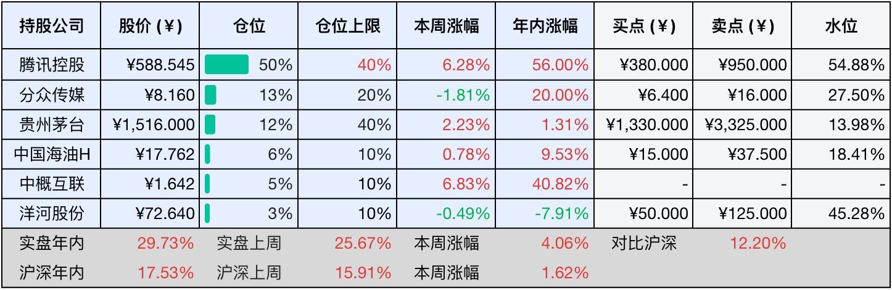
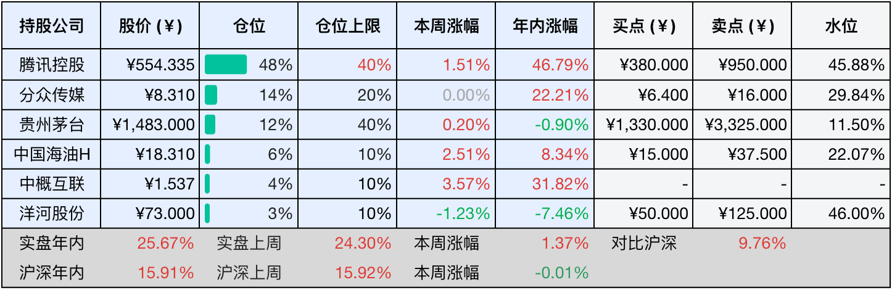

__微信公众号文章地址：[老罗投资周记-20250913](https://mp.weixin.qq.com/s/uJ4uVHTPcftzmXwAG4JC6A)__

```
老罗投资周记，每周六更新。专注于股权投资、阅读、学习与个人成长，知行合一、日拱一卒、投资人生。微信公众号【老罗投资】，文章均首发于公众号。
```

### 1. 本周交易

无

### 2. 目前持仓

当前持有的股票包括：腾讯控股 50%、分众传媒 13%、贵州茅台 12%、中国海油H 6%、中概互联 5%、洋河股份 3%。

此外还有部分现金，加上少量的恒瑞医药、海康威视、五粮液、上海机场、宋城演艺等股票，其份额较少，仅作为观察仓不进行记录。

本周投资组合整体涨跌<span class="red">+4.06%</span>，年内收益率<span class="red">+29.73%</span>。

**注：**

1. 表格底部数据为老罗与沪深300指数年内收益率对比。
2. 港股持仓已按实时汇率换算为人民币。



### 3. 上周数据



### 4. 本周事项

+ 中国海洋石油特别分红
+ 恒生指数创四年来新高

==只对持股和交易感兴趣的朋友，读到这里就可以退出了。后面是对上述事件的展开，无新内容。==

#### 4.1 中国海洋石油特别分红

中国海洋石油公司董事会近日通过了2025年中期股息分配方案，宣布向全体股东派发每股0.73港元（含税）的中期股息。这次派息将于9月11日除权除息，9月12日进行股权登记，并计划在10月17日正式发放股息。

根据股息派发的具体安排，A股股东的股息将以人民币支付，折算汇率按董事会宣布派息日前一周，中国人民银行公布的港元对人民币中间价平均值进行计算，而港股股东的股息将直接以港元支付，通过港股通持股的投资者需要扣除28%的红利税。如果在股权登记日前公司总股本发生变动，公司表示将维持每股派息金额不变，仅对分配总额进行相应调整。

这次分红体现了中海油在复杂市场环境下的稳健经营能力，2025年上半年，受国际油价震荡下行影响，布伦特原油现货平均价格同比下跌14.5%，在这样的背景下，中海油实现营业收入2076.08亿元，同比下降8.45%，归母净利润695.33亿元，同比下降12.79%。

尽管业绩短期压力较大，公司依然保持了53.47%的高毛利率和29.54%的资产负债率，表现出优秀的成本控制能力和财务稳健性。同时，上半年公司经营性现金流净额达到1091.82亿元，为这次分红提供了坚实保障。

#### 4.2 恒生指数创四年来新高

9月以来，港股市场表现强劲，恒生指数在9月10日收盘站上26200.26点，不仅稳稳拿下26000点整数关口，更是刷新了自2021年8月以来的历史高位。到9月12日收盘，恒生指数一周累计上涨了3.82%，报收26388.16点。这一波上涨行情中，市场交投活跃，投资者情绪高涨。

与之前的行情不同，这一轮港股上涨的推动力主要来源于互联网、生物医药等新经济板块，这些企业通过人工智能、云计算等核心业务的持续创新，打开了新的增长空间。腾讯股价创出四年新高，阿里年内涨幅超过75%，小米集团涨幅超过60%，这些龙头企业成为全球资金追捧的对象，带动了整个市场的情绪。

资金面的支撑是此轮行情的重要推动力，2025年南向资金以史诗级的速度加仓港股，截至9月9日已流入港股1.04万亿港元。9月12日，南向资金再度净买入约73.31亿港元，连续第11个交易日实现净买入。阿里巴巴-W、腾讯控股等龙头个股成为资金重点关注的对象。与此同时，欧美资金也逐步流入港股市场，国际资本不再单纯关注估值优势，更关注中国产业升级带来的长期价值。

与2020年至2021年的行情相比，这一轮上涨已有明显不同，那时行情是流动盛宴，主要受到美联储极度宽松的货币政策驱动。如今互联网龙头企业通过降本增效重拾增长，AI、云计算等新业务贡献第二增长点，同时新消费、生物科技等新经济板块成为行情绝对主力。市场关注点从传统行业的低估值、高股息，转向新经济赛道的高成长性与技术壁垒。

星展银行将恒指12个月目标上调到28000点，在乐观情景下甚至看高到30500点，市场参与者已经从单纯地寻找估值洼地，转向关注中国产业升级带来的长期价值，像AI、生物科技、新能源等赛道龙头公司的盈利能力持续提升，正吸引全球长线资金的重新配置。

### 5. 本周读书

#### 5.1 《以日为鉴：衰退时代生存指南》

现在的中国和日本越来越像了，确实，内卷很像，学历贬值很像，医疗改革很像，医患纠纷也很像，地产行业走向黄昏，全民热衷考公等，种种现象，仿佛是一种周期的重演。没有哪个国家能完全跳出发展的周期，如今的日本虽然GPD排名不断下滑，但凭借深入的医疗改革、企业的全球化布局和文化的输出，依然展现出不容小觑的韧性，谁也不能否认它在许多方面依然还很强大。

那么问题来了，在这个仿佛被周期笼罩的时代，我们究竟会走向何方？更重要的是，作为普通人，我们该如何自处？又该如何在这样的洪流中，尽量保全自己、甚至找到突破的可能？我想这才是我们最应该思考的问题。

评分四星半⭐️⭐️⭐️⭐️❤️

### 6. 本周运动

本周运动三次，全部是遛弯，体重减去2.1斤。

如果觉得本文还不错，那就点个赞或者在看吧，祝大家周末愉快！

```
老罗投资周记，每周六更新。专注于股权投资、阅读、学习与个人成长，知行合一、日拱一卒、投资人生。微信公众号【老罗投资】，文章均首发于公众号。
免责声明：本公众号只作为本人的投资日志记录，本文中提及的个股都有腰斩或血本无归的风险，本人不做任何投资建议，投资请坚持独立思考。
```

__微信公众号文章地址：[老罗投资周记-20250913](https://mp.weixin.qq.com/s/uJ4uVHTPcftzmXwAG4JC6A)__