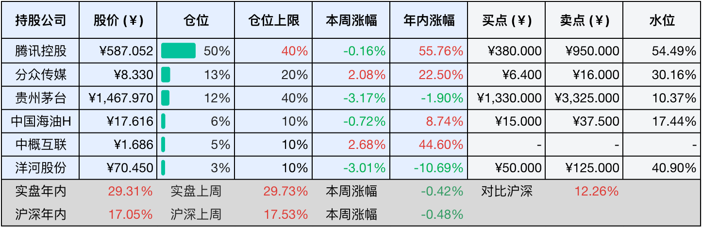

__微信公众号文章地址：[老罗投资周记-20250927](https://mp.weixin.qq.com/s/MO0HBsBeSHyrL_fCnJ8yWA)__

```
老罗投资周记，每周六更新。专注于股权投资、阅读、学习与个人成长，知行合一、日拱一卒、投资人生。微信公众号【老罗投资】，文章均首发于公众号。
```

### 1. 本周交易

无

### 2. 目前持仓

当前持有的股票包括：腾讯控股 50%、分众传媒 13%、贵州茅台 12%、中国海油H 6%、中概互联 5%、洋河股份 3%。

此外还有部分现金，加上少量的恒瑞医药、海康威视、五粮液、上海机场、宋城演艺等股票，其份额较少，仅作为观察仓不进行记录。

本周投资组合整体涨跌<span class="green">-0.35%</span>，年内收益率<span class="red">+28.96%</span>。

**注：**

1. 表格底部数据为老罗与沪深300指数年内收益率对比。
2. 港股持仓已按实时汇率换算为人民币。


### 3. 上周数据



### 4. 本周事项

仅记录下海康威视的半年度分红：2025年半年度分配方案为每10股派4元（含税），股权登记日10月9日，除权除息日10月10日。

本周生病休息，其他重要事项略过。

### 5. 本周读书

#### 5.1 《达尔文岛：他说41岁想换一种人生》

原来不止20岁的人迷茫，40岁的人同样迷茫，或许60岁的人也找不到意义，人生任何时候都可能带有疑问，某个年纪以为自己懂了，过几年又不懂了。

评分四星⭐️⭐️⭐️⭐️

#### 5.2 《朝圣之路：即使失去所有，你也要走自己的路》

你一定要有信念，不要想太远，50公里或100公里，只需要不断地把一只脚放在另一只脚的前面。

评分四星⭐️⭐️⭐️⭐️

### 6. 本周运动

本周病休没有运动，体重暂无变化。

如果觉得本文还不错，那就点个赞或者在看吧，祝大家周末愉快！

```
老罗投资周记，每周六更新。专注于股权投资、阅读、学习与个人成长，知行合一、日拱一卒、投资人生。微信公众号【老罗投资】，文章均首发于公众号。
免责声明：本公众号只作为本人的投资日志记录，本文中提及的个股都有腰斩或血本无归的风险，本人不做任何投资建议，投资请坚持独立思考。
```

__微信公众号文章地址：[老罗投资周记-20250927](https://mp.weixin.qq.com/s/MO0HBsBeSHyrL_fCnJ8yWA)__