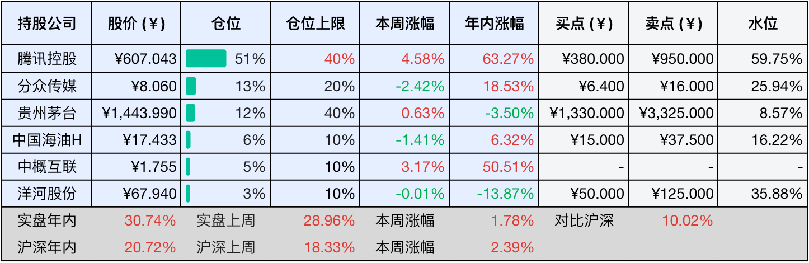
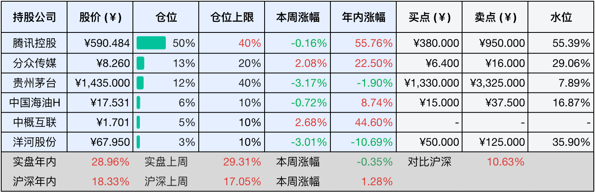

__微信公众号文章地址：[老罗投资周记-20251004](https://mp.weixin.qq.com/s/BBo5HhoSmWH34MpP2yxdfg)__

```
老罗投资周记，每周六更新。专注于股权投资、阅读、学习与个人成长，知行合一、日拱一卒、投资人生。微信公众号【老罗投资】，文章均首发于公众号。
```

### 1. 本周交易

周一(9月29日)买入五粮液(000858)，买入价格为120.00元人民币。

### 2. 目前持仓

当前持有的股票包括：腾讯控股 51%、分众传媒 13%、贵州茅台 12%、中国海油H 6%、中概互联 5%、洋河股份 3%。

此外还有部分现金，加上少量的五粮液、恒瑞医药、海康威视、上海机场、宋城演艺等股票，其份额较少，仅作为观察仓不进行记录。

本周因为国庆假期，A股与港股市场交易日不同步，A股仅开盘两天，港股则交易了四天。值得注意的是，由于港股通在假期期间暂停，10月2日与3日这两个港股正常交易日的市场波动，并未通过港股通反映出来。

本周投资组合整体涨跌<span class="red">+1.78%</span>，年内收益率<span class="red">+30.74%</span>。

**注：**

1. 表格底部数据为老罗与沪深300指数年内收益率对比。
2. 港股持仓已按实时汇率换算为人民币。



### 3. 上周数据



### 4. 本周事项

+ 贵州茅台公布9月终端动销数据
+ 腾讯继续实施股份回购

==只对持股和交易感兴趣的朋友，读到这里就可以退出了。后面是对上述事件的展开，无新内容。==

#### 4.1 贵州茅台公布9月终端动销数据

茅台近期公布的一组市场数据，释放出了明确的回暖信号。贵州茅台总经理王莉带队完成的全国调研显示，今年9月以来，茅台酒在终端动销表现强劲，销量环比增长近一倍，同比增幅超过20%。

为了摸清市场的真实情况，王莉带领团队历时一个多月，深入华东、西南、东北、华北、西北等重点市场，从扬州、重庆到长春、北京、西宁，共组织了16场区域座谈会，与全国300余家经销商面对面交流，倾听一线真实的声音。

调研结果印证了市场企稳向好的趋势，回顾六、七月，白酒行业整体承压，茅台凭借精准的市场投放策略稳住基本面。进入八月，随着前期措施见效和国庆、中秋双节需求拉动，终端动销已呈现环比上升势头。

值得注意的是，茅台构建的4+6渠道体系在行业调整中展现出了较强的韧性，渠道库存明显下降，目前已经回归到了健康水平，反映出市场活力的真实恢复。在半个月前的中期业绩说明会上，茅台高管就已经释放出积极信号，指出8月底以来终端动销环比增长显著。

之前流传的“贵州茅台下调年度增长目标至5%”的消息，大概率为不实信息。

#### 4.2 腾讯继续实施股份回购

今年以来，腾讯持续稳坐港股回购王之位，前三季度，累计回购金额已达576.61亿港元，在全港股市场中一马当先，这一规模大幅超越了汇丰控股、友邦保险等同样积极回购的港股蓝筹。腾讯在今年3月份宣布了不低于800亿港元的年度回购计划，目前已经完成了约72%，推进节奏符合预期。

持续的回购也为股价注入动力，10月2日，腾讯股价盘中触及683港元每股，创下四年半新高，年初至今，累计涨幅已达63.27%，表现十分抢眼。腾讯的强势表现，也在一定程度上带动了港股大市回暖，截至9月30日，恒生指数与恒生科技指数分别累计上涨了35.30%和48.22%。

大规模的回购向来被视作上市公司信心的体现，腾讯通过回购并注销股份，将直接增厚每股收益，提升股东回报。在2025年，除了不低于800亿港元的回购外，腾讯还将现金分红提升32%至约410亿港元，预计全年总股东回报将超过1210亿港元。

### 5. 本周读书

#### 5.1 《伯利兹：生活在海底300米的人，感到孤独》

独与天地精神往来，而不敖倪于万物，不谴是非，以与世俗处。

伯利兹是中美洲唯一以英语为官方语言的国家，国名来自国内河流伯利兹河和最大城市伯利兹市，该市是伯利兹的旧首都，新首都为贝尔莫潘。

伯利兹东临洪都拉斯湾，与洪都拉斯隔湾相望，两国最近距离只有75千米，北与墨西哥接壤，西和南与危地马拉毗邻。

评分四星⭐️⭐️⭐️⭐️

#### 5.2 《你也只活了一次，凭什么说我选择的人生是错的？》

人们对生命不该贪恋，也不该自己放弃，应像橙子熟透后自然掉落。

本书包括乌干达、纳米比亚、卢旺达、肯尼亚、南非和莫桑比克等非洲一系列国家的游记，非洲旅行相当危险，若计划前往，务必三思而后行。

评分四星⭐️⭐️⭐️⭐️

#### 5.3 《亚马逊：和原始部落的土著一起生活》

人类也慢慢变成这样，所有人走路时，你走路就可以了。所有人跑，你也只能跑起来。所有人没日没夜地跑，你也不要命地日夜奔跑。

评分四星⭐️⭐️⭐️⭐️

#### 5.4 《西西里岛：邂逅时光中的松弛感》

命运总是很顽劣，它会让你得到一些曾经心心念念的东西，但得到的时机永远都不对。我们很多人一生都在寻找一些东西，但当你终于找到的时候，它往往已经损毁或永远失去了。

评分四星⭐️⭐️⭐️⭐️

### 6. 本周运动

本周运动两次，均为遛弯，最近没有节食，体重反弹了2斤。

如果觉得本文还不错，那就点个赞或者在看吧，祝大家国庆假期愉快！

```
老罗投资周记，每周六更新。专注于股权投资、阅读、学习与个人成长，知行合一、日拱一卒、投资人生。微信公众号【老罗投资】，文章均首发于公众号。
免责声明：本公众号只作为本人的投资日志记录，本文中提及的个股都有腰斩或血本无归的风险，本人不做任何投资建议，投资请坚持独立思考。
```

__微信公众号文章地址：[老罗投资周记-20251004](https://mp.weixin.qq.com/s/BBo5HhoSmWH34MpP2yxdfg)__