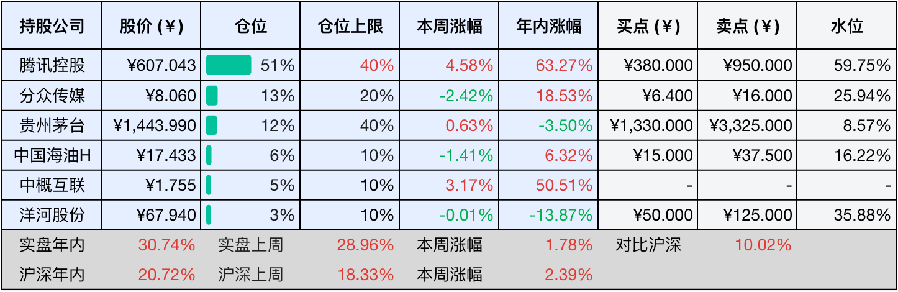

__微信公众号文章地址：[老罗投资周记-20251011](https://mp.weixin.qq.com/s/0nd7f0NIGLtNoGlYnWb1ow)__

```
老罗投资周记，每周六更新。专注于股权投资、阅读、学习与个人成长，知行合一、日拱一卒、投资人生。微信公众号【老罗投资】，文章均首发于公众号。
```

### 1. 本周交易

无

### 2. 目前持仓

当前持有的股票包括：腾讯控股 51%、分众传媒 13%、贵州茅台 12%、中国海油H 6%、中概互联 5%、洋河股份 3%。

此外还有部分现金，加上少量的五粮液、恒瑞医药、海康威视、上海机场、宋城演艺等股票，其份额较少，仅作为观察仓不进行记录。

本周投资组合整体涨跌 <span class="green">-2.31%</span>，年内收益率 <span class="red">+28.43%</span>。

**注：**

1. 表格底部数据为老罗与沪深300指数年内收益率对比。
2. 港股持仓已按实时汇率换算为人民币。


### 3. 上周数据



### 4. 本周事项

+ 海康威视中期分红到账
+ 中国海油10月17日将发放中期现金红利

==只对持股和交易感兴趣的朋友，读到这里就可以退出了。后面是对上述事件的展开，无新内容。==

#### 4.1 海康威视中期分红到账

海康威视于本周实施了中期分红，每股派发现金红利0.4元，分红总额约36亿元，这是海康威视上市15年来，首次推出中期分红计划。加上5月份已经完成的2024年度分红约64亿元，海康威视股东在2025年内到账的现金分红将超过百亿元。

海康威视一直很重视股东回报，从2010年上市以来，仅在IPO时融资34亿元，但累计分红已达648.36亿元，累计回购39.02亿元，合计687.38亿元，这意味着每1元融资额对应了20.22元的现金股东回报。

公司2025年上半年的经营状况也不错，营收418.18亿元，同比增长1.48%，净利润56.57亿元，同比增长11.71%。经营活动现金流净额53.43亿元，占净利润比值94%，而去年同期为流出1.90亿元，现金流状况显著改善。

这次中期分红的股权登记日是10月9日，除权除息日是10月10日，现金红利在10月10日发放到股东账户，但老罗的账户9号晚就显示已经到账。

这部分分红资金计划在股价合适时配置茅台、五粮液或美的。美的作为新增的配置对象，主要是基于收益优化考量，当前现金暂存股票账户仅能获得约1%的货币基金收益，而美的集团近年股息率持续稳定在4%以上，回报显著优于货币基金。

#### 4.2 中国海油10月17日将发放中期现金红利

中国海油中期现金红利将于10月17日正式发放至股东账户，港股一般会晚3-4个交易日到账。根据公司的公告，本次A股每股派发现金红利0.66612元（含税），算了下港股分红金额与A股基本持平（每股0.73港元）。按当前股价计算，这次分红股息率约1.8%，延续了中国海油高比例分红的传统。

在分红落地之前，控股股东中国海油集团的增持动作也持续发力，截至10月8日，集团已累计增持公司港股2209.8万股，增持金额约3.32亿港元。

今年以来，中国海油通过多种方式回馈投资者，除了这次中期分红外，公司2024年度分红已经派发了约410亿元，年内A+H股回购金额亦超过40亿元。算上本次中期分红，公司年内累计股东回报已经近500亿元，充分体现了中国海油“高分红+稳增长”的长期战略。

### 5. 本周读书

#### 5.1 《日本冲绳：八重山群岛的浪荡时光》

虽然我们总想着等有钱了，等所有的事情做完了，再去旅行。但是过了某个年纪，你可能真的很多事都做不了了，顶多到泰国按个摩，到日本泡个澡，到欧洲报个老年团。

评分四星⭐️⭐️⭐️⭐️

### 6. 本周运动

本周运动一次，主要是一些器械练习，体重变化不大。

如果觉得本文还不错，那就点个赞或者在看吧，祝大家周末愉快！

```
老罗投资周记，每周六更新。专注于股权投资、阅读、学习与个人成长，知行合一、日拱一卒、投资人生。微信公众号【老罗投资】，文章均首发于公众号。
免责声明：本公众号只作为本人的投资日志记录，本文中提及的个股都有腰斩或血本无归的风险，本人不做任何投资建议，投资请坚持独立思考。
```

__微信公众号文章地址：[老罗投资周记-20251011](https://mp.weixin.qq.com/s/0nd7f0NIGLtNoGlYnWb1ow)__