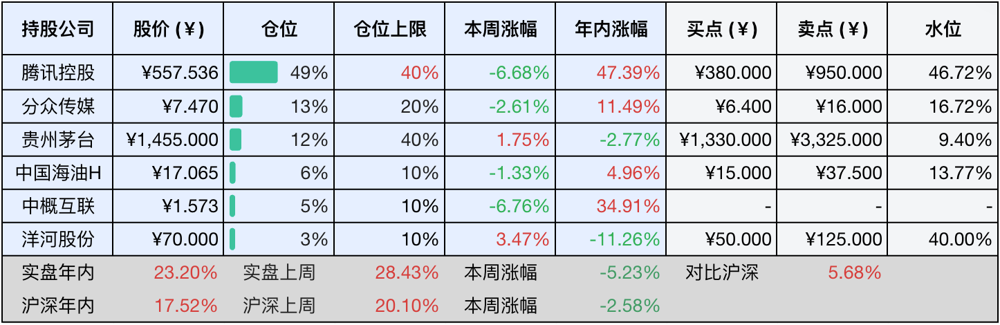

__微信公众号文章地址：[老罗投资周记-20251018](https://mp.weixin.qq.com/s/64i-4NqpaUQf3XuRw9Sw5A)__

```
老罗投资周记，每周六更新。专注于股权投资、阅读、学习与个人成长，知行合一、日拱一卒、投资人生。微信公众号【老罗投资】，文章均首发于公众号。
```

### 1. 本周交易

无

### 2. 目前持仓

当前持有的股票包括：腾讯控股 49%、分众传媒 13%、贵州茅台 12%、中国海油H 6%、中概互联 5%、洋河股份 3%。

此外还有部分现金，加上少量的五粮液、恒瑞医药、海康威视、上海机场、宋城演艺等股票，其份额较少，仅作为观察仓不进行记录。

本周投资组合整体涨跌 <span class="green">-5.23%</span>，年内收益率 <span class="red">+23.20%</span>。

**注：**

1. 表格底部数据为老罗与沪深300指数年内收益率对比。
2. 港股持仓已按实时汇率换算为人民币。



### 3. 上周数据


### 4. 本周事项

+ 海康威视三季报
+ 分众传媒和上海机场分红到账

==只对持股和交易感兴趣的朋友，读到这里就可以退出了。后面是对上述事件的展开，无新内容。==

#### 4.1 海康威视三季报

本周，海康威视2025年第三季度的财报正式出炉，这份成绩单里既有令人惊喜的亮点，也透露出这家安防巨头面临的现实挑战。

三季度单季，公司实现净利润36.62亿元，同比增长20.31%，增速较上半年明显提升。前三季度累计净利润达到93.19亿元，同比增长14.94%。营收方面保持平稳，第三季度营收239.40亿元，同比增长0.66%；前三季度累计营收657.58亿元，同比增长1.18%。

现金流的大幅改善是本次财报最亮眼的部分，前三个季度，海康威视经营活动产生的现金流量净额高达136.97亿元，同比大幅增长了426%。这一数字是净利润的1.47倍，创公司同期历史新高。现金流改善主要得益于销售回款的增加，截止到三季度末，公司应收账款与应收票据总额较年初大幅下降46.64亿元，表明公司的资产质量得到提升，资金周转效率显著改善。同时，公司毛利率保持稳步提升，第三季度毛利率达到45.67%，同比提升1.65个百分点，显示公司产品结构和成本控制能力持续在优化。

在股东回报方面，海康威视一如既往地慷慨，公司中期现金分红36.66亿元已实施完毕，在过去的12个月内，海康威视已经现金分红100.96亿元，并完成注销式回购20.28亿元，合计向股东回报达到121.24亿元。自2010年上市以来，海康威视累计实现净利润约1380亿元，累计派发现金红利约685亿元，分红率保持在50%左右，实现了业绩增长+高额分红+回购的良性循环。

尽管海康威视三季报显示其财务数据非常稳健，特别是现金流暴增了426%，但海康威视也面临着增长挑战。公司营收已连续有5个季度没有明显增长，其中主要是因为受到国内传统市场需求低迷影响，当前的增长主要来自创新业务，而国内主营业务仍受政府支付收紧、宏观经济等因素制约。

海康威视在盈利能力、现金流管理和股东回报方面依然稳健，但如何突破增长瓶颈、找到新的增长引擎，将是公司未来需要解决的关键课题。

#### 4.2 分众传媒和上海机场分红到账

本周，分众传媒和上海机场的分红如期到账。分众传媒本次中期分红方案为每10股派发现金红利1.00元（含税），股权登记日为10月16日，除权除息日为10月17日。按公司总股本144.42亿股计算，此次派现总额约14.4亿元。上海机场则每股派现0.21元（含税），同样于10月16日除权除息，共派发现金红利5.23亿元。两家公司合计为股东派发了近20亿元（约19.63亿元）的现金分红。

对分众传媒的股东而言，这次分红延续了公司高比例回馈股东的一贯传统，2024年全年，公司累计现金分红总额达47.66亿元，占净利润的比例超过了92%，如此高的分红比例在A股市场也是非常罕见的。

而上海机场此次将中期净利润的50.05%用于分红，显示出其现金流状况持续改善，及公司对股东回报的重视。随着国际航线需求的稳步复苏，上海机场的盈利环境正在逐步好转，这为未来持续分红提供了有力的支持。

每一次分红到账，都是对长期投资理念的一次小小奖励，在市场喧嚣中，这些实实在在的现金回报提醒着我们：投资的本质，终将回归到对企业内在价值的认可与长期陪伴。

### 5. 本周读书

#### 5.1 《人体简史》

按英国皇家化学学会的说法，构建一个全新人类的全部成本（以本尼迪克特·康伯巴奇为样板，卷福和奇异博士的扮演者）是个非常精确的数字：96546.79英镑，这换成人民币快100万了，还真不便宜。不过我们的身体不是一堆物料攒出来的，实际上没人说的清楚，7000亿亿亿的原子，为什么那么乐意凑在一起构成一个“我”。所以，“我”的的确确是个指挥千军万马的司令部，指挥这个司令部的都是名副其实的大将军，100万人民币是买不来一个司令部和大将军的，只是把人当“废铁”卖的价。

评分五星⭐️⭐️⭐️⭐️⭐️

#### 5.2 《从细胞到超人》

这是一本兼具趣味与深度的科普佳作，作者身为顶级科学家，却怀揣一颗孩童般的好奇心，带领读者开启一场从微观细胞到宏观超人的生命穿越之旅，令人震撼于造物的神奇。

评分三星半⭐️⭐️⭐️✨

#### 5.3 《三国解密》

历史并没有善恶是非之分，因而三方麾下俱是英雄。

评分四星⭐️⭐️⭐️⭐️

### 6. 本周运动

本周运动三次，主要为遛弯为主，体重下降2斤。

如果觉得本文还不错，那就点个赞或者在看吧，祝大家周末愉快！

```
老罗投资周记，每周六更新。专注于股权投资、阅读、学习与个人成长，知行合一、日拱一卒、投资人生。微信公众号【老罗投资】，文章均首发于公众号。
免责声明：本公众号只作为本人的投资日志记录，本文中提及的个股都有腰斩或血本无归的风险，本人不做任何投资建议，投资请坚持独立思考。
```

__微信公众号文章地址：[老罗投资周记-20251018](https://mp.weixin.qq.com/s/64i-4NqpaUQf3XuRw9Sw5A)__