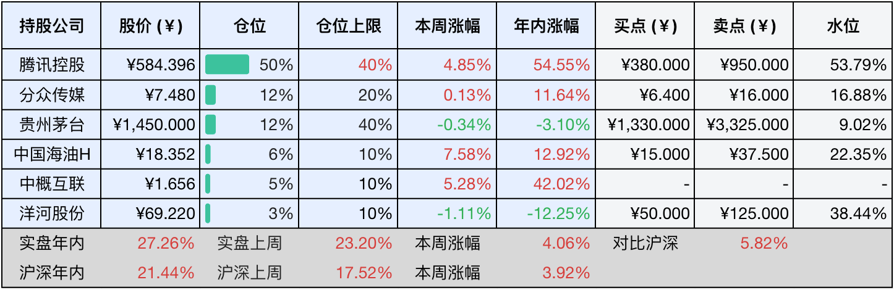
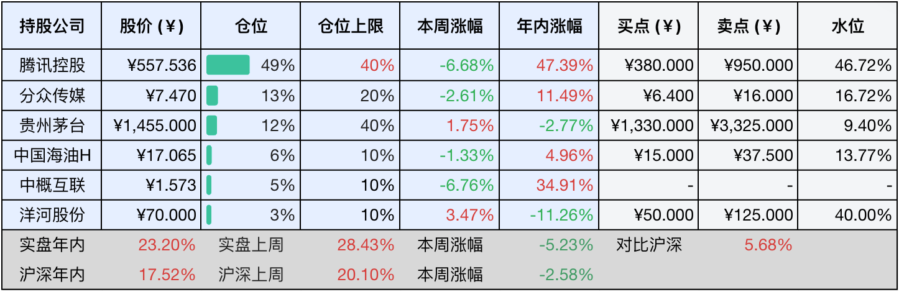

__微信公众号文章地址：[老罗投资周记-20251025](https://mp.weixin.qq.com/s/-uHWsuisdjCzXwprF4Tkxg)__

```
老罗投资周记，每周六更新。专注于股权投资、阅读、学习与个人成长，知行合一、日拱一卒、投资人生。微信公众号【老罗投资】，文章均首发于公众号。
```

### 1. 本周交易

无

### 2. 目前持仓

当前持有的股票包括：腾讯控股 50%、分众传媒 12%、贵州茅台 12%、中国海油H 6%、中概互联 5%、洋河股份 3%。

此外还有部分现金，加上少量的五粮液、恒瑞医药、海康威视、上海机场、宋城演艺等股票，其份额较少，仅作为观察仓不进行记录。

本周投资组合整体涨跌 <span class="red">+4.06%</span>，年内收益率 <span class="red">+27.26%</span>。

**注：**

1. 表格底部数据为老罗与沪深300指数年内收益率对比。
2. 港股持仓已按实时汇率换算为人民币。



### 3. 上周数据



### 4. 本周事项

+ 茅台集团换帅
+ 中国海油分红到账

==只对持股和交易感兴趣的朋友，读到这里就可以退出了。后面是对上述事件的展开，无新内容。==

#### 4.1 茅台集团换帅

茅台集团于今天上午召开大会，宣布了重大人事调整：张德芹不再担任集团董事长，由贵州省能源局局长陈华接任，这次调整，意味着张德芹在执掌茅台仅一年半后即卸任。

张德芹作为老茅台人，职业生涯和茅台渊源深厚，他于2024年4月接替了丁雄军出任茅台董事长，任内正好是白酒行业进入深度调整期。他推行提升直销渠道占比至45%、废除拆箱令等政策，并提出经销商是家人的厂商关系理念。2025年上半年，贵州茅台实现营业总收入910.94亿元，净利润454.03亿元，业绩仍然保持稳健。

新任董事长陈华出生于1972年3月，彝族，拥有丰富的能源系统工作经历。他曾任贵州省安全生产监督管理局副局长、贵州煤矿安全监察局党组成员，2022年3月起担任贵州省能源局局长。

这已经是茅台集团五年内第四次更换董事长，从2020年3月的高卫东，到2021年8月的丁雄军，再到2024年4月的张德芹，以及如今的陈华。

这次换帅正值贵州省白酒产业发展的关键阶段，根据规划，2025年贵州白酒产业的目标产值为1600亿元，这一目标与贵州省十四五规划中提出的，酱香白酒产业集群总产值达到2500亿元的愿景紧密相连。新董事长的上任，将为茅台乃至贵州白酒产业带来什么样的新气象，值得持续关注。

#### 4.2 中国海油分红到账

老罗通过港股通持有的中国海油（00883.HK）股票，已于10月20日晚间收到2025年度的中期股息，再添一笔实实在在的收益。

需要留意的是，作为港股通投资者，实际到手金额会进行税费折算，由于中国海油属于红筹股，分红需要扣除约28%的税费，其中包括公司代缴的10%出境税，以及中国结算代扣的20%个人所得税。经过计算，税后每股实际收益约为0.4815人民币。如果持股数量较多，这笔税后收益依然相当可观。

中国海油素以稳定、可持续的分红政策著称，是市场公认的高股息蓝筹股。持续可期的现金分红，为价值投资者提供了稳定的现金流回报，这也是其备受青睐的重要原因。随着公司基本面的持续稳健，其长期投资价值有望进一步体现。

### 5. 本周读书

#### 5.1 《不生锈的人生：102岁的哲代奶奶从不内耗》

没有苦难的人生是无趣的。不过，我就是随便说说。

查了下老奶奶今年已经105岁了，仍然还健康地活着。

评分四星半⭐️⭐️⭐️⭐️✨

#### 5.2 《一本书看透股权架构》

在中国历史上，共同创业的股东很多都逃不过“四同”的结局：第一年同舟共济；第二年同床异梦；第三年同室操戈；第四年同归于尽。

这本书从法律、资本、税务和管理四个维度，详细讲解了各种公司股权架构，值得一读。

评分三星半⭐️⭐️⭐️✨

### 6. 本周运动

本周大降温，无运动，体重也无变化。

如果觉得本文还不错，那就点个赞或者在看吧，祝大家周末愉快！

```
老罗投资周记，每周六更新。专注于股权投资、阅读、学习与个人成长，知行合一、日拱一卒、投资人生。微信公众号【老罗投资】，文章均首发于公众号。
免责声明：本公众号只作为本人的投资日志记录，本文中提及的个股都有腰斩或血本无归的风险，本人不做任何投资建议，投资请坚持独立思考。
```

__微信公众号文章地址：[老罗投资周记-20251025](https://mp.weixin.qq.com/s/-uHWsuisdjCzXwprF4Tkxg)__