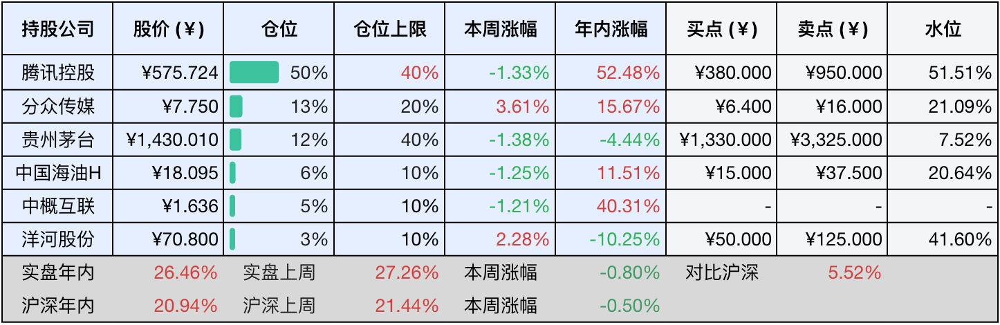
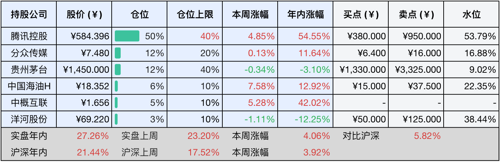

__微信公众号文章地址：[老罗投资周记-20251101](https://mp.weixin.qq.com/s/RF0xW2VXsVQu6hbd6W4xJg)__

```
老罗投资周记，每周六更新。专注于股权投资、阅读、学习与个人成长，知行合一、日拱一卒、投资人生。微信公众号【老罗投资】，文章均首发于公众号。
```

### 1. 本周交易

无

### 2. 目前持仓

当前持有的股票包括：腾讯控股 50%、分众传媒 13%、贵州茅台 12%、中国海油H 6%、中概互联 5%、洋河股份 3%。

此外还有部分现金，加上少量的五粮液、恒瑞医药、海康威视、上海机场、宋城演艺等股票，其份额较少，仅作为观察仓不进行记录。

本周投资组合整体涨跌 <span class="green">-0.80%</span>，年内收益率 <span class="red">+26.46%</span>。

**注：**

1. 表格底部数据为老罗与沪深300指数年内收益率对比。
2. 港股持仓已按实时汇率换算为人民币。



### 3. 上周数据



### 4. 本周事项

+ 茅台、五粮液、洋河发布三季报

==只对持股和交易感兴趣的朋友，读到这里就可以退出了。后面是对上述事件的展开，无新内容。==

#### 4.1 茅台、五粮液、洋河发布三季报

高端白酒的黄金时代正迎来一场不小的考验，随着茅台、五粮液和洋河股份2025年三季报的陆续披露，行业整体面临的挑战已清晰浮现。作为行业代表，这三家企业的业绩均出现不同程度下滑，反映出白酒行业正进入一轮深度调整期。

具体来看，茅台前三季度营收为1309.04亿元，同比增长6.32%，净利润646.27亿元，同比增长6.25%。尽管仍保持正增长，但其第三季度的表现却明显放缓，营收增速仅为0.35%，净利润增速仅为0.48%，创下多年来的新低。五粮液的情况更为严峻，前三季度营收同比下降10.26%，净利润下降13.72%；其中第三季度营收大幅下滑52.66%，净利润下降65.62%，远超市场预期。洋河股份的下滑更为明显，前三季度营收同比下降34.26%，净利润下降53.66%，第三季度甚至出现3.69亿元的净亏损，而去年同期为盈利6.32亿元。

行业调整并非个别现象，而是全行业共同面对的挑战。2025年第三季度，A股20家白酒上市公司中，有9家出现营收或净利润下跌。除了前述三家企业外，口子窖第三季度净利润同比下滑92.6%，老白干酒下降68.5%，舍得酒业下滑63.2%，就连一向稳健的山西汾酒，第三季度净利润也出现了自2015年以来的首次下滑。国家统计局数据也显示，2025年1-9月全国规模以上白酒企业产量同比下降9.90%，产量和业绩双双承压，印证了行业整体面临的困境。

当前白酒行业的困境，主要源于价格体系承压和渠道库存高企两大问题。以飞天茅台为例，散瓶批价已从2021年的3000元以上高位，连续跌破了多个关口，目前来到1660元左右，下行趋势明显。更令人担忧的是价格倒挂现象，第八代五粮液的批发价在855元至820元区间波动，远低于1019元的出厂价，这严重挤压了渠道商的利润空间，影响了渠道商打款和进货的意愿。从三季度末的合同负债（预收款）来看，茅台、五粮液分别较年初下降19.21%和20.72%，反映出经销商的信心不足。《2025中国白酒市场中期研究报告》显示，行业平均存货周转天数达900天，同比增加10%，60%的企业面临价格倒挂。

面对行业逆风，白酒企业正在积极调整策略，控费减支、主动降速成为普遍选择。从三季报可以看出，茅台、五粮液、洋河等企业的销售费用和管理费用均有所下降，显示出企业在成本控制方面的努力。不少酒企还主动控制发货节奏，以帮助渠道消化库存，这种主动调整虽然短期内会影响业绩表现，但有利于长期渠道生态的健康。

总体来看，能够实现低度化、年轻化转型，或具备深度渠道掌控力的企业，更有望穿越行业调整周期。而缺乏品牌优势和产品溢价能力的酒企，则面临更大的挑战，白酒行业正在经历一场深刻的洗牌。

本周旗下还有几家公司披露了三季报，后面的周报慢慢更新。

### 5. 本周读书

#### 5.1 《战神粟裕》

运动战的天才，谋略与魄力的化身。在中国的军事史上，粟裕的名字始终与战神之称交相辉映，这一称号并非来自官方册封，而是对其出神入化的指挥艺术、彪炳史册的战绩以及崇高人格的自然推崇。

他是一位将《孙子兵法》的智慧在现代战场上运用至化境的战略大师，一位凭借着一系列神仙仗奠定军神地位的杰出指挥者，也是一位在辉煌与悲情交织中铸就传奇的英雄人物。

评分四星半⭐️⭐️⭐️⭐️✨

#### 5.2 《四维读财报：看懂中国公司》

面对一家中国企业的财务报表，如何在最短时间内看透其本质？在信息唾手可得、分析工具日益智能的今天，真正让你脱颖而出的，不再是数据获取能力，而是独到的分析思路和解读框架。

本书以作者独创的张氏财报分析框架为基础，深入解读中国上市公司的真实财报案例，让读者迅速把握企业的战略布局、核心竞争力、真实价值、潜在风险和发展前景。

评分四星⭐️⭐️⭐️⭐️

### 6. 本周运动

本周运动一次，下周起恢复锻炼与晚上节食。

如果觉得本文还不错，那就点个赞或者在看吧，祝大家周末愉快！

```
老罗投资周记，每周六更新。专注于股权投资、阅读、学习与个人成长，知行合一、日拱一卒、投资人生。微信公众号【老罗投资】，文章均首发于公众号。
免责声明：本公众号只作为本人的投资日志记录，本文中提及的个股都有腰斩或血本无归的风险，本人不做任何投资建议，投资请坚持独立思考。
```

__微信公众号文章地址：[老罗投资周记-20251101](https://mp.weixin.qq.com/s/RF0xW2VXsVQu6hbd6W4xJg)__