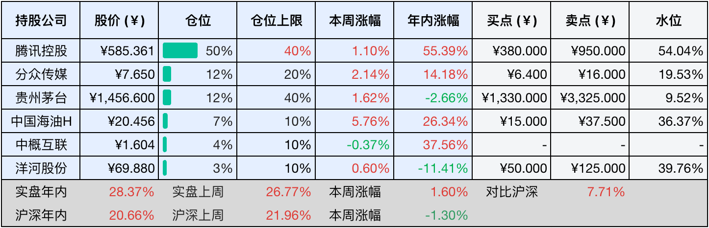

__微信公众号文章地址：[老罗投资周记-20251122](https://mp.weixin.qq.com/s/9pdCjthFOKnhtTn60xuSHA)__

```
老罗投资周记，每周六更新。专注于股权投资、阅读、学习与个人成长，知行合一、日拱一卒、投资人生。微信公众号【老罗投资】，文章均首发于公众号。
```

## 1. 本周交易

无

## 2. 目前持仓

当前持有的股票包括：腾讯控股 49%、分众传媒 13%、贵州茅台 12%、中国海油H 7%、中概互联 4%、洋河股份 3%。

此外还有部分现金，加上少量的五粮液、恒瑞医药、海康威视、上海机场、宋城演艺等股票，其份额较少，仅作为观察仓不进行记录。

本周投资组合整体涨跌 <span class="green">-4.26%</span>，年内收益率 <span class="red">+24.11%</span>。

**注：**

1. 表格底部数据为老罗与沪深300指数年内收益率对比。
2. 港股持仓已按实时汇率换算为人民币。


## 3. 上周数据



## 4. 本周事项

+ 腾讯恢复回购
+ 微信小程序内购苹果抽成降至15%
+ 分众传媒分红下周将到账

==只对持股和交易感兴趣的朋友，读到这里就可以退出了。后面是对上述事件的展开，无新内容。==

### 4.1 腾讯恢复回购

腾讯于11月18日重启股票回购，当日以约6.35亿港元回购了101.3万股，标志着公司在三季报静默期结束后，再次用真金白银向市场传递对自身长期价值的坚定信心。在随后的几天里，腾讯持续加码回购力度，短短四天累计投入的金额就已经突破了25亿港元，展现出小企鹅在回报股东方面的持续决心。

从操作节奏来看，腾讯本轮回购呈现出高频、小额、均价回落的特点，单日回购金额维持在6亿港元左右。回购节奏和全年不低于800亿港元的回购计划步调一致，如果按照当前的进度推进，公司有望顺利完成、甚至小幅超越既定的目标。

今年以来，腾讯的回购力度始终强劲，截至10月中旬，年内累计回购金额已经突破600亿港元，持续在港股回购市场中保持领先地位，当前排名第二，仅次于汇丰控股。

下图是三季报发布前，港股回购排名TOP20：


### 4.2 微信小程序内购苹果抽成降至15%

持续近八年的微信与苹果抽成拉锯战，在本月迎来了转折，苹果正式推出小程序合作伙伴计划，宣布对参与计划的开发者收取15%的内购抽成，较常规30%的苹果税大幅下降。微信方面随后表态欢迎，并将尽快为开发者提供接入支持。

这次合作打破了iOS端微信小程序长期无法直接进行虚拟支付的僵局，过去用户在小程序中购买虚拟商品时，经常会看到由于苹果公司规定，iOS端暂不支持虚拟支付的提示，导致支付流程繁琐。新政策实施后，支付将更便捷安全，开发者也不再需要借助二维码跳转等灰色渠道。

这次15%的抽成比例，既低于苹果常规的30%，也低于腾讯对安卓端小游戏40%的抽成，反映出了双方的让步与妥协。对中国市场潜力的共识是推动合作的关键，中国是苹果App Store第二大市场，2024年数字商品销售额达230亿美元，而中国小游戏市场同年收入近400亿元，同比增长了近一倍。面对如此规模，苹果不得不调整其全球统一的抽成策略。

这也是苹果在多地反垄断压力下的适应性调整，尽管抽成的比例有所下降，但苹果借此切入了微信小程序生态，获得了稳定收入。腾讯则解决了iOS支付的合规问题，为小游戏、微短剧等付费场景的进一步爆发扫清了障碍。

### 4.3 分众传媒分红下周将到账

分众今年第三次分红下周就要到账了，每股派发0.05元（含税），股权登记日为11月24日，除权除息日为11月25日，现金红利将于11月25日开始发放，但按照以往的经验，24日晚应该就会到账了。

虽然单看每股金额不算高，但正如那句老话——蚊子腿也是肉，每一笔到账的现金都是实实在在的回报。我计划将这次分红到账的资金，继续投入到长期关注的白酒老登股中，寻找合适的时机进行加仓。

## 5. 本周读书

### 5.1 《屁事连篇：肛肠科医生的笑泪故事》

有利无弊厚脸皮，有弊无利当放屁，有利有弊慎分析，利弊不清问上帝。

本书挺好看的，但是肛肠科很多内容还是有点重口，看时应该避开吃饭时间，免得没了胃口。还有他人在场时也不要看，免得笑出声别人以为你有神经病。

评分四星⭐️⭐️⭐️⭐️

## 6. 本周运动

本周运动三次，都是快走，继续恢复中。

如果觉得本文还不错，那就点个赞或者在看吧，祝大家周末愉快！

```
老罗投资周记，每周六更新。专注于股权投资、阅读、学习与个人成长，知行合一、日拱一卒、投资人生。微信公众号【老罗投资】，文章均首发于公众号。
免责声明：本公众号只作为本人的投资日志记录，本文中提及的个股都有腰斩或血本无归的风险，本人不做任何投资建议，投资请坚持独立思考。
```

__微信公众号文章地址：[老罗投资周记-20251122](https://mp.weixin.qq.com/s/9pdCjthFOKnhtTn60xuSHA)__