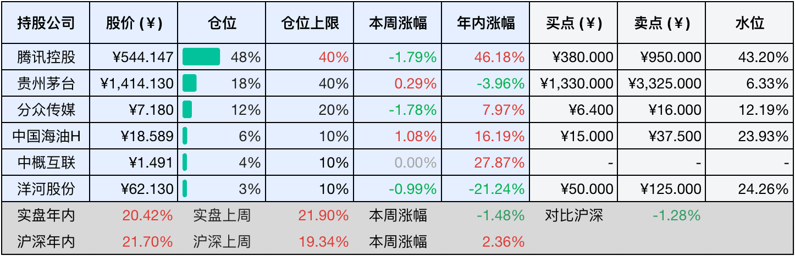

__微信公众号文章地址：[老罗投资周记-20251227](https://mp.weixin.qq.com/s/Ck5CmhdVTqU81NA2vs17CQ)__

```
老罗投资周记，每周六更新。专注于股权投资、阅读、学习与个人成长，知行合一、日拱一卒、投资人生。微信公众号【老罗投资】，文章均首发于公众号。
```

## 1. 本周交易

无

## 2. 目前持仓

当前持有的股票包括：腾讯控股 48%、贵州茅台 18%、分众传媒 12%、中国海油H 6%、中概互联 4%、洋河股份 3%。

此外还有部分现金，加上少量的五粮液、恒瑞医药、海康威视、粉笔等股票，其份额较少，仅作为观察仓不进行记录。

本周投资组合整体涨跌 <span class="green">-1.48%</span>，年内收益率 <span class="red">+20.42%</span>，快到年底又落后于沪深300指数了，今年有可能跑输指数。

**注：**

1. 表格底部数据为老罗与沪深300指数年内收益率对比。
2. 港股持仓已按实时汇率换算为人民币。



## 3. 上周数据


## 4. 本周事项

+ 贵州茅台发布股份回购计划
+ A股全年成交量超过400万亿破历史记录

==只对持股和交易感兴趣的朋友，读到这里就可以退出了。后面是对上述事件的展开，无新内容。==

### 4.1 贵州茅台发布股份回购计划

上市公司回购股份的消息时常出现，但当这一动作出现在贵州茅台身上，依然会引发市场的高度关注。并不是因为回购本身有多新鲜，而是这家公司的任何资本运作，都会被放在显微镜下反复解读。

根据公告，茅台计划在股东大会通过后的六个月内，以不超过每股1863.67元的价格，回购价值15亿至30亿元的股份，完成注销后公司的总股本将会相应减少。从公告内容来看，这次的回购并不复杂，也没有附加过多条件，更多像是一种态度表达。对外释放的信息并不激进，但已经足够明确：公司认可自身的长期价值，也愿意在合适的时点用真金白银做出回应。回购在制度层面上是一种常见工具，但它是否真正有意义，往往取决于实施主体。对于现金流充裕、经营稳定的公司来说，回购更多是一种资本结构的管理方式，而不是应对短期波动的权宜之计。

贵州茅台的特殊之处在于，它并不缺乏市场关注，也不存在融资压力，选择在这样的背景下回购股份，本身就意味着公司更在意长期股东关系的维护，而不是通过短期动作博取情绪上的回报。从更现实的角度看，回购并不会直接改变公司的基本面，白酒行业的竞争格局、消费趋势、渠道变化，仍然是影响公司价值的最核心因素，回购只是其中的一个配套动作，而并非决定性的因素。

不少投资者习惯把回购当作一种信号来解读，但这种信号更多是方向性的，而不是结论性的，它反映的是管理层对当前阶段的判断，而不是对未来收益的承诺。如果拉长时间来看，贵州茅台过去的经营表现，更多是靠产品、品牌和渠道一步步积累出来的，而不是依赖资本市场操作。回购能否真正发挥作用，最终还是要回到这些基本要素上，回购提供了一个观察公司态度的窗口，但并不需要被赋予过多的情绪或是想象空间。

在当前的大环境下，保持对企业长期行为的关注，往往比对单一事件的解读更有价值，回购计划本身只是一个节点，真正值得持续观察的，仍然是公司在变化中的稳定性。

### 4.2 A股全年成交量超过400万亿破历史记录

A股市场在年底交出了一份刷新纪录的成绩单，截至十二月下旬，全年的累计成交额已经突破了四百万亿元，这是市场历史上从未达到过的高度。成交额的跃升，首先离不开参与资金的多元化，一方面是来自海外的资金，数据显示国际资金净流入中国市场的速度在加快，另一方面国内长期的制度建设也在吸引更多本土资金入市，险资、社保基金等长期资金稳步入场，居民储蓄通过各类渠道向资本市场转移的趋势也在延续。这些资金带着不同的期限和目的汇聚在一起，自然推高了整体的交易规模。

与此同时，市场本身的深度与复杂度的提升，也是成交放大的技术性原因。量化策略、高频交易等基于算法的交易方式，已经成为市场中不可忽视的力量，这类交易具有高周转、程序化的特征，客观上会增加市场的换手和成交。这既是市场向机构化、专业化演进的一个侧面，也让成交额的构成变得更加复杂。

对于普通参与者来说，市场更热闹了，但判断依然需要放慢速度，理解成交量放大的原因，保持对投资原则的坚持，可能比追逐每一次的交易机会更为重要。

## 5. 本周读书

### 5.1 《宇宙奥德赛：飞向宇宙尽头》

这本书做到了深入浅出，并没有复杂的公式与深奥的理论，作者用直观的方式，带领读者领略可知宇宙的浩瀚无垠。作为一本科普读物，它在让读者理解并接受这些知识上，算是做得非常地成功。

在可观测宇宙面前，人类何其渺小，在时间的长河里，我们的文明又何其短暂。从南方古猿到现代智人，进化之路走了数百万年，人类文明出现至今，不过几千年，而真正摆脱大规模的饥饿与匮乏，仅仅是近百年的事。面对无尽的宇宙未知，我们不知道的还有很多很多。

评分四星⭐️⭐️⭐️⭐️

### 5.2 《给孩子讲宇宙》

很敬佩科学家的精神，记得曾在一本书上读到，我们不一定能成为科学家，但可以拥有科学家的精神。什么是科学家精神？当有人告诉你一个大铁球和一个小铁球的下落速度相同时，你如果真的会找来做实验，反复验证，那便是了。

评分四星⭐️⭐️⭐️⭐️

### 5.3 《给孩子讲相对论》

这本书作为给孩子看的科普读物，内容已经写得尽可能通俗易懂了，但说实话，要真正理解相对论，确实还是挺有难度的。人类对世界的探索是永恒的，说到这里，真的不得不佩服像爱因斯坦这样的人，有时甚至会怀疑，他是不是从未来穿越而来的。否则那些如此超前的理论，究竟是怎样被发现的？

评分四星⭐️⭐️⭐️⭐️

## 6. 本周运动

本周运动两次，还是在室内快走。

如果觉得本文还不错，那就点个赞或者在看吧，祝大家周末愉快！

```
老罗投资周记，每周六更新。专注于股权投资、阅读、学习与个人成长，知行合一、日拱一卒、投资人生。微信公众号【老罗投资】，文章均首发于公众号。
免责声明：本公众号只作为本人的投资日志记录，本文中提及的个股都有腰斩或血本无归的风险，本人不做任何投资建议，投资请坚持独立思考。
```

__微信公众号文章地址：[老罗投资周记-20251227](https://mp.weixin.qq.com/s/Ck5CmhdVTqU81NA2vs17CQ)__