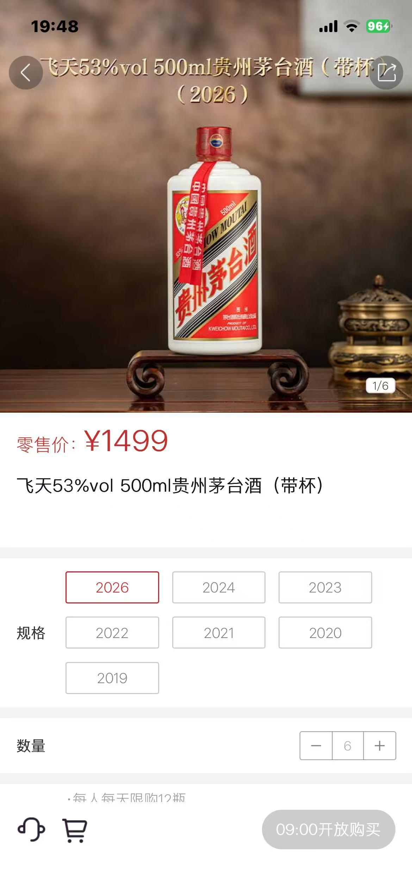

__微信公众号文章地址：[老罗投资周记-20260103](https://mp.weixin.qq.com/s/ny_prP5_6cQJwDOhfauBMw)__

```
老罗投资周记，每周六更新。专注于股权投资、阅读、学习与个人成长，知行合一、日拱一卒、投资人生。微信公众号【老罗投资】，文章均首发于公众号。
```

## 1. 本周交易

无

## 2. 目前持仓

当前持有的股票包括：腾讯控股 48%、贵州茅台 18%、分众传媒 13%、中国海油H 6%、中概互联 4%、洋河股份 3%。

此外还有部分现金，加上少量的五粮液、恒瑞医药、海康威视、粉笔等股票，其份额较少，仅作为观察仓不进行记录。

2025年最后一周投资组合整体涨跌 <span class="green">-1.09%</span>，年内收益率 <span class="red">+19.33%</span>。

2026年港股1月2日开盘一天，涨得较多，因为是用港股通投资的，收益并没有更新，所以今年第一周投资组合整体涨跌 <span class="red">+0.00%</span>，年内收益率 <span class="red">+0.00%</span>。

**注：**

1. 表格底部数据为老罗与沪深300指数年内收益率对比。
2. 港股持仓已按实时汇率换算为人民币。


## 3. 上周数据


## 4. 本周事项

+ 飞天茅台登陆i茅台APP
+ 腾讯连续四年登顶港股回购王

==只对持股和交易感兴趣的朋友，读到这里就可以退出了。后面是对上述事件的展开，无新内容。==

### 4.1 飞天茅台登陆i茅台APP

最近，如果打开茅台官方的数字营销平台i茅台APP，会发现一个非常明显的变化，贵州茅台的核心产品飞天茅台已经上架了。过去很长一段时间里，茅台的销售，尤其是飞天茅台这样的主力产品，高度依赖于线下庞大的经销商网络，这套传统体系曾是茅台市场地位的基石，但也带来了价格管控、真实消费触达等方面的挑战。近几年，通过自营的i茅台平台投放部分新品、生肖酒和系列酒，已经成为茅台探索直销、贴近市场的重要一步。如今将飞天茅台这款企业压舱石放入其中，试探的意味依然存在，但步伐显然更进了一层。



从企业的角度看，这步棋逻辑上是清晰的，增加自营渠道的占比，意味着公司能更直接地掌握一部分终端价格和销售节奏，利润结构也可能得到优化。更重要的是，通过官方平台积累的真实消费数据，或许比任何市场调研都更能直观地反映需求的变化。在消费环境和习惯都在演进的今天，这种直接触达的能力，其长期价值可能不亚于短期的销售业绩。

当然，任何重要的调整都伴随着权衡，如何妥善处理和原有经销商体系的关系，避免渠道间的冲突，是摆在茅台面前的现实课题。飞天茅台的稀缺性标签，一部分正源于其相对复杂的可获得性，当购买路径变得更为直接和透明时，市场的预期和投机情绪可能会发生非常微妙的变化，这对公司管理者提出了新的要求。

对于普通的消费者而言，或许不必急于对这一步棋下定论，它更像是一个持续的、谨慎的进程中的一环。传统消费品巨头拥抱数字化直销，早已经不是新鲜事了，但具体到茅台这样具有特殊市场地位和品牌效应的公司，它每一步探索都会引来大量的审视。飞天茅台登陆官方APP，短期看是茅台为消费者提供了一个新的、保真的购买渠道；长期看，则是茅台在主动重塑与市场和消费者之间的距离。

### 4.2 腾讯连续四年登顶港股回购王

腾讯再次坐上了回购王的位置，随着港股全年数据出炉，2025年港股市场整体回购金额约为3191亿港元，其中腾讯一家公司就贡献了800.36亿港元，接近回购总量的四分之一，这已经是腾讯连续第四年位居回购榜首。去年港股市场的整体表现优秀，主要指数涨幅在全球市场中都名列前茅，不少公司的回购力度比前一年反而减弱，在这样的背景下，腾讯依然按照既定节奏，完成了年初设定的800亿港币回购目标。

一家企业能够持续多年进行如此规模的回购，前提一定是盈利能力和现金流的稳定，过去一年，腾讯的核心业务保持增长，为回购提供了充足的资金基础。当账面现金不断积累，管理层通常面临几种选择：继续加码新业务，还是通过分红或回购的方式回馈股东。近几年腾讯的方向相对清晰，更偏向后者，尤其是将回购股份直接注销，使得现有股东的持股比例自然提升，这种方式带来的回报更为直接，特别是对于港股通投资者来说，还能减少大量的分红税。

把视角放宽来看，腾讯的做法并非特例，在回购金额靠前的名单中，有阿里巴巴、小米这样的互联网公司，也有汇丰、友邦等金融机构，这似乎逐渐成为许多行业龙头的共同行为。当企业走过高速扩张阶段，进入增长趋于平稳的时期，如何更有效地使用自由现金流，就变成了一项绕不开的课题，持续而大规模的回购，正是它们给出的其中一种方案。

## 5. 本周读书

### 5.1 《给孩子讲量子力学》

遇事不决，量子力学，这句话道出了量子世界在人们心中的高深与神秘。真正的量子力学究竟有多奇妙？专业论文或许让人望而却步，不如从这本写给孩子看的启蒙书开始来试试吧。

评分四星⭐️⭐️⭐️⭐️

### 5.2 《皇权与绅权》

费孝通先生在《皇权与绅权》里，用一个生动的比喻解析古代中国的权力结构：它像一套双轨制。一条是皇权铺下的官道，从京城一路通到县衙；另一条则是乡绅织就的乡间小路，从县衙门口蜿蜿蜒蜒，伸向每一个村庄的角落。这一明一暗两条轨道，彼此衔接，也相互牵制，传统社会上千年的稳定与此相关，而中国知识分子身上那种深沉而曲折的困境，似乎也早早埋根于此。

评分四星⭐️⭐️⭐️⭐️

### 5.3 《人生须尽欢：李白传》

其实吧，在这个世界上可能有两个李白，一个在文字里骏马白衣、放荡不羁，一个在现实中蝇营狗苟、彷徨无依。前一个是李白，后一个也是李白，只是人们更愿意相信前一个是李白，不愿意承认后一个也是李白。

评分五星⭐️⭐️⭐️⭐️⭐️

## 6. 本周运动

本周运动两次，一次室内跳操，一次室外快走。明天周日，元旦休假结束，继续恢复锻炼。

如果觉得本文还不错，那就点个赞或者在看吧，祝大家周末愉快！

```
老罗投资周记，每周六更新。专注于股权投资、阅读、学习与个人成长，知行合一、日拱一卒、投资人生。微信公众号【老罗投资】，文章均首发于公众号。
免责声明：本公众号只作为本人的投资日志记录，本文中提及的个股都有腰斩或血本无归的风险，本人不做任何投资建议，投资请坚持独立思考。
```

__微信公众号文章地址：[老罗投资周记-20260103](https://mp.weixin.qq.com/s/ny_prP5_6cQJwDOhfauBMw)__