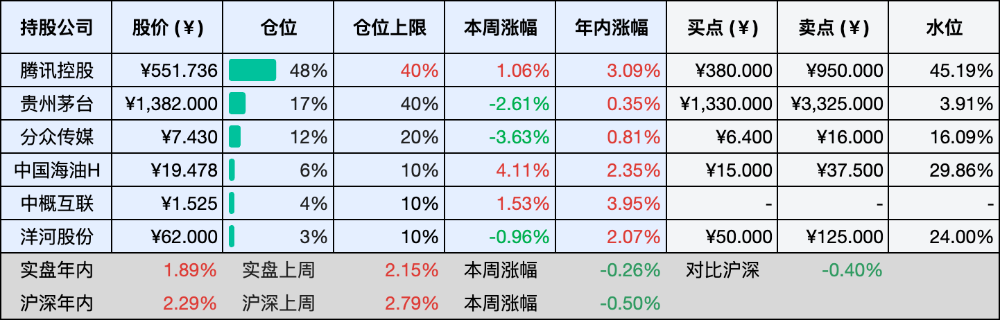
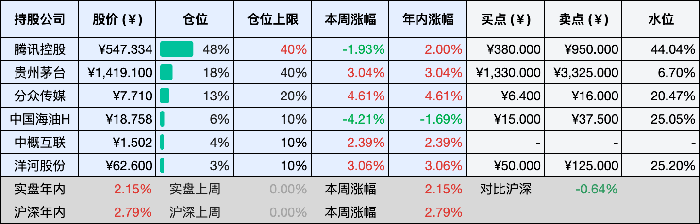

__微信公众号文章地址：[老罗投资周记-20260117](https://mp.weixin.qq.com/s/Q-2Iu5KOfeRFYnRlh-nj0Q)__

```
老罗投资周记，每周六更新。专注于股权投资、阅读、学习与个人成长，知行合一、日拱一卒、投资人生。微信公众号【老罗投资】，文章均首发于公众号。
```

## 1. 本周交易

无

## 2. 目前持仓

当前持有的股票包括：腾讯控股 48%、贵州茅台 17%、分众传媒 12%、中国海油H 6%、中概互联 4%、洋河股份 3%。

此外还有部分现金，加上少量的五粮液、恒瑞医药、海康威视、粉笔等股票，其份额较少，仅作为观察仓不进行记录。

本周投资组合整体涨跌 <span class="green">-0.26%</span>，年内收益率 <span class="red">+1.89%</span>。

**注：**

1. 表格底部数据为老罗与沪深300指数年内收益率对比。
2. 港股持仓已按实时汇率换算为人民币。



## 3. 上周数据



## 4. 本周事项

+ 分众收购新潮获深交所受理
+ 三大交易所提高融资保证金比例

==只对持股和交易感兴趣的朋友，读到这里就可以退出了。后面是对上述事件的展开，无新内容。==

### 4.1 分众收购新潮获深交所受理

分众传媒1月12日发布公告称，公司计划通过发行股份与支付现金相结合的方式，收购张继学、重庆京东海嘉电子商务有限公司、百度在线网络技术（北京）有限公司等45个交易对手方所持有的成都新潮传媒集团股份有限公司90.02%股权。分众于1月9日收到深圳证券交易所的通知，深交所已经依据相关规定完成对该申请文件的核对，确认文件材料齐全，并决定予以受理。

这几年梯媒的竞争一直比较激烈，点位和价格几乎成了各家公司反复拉扯的焦点。分众主要扎根在一二线城市的写字楼里，覆盖的是上班族这样的核心消费人群，靠着近300万个电梯终端，覆盖4亿城市主流消费人群，早早就奠定了行业的龙头地位。新潮则把大量资源投在社区，通过终端数量去抓下沉市场，靠着70多万部电梯智能屏，已经在下沉市场站稳了脚跟。这两个方向本来就不完全重合，这次走到一起，更像是把各自的长处拼在了一张更完整的网络里。

广告主的投放思路也在发生变化，只在某一个场景里反复曝光，效果越来越有限，能不能把办公和生活两个场景连起来，变得更重要。如果整合顺利，从白天到晚上的触达路径更完整，不同类型客户的需求也更容易被同时覆盖，这对平台本身和广告主来说，都是现实层面的好处。

从行业角度看，户外广告一直比较分散，靠几家头部公司去整合资源、提高效率，其实是很多成熟行业都会走的一步。价格战打久了，大家都很难轻松，能不能把重心慢慢转回到点位质量、投放效果和运营能力上，对整个行业都是好事。

当然受理只是流程的开始，真正的考验还在后面。团队能不能顺利磨合，哪些点位要保留，客户资源如何协调，都不是一两个月就能理顺的事情。但不管结果最终如何，这件事至少说明，梯媒行业正在告别过去那种拼速度、拼数量的阶段，接下来比的，更多是耐心和运营的基本功。

### 4.2 三大交易所提高融资保证金比例

1月14日，沪深北交易所同时发布通知，把融资买入股票时的最低保证金比例从80%调回到100%。这意味着，从1月19日开始，想通过融资多买一点股票，需要先拿出更多自有资金，借钱的门槛比之前高了一些。

放在日常理解里，其实也不复杂，以前拿80万元本金，最多可以再借100万元，一共可以买180万元的股票。现在如果想借100万元，自己也得先准备100万元，总规模变成200万元，表面上看总金额更大了，但资金放大的比例其实变小了，杠杆被收紧了一点。

这个时间点的调整，和最近市场的热度有不小关系，近段时间融资余额一路走高，已经接近历史高位，成交额也明显放大，个别交易日接近四万亿元。在这样的环境下，把借钱的条件稍微收紧一些，更像是在提醒市场别跑得太快，让节奏慢下来一点。

这种做法本身并不算激烈，更像是对交易情绪的轻微调节，而且这次调整只影响新发生的融资交易，已经在用的融资合约不会受影响，给了市场一个比较平缓的过渡空间，不至于出现突然收缩带来的不适应。

从以往经验看，类似调整很难单独决定市场的方向，无论是上调还是下调保证金比例，更多影响的是交易结构，而不是整体趋势。短期内，依赖高杠杆参与的交易可能会收敛一些，波动较大的题材热度也可能有所降温，但这并不等同于行情就此改变。

换个角度看，这更像是一次对市场节奏的提醒，价格如果主要靠资金推动，持续性往往有限，真正能走得更远的，还是企业自身的经营表现。当交易节奏放慢，资金回到对基本面的关注上，反而有利于市场形成更加稳健的共识。

## 5. 本周读书

### 5.1 《少年相思在长安，唐代诗人的不羁人生》

人往往年老了之后又想变回到少年，大概只因少年时可飞扬跋扈、肆无忌惮，那时的自己手中有剑、眼中有光，整日幻想自己是屠龙的勇者，不计得失，不弃梦想，仿佛所有明天都闪着光。

可时光荏苒，那个提剑策马的少年终究学会了在市井间行走，率性的东西走着走着就丢了，再捡起时也已索然无味。原来没有什么一成不变，我们都在不知不觉中蜕变、失去，然后长大。也许正因为那样汹涌而天真的岁月一去不返，人才会频频回望，在记忆里寻找那一去不返的的自己。

评分四星⭐️⭐️⭐️⭐️

## 6. 本周运动

本周室内跳操两次，下周继续。

如果觉得本文还不错，那就点个赞或者在看吧，祝大家周末愉快！

```
老罗投资周记，每周六更新。专注于股权投资、阅读、学习与个人成长，知行合一、日拱一卒、投资人生。微信公众号【老罗投资】，文章均首发于公众号。
免责声明：本公众号只作为本人的投资日志记录，本文中提及的个股都有腰斩或血本无归的风险，本人不做任何投资建议，投资请坚持独立思考。
```

__微信公众号文章地址：[老罗投资周记-20260117](https://mp.weixin.qq.com/s/Q-2Iu5KOfeRFYnRlh-nj0Q)__