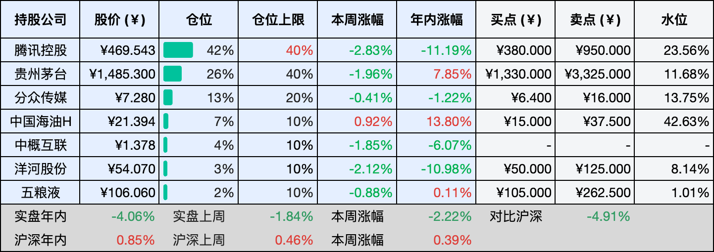

__微信公众号文章地址：[老罗投资周记-20260214-春节快乐](https://mp.weixin.qq.com/s/ZswTnQyApCGyR1-GaTuyYg)__

```
老罗投资周记，每周六更新。专注于股权投资、阅读、学习与个人成长，知行合一、日拱一卒、投资人生。微信公众号【老罗投资】，文章均首发于公众号。
```

## 1. 本周交易

无

## 2. 目前持仓

当前持有的股票包括：腾讯控股 42%、贵州茅台 26%、分众传媒 13%、中国海油H 7%、中概互联 4%、洋河股份 3%、五粮液 2%。

此外还有部分现金，加上少量的恒瑞医药、海康威视、粉笔等股票，其份额较少，仅作为观察仓不进行记录。

本周投资组合整体涨跌 <span class="green">-2.22%</span>，年内收益率 <span class="green">-4.06%</span>。

**注：**

1. 表格底部数据为老罗与沪深300指数年内收益率对比。
2. 港股持仓已按实时汇率换算为人民币。



## 3. 上周数据


## 4. 本周事项

+ 蛇年的工作就到这里，马年继续出发

==只对持股和交易感兴趣的朋友，读到这里就可以退出了。后面是对上述事件的展开，无新内容。==

### 4.1 蛇年的工作就到这里，马年继续出发

蛇年的工作，到这儿就算正式收尾了，办公室里的人一天天少了，楼下的红灯笼也陆陆续续挂了起来，这种时候，人总忍不住停下脚步，往后回头望一望，也往前多想一想。

回头看过去这一年，蛇年走得不算快，甚至有好些日子，慢得让人有些心急。市场的起起落落、工作里的磕磕绊绊、生活中那些不大不小的坎儿，都一笔一画刻在了这一年的日历上。年初定下的那些目标，有的稳稳完成了，有的走着走着改了方向，还有些，就这么轻轻放下、不了了之。其实回头看的时候，未必非要给每一件事都下个定论、算个输赢，那些跌跌撞撞的瞬间，那些踏踏实实努力的日子，凑在一起，就是这一整年最真实的模样。

马在生肖里，总带着一股往前冲的劲儿，让人下意识就觉得，新的一年要跑起来、要快一点，但真正靠谱的出发，从来不在速度有多快，而在方向对不对、脚步稳不稳。

新的一年，还是要在投资上多留一份耐心，不在市场热闹的时候跟风冲动，也不在行情冷清的时候慌了手脚。继续守在自己熟悉的领域里慢慢摸索，不贪多、不冒进，那些看不懂的机会，就安安静静放过，不盲目追逐。把读书、运动、随手记录的小习惯坚持下去，不追求多么惊天动地，只求每一天都过得扎实、过得安心。

做投资这么多年，越来越觉得，它从来不是一场冲刺，更像是一场漫长的长跑，重要的不是某一段路冲得多猛、跑得有多快，而是能不能稳稳当当、一直坚持跑下去。市场从来没有一直的好行情，也没有一直的坏光景，周期起起伏伏本就是常态，只要还在场内，只要不轻易退场，就总有新的机会。

马年要做的，其实也很简单，不过是继续稳稳地往前走，日拱一卒，不疾不徐，不慌不忙。蛇年的工作就到这里了，不管这一年收获了多少、留下了多少遗憾，都该轻轻放下了。

马年，我们重新出发，带上过去一年的经验与沉淀，带上对未来的期待与热爱，也带上那份不急不躁、从容笃定的心。新的一年，不辜负每一份努力，不怠慢每一寸时光，继续往前走，继续在路上。

最后，祝大家马年平安顺遂，投资稳稳当当，日子越过越踏实，万事皆如心意。

## 5. 本周读书

### 5.1 《投资稳赚》

通往财富的道路，不仅仅是让资本享受长期复利的魔力，同样重要的是，要小心避开成本在长期复利作用下悄悄挖出的陷阱。我们需要尽量远离那些高成本、高换手率的操作，以及当下金融服务体系中那些鼓励频繁交易、看似聪明的投机模式。

基金经理的利益，往往建立在“别傻待着，要做点什么”的行动格言之上，他们需要通过客户的频繁操作来赚取费用。而普通的投资者，其根本利益却恰好与之相反，更像是建立在“别乱动，待着就好”这句格言之上，因为不必要的行动常常带来不必要的成本和错误的决策。理解这两种立场的不同，或许比掌握任何复杂的投资技巧都更为基础。

评分三星半⭐️⭐️⭐️✨

## 6. 本周运动

本周锻炼三次，全部是健身环大冒险。下周就是春节了，每逢佳节胖三斤，千万得注意不能吃太多。

如果觉得本文还不错，那就点个赞或者在看吧，再次祝大家春节快乐，马上有钱！

```
老罗投资周记，每周六更新。专注于股权投资、阅读、学习与个人成长，知行合一、日拱一卒、投资人生。微信公众号【老罗投资】，文章均首发于公众号。
免责声明：本公众号只作为本人的投资日志记录，本文中提及的个股都有腰斩或血本无归的风险，本人不做任何投资建议，投资请坚持独立思考。
```

__微信公众号文章地址：[老罗投资周记-20260214-春节快乐](https://mp.weixin.qq.com/s/ZswTnQyApCGyR1-GaTuyYg)__