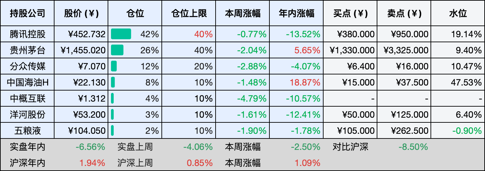

__微信公众号文章地址：[老罗投资周记-20260307](https://mp.weixin.qq.com/s/I-RZZjRD6nJcvtsVtrGP-Q)__

```
老罗投资周记，每周六更新。专注于股权投资、阅读、学习与个人成长，知行合一、日拱一卒、投资人生。微信公众号【老罗投资】，文章均首发于公众号。
```

## 1. 本周交易

无

## 2. 目前持仓

当前持有的股票包括：腾讯控股 43%、贵州茅台 25%、分众传媒 12%、中国海油H 8%、中概互联 4%、洋河股份 3%、五粮液 2%。

此外还有部分现金，加上少量的恒瑞医药、海康威视、粉笔等股票，其份额较少，仅作为观察仓不进行记录。

本周投资组合整体涨跌 <span class="green">-0.83%</span>，年内收益率 <span class="green">-7.39%</span>。

**注：**

1. 表格底部数据为老罗与沪深300指数年内收益率对比。
2. 港股持仓已按实时汇率换算为人民币。


## 3. 上周数据



## 4. 本周事项

+ 美国CFIUS重新评估腾讯海外游戏投资
+ 美以针对伊朗的打击行动对油价的影响

==只对持股和交易感兴趣的朋友，读到这里就可以退出了。后面是对上述事件的展开，无新内容。==

### 4.1 美国CFIUS重新评估腾讯海外游戏投资

美国外国投资委员会CFIUS，就是专门审查外资是否涉及美国国家安全的机构，最近又重新开始评估腾讯持有的几家海外游戏公司股份。这次被盯上的，都是游戏圈里响当当的名字，《堡垒之夜》的开发商Epic Games，还有开发了《部落冲突》的Supercell，腾讯在这两家公司分别持有约28%和84.3%的股份。

早在特朗普第一个任期，CFIUS就对腾讯的投资表达过担忧，核心问题只有一个，腾讯会不会通过持股，接触到数百万美国用户的个人数据，包括财务信息和社交记录这类敏感内容。到了拜登任内，审查也没有停止，只是当时内部意见不统一，有人主张强制剥离，有人倾向于建立数据保护机制，最终没有做出正式决定。现在随着特朗普政府重新审视这件事，那块悬了许久的石头又被提了起来。

从公开信息看，这一轮审查的焦点很明确，不是针对游戏本身，而是背后的数据安全问题。游戏平台积累了海量用户行为数据，一旦被视为可能的外国政府获取渠道，性质就完全变了。不过目前还没有定论，知情人士透露的结果可能是强制剥离，也可能通过数据保护协议保留投资，或者部分减持。

如果最终走向强制剥离，影响会是多层面的，对腾讯而言，这些海外游戏资产不只是财务投资，更是其全球游戏版图的核心。Epic和Supercell带来的不只是利润，还有研发能力、IP资源和全球化运营的经验，被迫退出，意味着多年布局可能面临重构。对整个游戏行业来说，这也是一道分水岭，地缘政治正在从贸易、科技领域，进一步渗入文化娱乐产业。

这也是中国企业全球化进程中必然会遇到的坎，市场的大门有时敞开，有时半掩，在不同规则下找到平衡，考验的不仅仅是商业智慧。未来几周，随着特朗普计划中的访华行程临近，这件事或许会有更清晰的走向。

### 4.2 美以针对伊朗的打击行动对油价的影响

自2月28日美以对伊朗发动军事打击以来，局势急转直下，伊朗方面迅速以关闭霍尔木兹海峡作为回应，国际油价应声飙涨，布伦特原油一度站上80美元的关口，市场对石油危机的议论声再起。

霍尔木兹海峡被称作全球能源的咽喉，一点也不夸张，全球约五分之一的海运石油要从这里经过，沙特、伊拉克、阿联酋这些产油大国，九成以上的出口都依赖这条水道。冲突爆发后，彭博社的数据显示，海峡的原油运输量已骤降至正常水平的四分之一以下，超过150艘油轮在海外抛锚避险，全球能源供应链瞬间绷紧。卡塔尔的液化天然气生产也因遭袭而暂停，让本来就很紧张的供应局势雪上加霜。

油价的下一步走向，取决于这场冲突的持续时间和破坏程度。摩根大通的测算显示，如果霍尔木兹海峡完全封锁25天，中东产油国就将因运不出去而被迫减产；瑞银集团在最新的报告中，已将2026年布伦特原油均价预测上调10美元至每桶72美元，以反映海峡几乎关闭的现实；高盛则认为，如果封锁持续一个月，国际油价将突破100美元。

油价的剧烈波动，自然会传导到资本市场，高油价对上游油气开采企业是明确的利好。在三桶油中，中国海洋石油的盈利与油价的正向关联度是最高的，如果高油价持续，公司未来的利润预期将得到有力支撑。多家机构近期也上调了中海油的目标价，瑞银将其H股目标价调升至33.6港元，维持行业首选。

但从风险角度看，局势依然复杂，中国作为全球最大原油进口国，大约50%的进口需要经过霍尔木兹海峡，如果供应长期中断，国内炼化企业的成本压力将会显著上升。不过，像中海油这样以自产为主的上游公司，反而可能在能源保供的大背景下凸显其战略价值。所幸，中国拥有约13亿桶战略石油储备，可以应对大约75天的国内消费，为短期冲击提供了缓冲。

对持有中海油H的老罗来说，这一轮地缘冲突带来的是一种复杂的处境，短期看，油价上涨对股价是有明确推动作用的，本周能源股的普涨也印证了这一点。但中期的不确定性依然存在，冲突会持续多久，OPEC+的增产能否对冲缺口，全球经济会不会被高油价拖累进而反噬需求，这些都需要继续观察。

## 5. 本周读书

### 5.1 《埃及：新年夜体验招魂，人的本性该是什么？》

提到埃及，大多数人脑海里蹦出来的第一个词大概是金字塔，但这篇文章没有谈及这些，只讲了一场在埃及乡村跨年夜举行的招魂音乐会，神秘，浪漫，而且真实。

黄土路、泥砖房、裹着头巾的村民，那种扑面而来的乡土气息和烟火气，像极了我们几十年前的样子，心里忽然涌起一种复杂的情绪，惊叹于我们国家这几十年的发展速度。也难免感慨，原来在二十一世纪的今天，世界上还有那么多地方、那么多普通人，依然生活在动荡与困顿里，甚至饱受战乱之苦。

评分三星半⭐️⭐️⭐️✨

## 6. 本周运动

本周运动两次，都是在室外遛弯，体重下降一公斤。

如果觉得本文还不错，那就点个赞或者在看吧，祝大家周末愉快！

```
老罗投资周记，每周六更新。专注于股权投资、阅读、学习与个人成长，知行合一、日拱一卒、投资人生。微信公众号【老罗投资】，文章均首发于公众号。
免责声明：本公众号只作为本人的投资日志记录，本文中提及的个股都有腰斩或血本无归的风险，本人不做任何投资建议，投资请坚持独立思考。
```

__微信公众号文章地址：[老罗投资周记-20260307](https://mp.weixin.qq.com/s/I-RZZjRD6nJcvtsVtrGP-Q)__