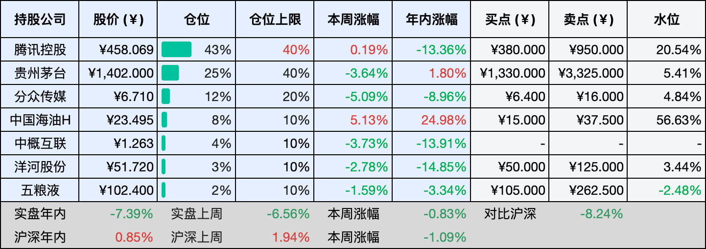

__微信公众号文章地址：[老罗投资周记-20260314](https://mp.weixin.qq.com/s/JXoB-GD-hsTl6JEpgEEwkg)__

```
老罗投资周记，每周六更新。专注于股权投资、阅读、学习与个人成长，知行合一、日拱一卒、投资人生。微信公众号【老罗投资】，文章均首发于公众号。
```

## 1. 本周交易

周四(03月12日)卖出中国海油H(00883)，卖出价格为25.424元人民币。

## 2. 目前持仓

当前持有的股票包括：腾讯控股 44%、贵州茅台 24%、分众传媒 12%、中概互联 4%、洋河股份 2%、中国海油H 2%、五粮液 2%。

此外还有部分现金，加上少量的恒瑞医药、海康威视、粉笔等股票，其份额较少，仅作为观察仓不进行记录。

本周投资组合整体涨跌 <span class="red">+3.13%</span>，年内收益率 <span class="green">-4.26%</span>。

**注：**

1. 表格底部数据为老罗与沪深300指数年内收益率对比。
2. 港股持仓已按实时汇率换算为人民币。


## 3. 上周数据



## 4. 本周事项

+ 卖出中国海油H
+ 腾讯版小龙虾WorkBuddy公测上线，QClaw也在内测中

==只对持股和交易感兴趣的朋友，读到这里就可以退出了。后面是对上述事件的展开，无新内容。==

### 4.1 卖出中国海油H

周四卖出了手里大部分的中国海油H，这笔投资是从去年4月7日开始买入的，算下来持有了十一个月时间，最近油价涨得比较快，加上这一轮地缘冲突的催化，股价走得挺猛，算上分红盈利已经超过了80%。我选择在这个位置减掉四分之三，剩下的继续留着观察。

卖出的理由其实不复杂，短期涨得太急，估值已经不算便宜了，地缘冲突这种东西，谁也不知道下一步会往哪个方向走，可能继续发酵，也可能突然缓和。与其赌方向，不如先落袋一部分，把利润装进口袋，投资做了这么多年，越来越觉得赚看得懂的钱，比赚最后一块铜板更重要。

这笔卖出的资金，计划在港股通T+2之后，换到贵州茅台上去。茅台最近的价格也不算太低，但对我来说，它和中国海油是两种完全不同的生意，海油是资源品，靠的是开采成本和油价波动，周期性强，而茅台是消费品，靠的是品牌和护城河，确定性更高。在我自己的仓位里茅台一直是核心持仓之一，这次如果有机会再增加一些，会让组合的结构更稳。

当然，换仓也不是没有纠结，海油的基本面其实不错，产量还在增长，成本控制也好，长期看未必就到顶了。茅台这边，消费环境还在恢复，短期业绩也不会太快。但投资就是这样，永远要在不同的机会之间做取舍，我更倾向于把资金放在那些更能让人睡得着觉的地方。

下周资金到账之后，就看茅台的价格能不能给个合适的机会了，如果涨得太快，我就再等等，如果价格合适就慢慢买进去。投资是个长期的活儿，也不差这一时半刻。

### 4.2 腾讯版小龙虾WorkBuddy公测上线，QClaw也在内测中

腾讯最近出了两款AI产品，一个叫WorkBuddy，一个叫QClaw，WorkBuddy已经公测上线，QClaw还在内测，我暂时没搞到内测码，只能先用上WorkBuddy体验体验。

WorkBuddy装起来确实不麻烦，跟装个普通软件差不多，装好之后可以接企业微信、QQ、飞书、钉钉这些办公软件。我试着让它处理点简单的任务，比如整理文档、查资料，反应还算快，理解能力也还行。不过聊了几轮之后偶尔会卡住，可能是后台服务扛不住这波流量，说明产品还是有点仓促上阵的意思，需要优化的地方还不少。

QClaw这边暂时用不上，但据说能直接接进微信，在手机微信上给电脑发指令，让它帮忙干活。比如整理文件、处理表格，甚至写代码，这种感觉挺奇妙，就像微信里住进了一个能帮你干活的助手。不过毕竟是内测，具体体验怎么样，还得等有机会试了才知道。

这两款产品的思路挺腾讯，不是自己重新造一套东西，而是把OpenClaw的能力包装得更易用，再和自家的社交生态绑在一起。WorkBuddy主打办公场景，QClaw则是把AI塞进了微信对话框。

这几天小龙虾火得一塌糊涂，深圳腾讯大厦楼下甚至有人排队等着现场安装，马化腾自己都在朋友圈感慨，没想到会这么火。但热闹归热闹，产品本身还远没到成熟的地步，我试用时遇到的那些卡顿和断连，说明这波热潮更多是尝鲜心态驱动，真正能留下来的用户，还得看后续的体验优化。

## 5. 本周读书

### 5.1 《欢乐数学之疯狂微积分：一本充满“烂插画”的微积分原理启蒙书》

这是一本讲微积分的书，但翻开之后，完全找不到那些让人昏昏欲睡的符号和公式。如果你对下面这几个问题感兴趣，那这本书大概会对你的胃口：比如，怎么根据自行车留下的车轮印，判断它当时是朝哪个方向骑的？一位数学教授跟他的狗玩抛球游戏，居然玩出了一篇正经的学术论文，还给狗狗挣了个荣誉博士学位。还有托尔斯泰是怎么用微积分来证明，研究历史不能太看重伟人作用的？

作者的文笔还有点幽默，读起来轻松，跟印象里那门让人头疼的高数，完全是两回事。

评分四星⭐️⭐️⭐️⭐️

## 6. 本周运动

本周运动五次，都是在室外遛弯，下周继续。

如果觉得本文还不错，那就点个赞或者在看吧，祝大家周末愉快！

```
老罗投资周记，每周六更新。专注于股权投资、阅读、学习与个人成长，知行合一、日拱一卒、投资人生。微信公众号【老罗投资】，文章均首发于公众号。
免责声明：本公众号只作为本人的投资日志记录，本文中提及的个股都有腰斩或血本无归的风险，本人不做任何投资建议，投资请坚持独立思考。
```

__微信公众号文章地址：[老罗投资周记-20260314](https://mp.weixin.qq.com/s/JXoB-GD-hsTl6JEpgEEwkg)__