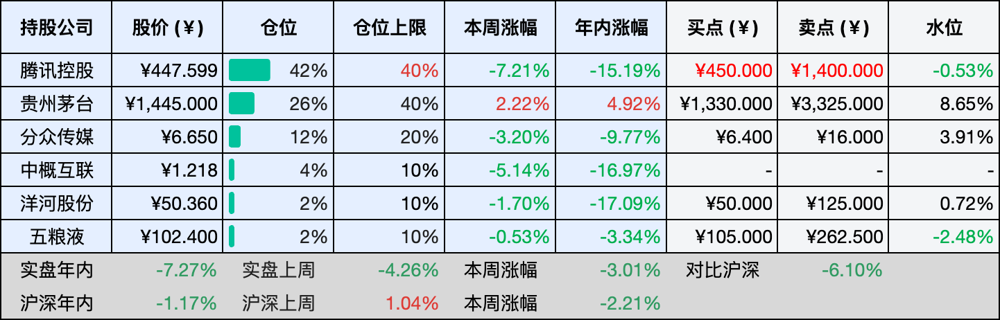
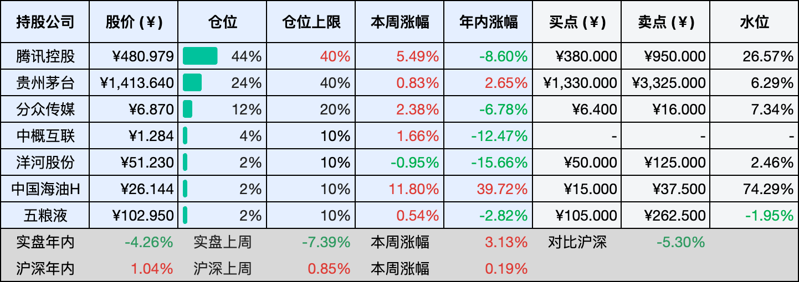

__微信公众号文章地址：[老罗投资周记-20260321](https://mp.weixin.qq.com/s/jsK87xUNpOVCLt1BZqWJEA)__

```
老罗投资周记，每周六更新。专注于股权投资、阅读、学习与个人成长，知行合一、日拱一卒、投资人生。微信公众号【老罗投资】，文章均首发于公众号。
```

## 1. 本周交易

周五(03月20日)清仓卖出中国海油H(00883)，卖出价格为26.421元人民币。

## 2. 目前持仓

当前持有的股票包括：腾讯控股 42%、贵州茅台 26%、分众传媒 12%、中概互联 4%、洋河股份 2%、五粮液 2%。

此外还有部分现金，加上少量的恒瑞医药、海康威视、粉笔等股票，其份额较少，仅作为观察仓不进行记录。

本周投资组合整体涨跌 <span class="green">-3.01%</span>，年内收益率 <span class="green">-7.27%</span>。

**注：**

1. 表格底部数据为老罗与沪深300指数年内收益率对比。
2. 港股持仓已按实时汇率换算为人民币。



## 3. 上周数据



## 4. 本周事项

+ 腾讯年报及估值调整

==只对持股和交易感兴趣的朋友，读到这里就可以退出了。后面是对上述事件的展开，无新内容。==

### 4.1 腾讯年报及估值调整

腾讯本周发布2025年财报，全年营收7517.7亿元，同比增长14%；非国际财务报告准则下的归母净利润达到2596亿元，同比增长17%。非常优秀的成绩单，但市场先生并不买账，因为腾讯今年将在AI方面加大投入，同时减少回购金额，这周腾讯先涨后跌，全周跌幅达到了7.21%。

然后是估值调整，未来三年，腾讯的非国际净利润如果保持年均10%的复合增长，这个增速不算高，这是对腾讯核心业务稳定性的认可：游戏、广告、金融科技这几块基本盘，虽然各自面临不同的周期，但叠加在一起，整体韧性依然足够。基于这个假设，三年后的利润预测大约是2596乘以1.1的三次方，得到3455亿元。

有了利润的预测，估值就变得相对简单，如果给一个合理市盈率25倍，对应的三年后合理市值大约是8.64万亿元。考虑到安全边际，理想买点通常设在合理市值的一半左右，也就是4.32万亿元，折合每股约473元人民币，在这个基础上再保守一点，买入价格定为450元人民币，具备非常厚实的安全边际。这个价格，以当前利润水平计算，买入时的市盈率大约在16倍左右，对于腾讯这样体量的公司来说，这是一个留有容错空间的位置。不过，目前腾讯的仓位已经偏高，除非出现3字头的BUG价格，否则暂时没有买入计划。

再看卖点，卖点取两个数值中的较低者，一个是三年后合理估值的150%，也就是12.96万亿元，对应股价约1420元；另一个是当年利润的50倍，2596亿乘以50也是12.98万亿元，大致相当。所以卖点可以定在1400元附近，从目前的股价到卖点，还有相当可观的空间。但投资就是这样，空间是空间，过程是过程，中间的波动谁也说不准。

可能有人会问，10%的增速是不是太保守了？其实这个问题可以反过来想，如果腾讯未来三年的增长真的能超过10%，那当然更好，意味着现在的价格会更便宜，但如果达不到10%，那么保守的预测本身就是一层保护。在投资里，宁可把困难想得多一点，把预期放得低一点，这样最后的结果反而容易超出预期。

数据会说话，但数据也只是一部分，真正让我愿意继续持有腾讯的，不是那些精确到小数点后的估值，而是它在游戏、广告、金融科技这些领域里，依然保持着对用户的敏锐和产品上的执行力，这比任何短期价格波动都更值得信赖。

## 5. 本周读书

### 5.1 《我们都是普通人：《水浒传》人物的市井人生》

这是一本从人性角度分析水浒的书，它讲的不是英雄好汉，而是一群普通人，从柴米油盐的日子里一步步被推着走，直到背上人命，踏上梁山。每一段路，每一次抉择，都写得细致入微，怎么走投无路，怎么一步步变成了杀人放火的亡命之徒。

所谓义气相投、以义相交的结义，说到底不过是拉帮结派最好的借口，而那个替天行道的口号，细细琢磨，也不过是蛊惑人心的把戏。人最底层的渴望，其实很简单——被看见。因为被看见，就意味着我的存在是有价值的。

每一个结局，说到底都是自己选的路，如果先读这本，再回头看《水浒传》，大概会读出完全不一样的味道。

评分四星半⭐️⭐️⭐️⭐️✨

### 5.2 《不内耗人生：王阳明独知力修心课》

落笔随心不设限，行事笃实不空谈，不困过往不忧未来，自在随心便是生活真谛。

评分三星半⭐️⭐️⭐️✨

## 6. 本周运动

本周无运动，下周得恢复了。

如果觉得本文还不错，那就点个赞或者在看吧，祝大家周末愉快！

```
老罗投资周记，每周六更新。专注于股权投资、阅读、学习与个人成长，知行合一、日拱一卒、投资人生。微信公众号【老罗投资】，文章均首发于公众号。
免责声明：本公众号只作为本人的投资日志记录，本文中提及的个股都有腰斩或血本无归的风险，本人不做任何投资建议，投资请坚持独立思考。
```

__微信公众号文章地址：[老罗投资周记-20260321](https://mp.weixin.qq.com/s/jsK87xUNpOVCLt1BZqWJEA)__