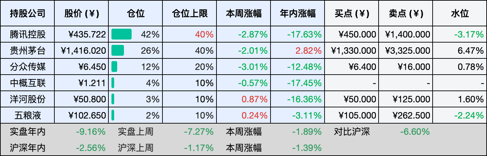

__微信公众号文章地址：[老罗投资周记-20260328](https://mp.weixin.qq.com/s/fVp8XKtW9hnAWIQl5oYXYg)__

```
老罗投资周记，每周六更新。专注于股权投资、阅读、学习与个人成长，知行合一、日拱一卒、投资人生。微信公众号【老罗投资】，文章均首发于公众号。
```

## 1. 本周交易

无

## 2. 目前持仓

当前持有的股票包括：腾讯控股 42%、贵州茅台 26%、分众传媒 12%、中概互联 4%、洋河股份 3%、五粮液 2%。

此外还有部分现金，加上少量的恒瑞医药、海康威视、粉笔等股票，其份额较少，仅作为观察仓不进行记录。

本周投资组合整体涨跌 <span class="green">-1.89%</span>，年内收益率 <span class="green">-9.16%</span>。

**注：**

1. 表格底部数据为老罗与沪深300指数年内收益率对比。
2. 港股持仓已按实时汇率换算为人民币。



## 3. 上周数据


## 4. 本周事项

+ 贵州茅台代售制新政正式落地
+ 恒瑞医药年报发布

==只对持股和交易感兴趣的朋友，读到这里就可以退出了。后面是对上述事件的展开，无新内容。==

### 4.1 贵州茅台代售制新政正式落地

本周，茅台在渠道上又迈出了一步，针对茅台十五年、精品茅台、生肖茅台这些核心的非标产品，公司正式落地了代售制。简单来说，经销商不再像过去那样买断货权，而是先交一笔保证金，卖出去之后赚取5%的服务费。所有代售产品，都要通过i茅台平台来完成销售。

过去，经销商是先把货买下来，再自己定价卖出去，赚的是进销差价。这意味着经销商手里有货，就有定价权，市场上价格的波动，很大程度上取决于他们怎么卖。现在改成了代售制，货还是茅台自己的，经销商只负责卖，赚的是服务费，价格严格执行官方统一的零售价。这样一来，茅台对终端价格的掌控力一下子强了很多。

经销商的角色也在变，以前他们是独立的经营者，现在是服务商，以前承担的是买断货的风险，现在赚的是相对稳定的服务费。这种转变，短期内可能会让一些习惯了传统模式的经销商不太适应，但从长期看，渠道的功能变得更纯粹了，经销商不用再操心库存和价格，只需要专注于把酒卖给真正的消费者。

对茅台来说，这一步棋的意图很清晰，这些年茅台的价格体系一直是市场关注的焦点，尤其是非标产品，价格波动比较大，容易滋生投机和囤货。通过代售制把零售价格统一起来，把销售渠道集中到官方平台，既稳定了市场预期，也减少了中间环节的博弈。

当然，任何变革都不会一帆风顺，代售制的落地，需要经销商的配合，也需要系统的支撑，i茅台能不能承接住这么大的销量，服务费的模式能不能让经销商满意，这些都需要在实践中慢慢磨合。但不管怎么说，这一步迈出去，方向是明确的，茅台的渠道改革，正在从过去试探性的摸索，进入到一个更为系统的阶段。

### 4.2 恒瑞医药年报发布

恒瑞医药全年营收316.29亿元，同比增长13.02%；归母净利润77.11亿元，同比增长21.69%，营收和净利润都创下了历史新高。一个是创新药销售收入，全年达到163.42亿元，同比增长26.09%，占药品销售收入的比重首次突破58%。这意味着，创新药已经真正扛起了业绩增长的大旗。另一个是对外许可收入，全年33.92亿元，同比增长25.62%。

从2023年至今，恒瑞已经完成了12笔海外授权交易，潜在总交易价值超过270亿美元。这种BD收入，正在成为公司越来越重要的现金流来源。拆开来看，抗肿瘤创新药收入132.40亿元，同比增长18.52%；非肿瘤创新药收入31.02亿元，同比大增73.36%。非肿瘤领域的高增速，说明公司的产品矩阵正在从单一的肿瘤领域向更广泛的疾病领域延伸。研发投入方面，全年累计研发投入87.24亿元，占营收比重27.58%。这种高强度的投入，为后续管线储备了充足弹药。年报中还提出，力争2026年创新药销售收入实现超过30%的增长，同时预计2026年至2028年将有约53项创新成果获批上市。

估值方面，2025年归母净利润77.11亿元，这是一个还不错的基数。考虑到公司正处于创新药密集兑现期，未来三年保持15%的复合增长不算激进，这个增速低于公司自身设定的创新药增长目标，但留出了足够的安全边际。基于这个假设，三年后的利润预测大约是77.11乘以1.15的三次方，得到117.3亿元左右。给一个市盈率40倍，对应的三年后合理市值大约是4692亿元，考虑到创新药企业的成长性和管线厚度，40倍PE并非不可接受，恒瑞目前的研发投入强度和后续53项创新成果的预期，为这个估值提供了支撑。理想买点通常设在合理市值的一半左右，也就是2346亿元，折合每股约35元。

再看卖点，卖点取两个数值中的较低者，一个是三年后合理估值的150%，也就是7038亿元，对应股价约106元；另一个是当年利润的80倍，77.11亿乘以80是6169亿元，对应股价约93元。取较低者，卖点可以定在93元附近。

## 5. 本周读书

### 5.1 《吉卜力的天才们》

挺不错的一本书，那些年看过的电影《天空之城》《龙猫》《侧耳倾听》《幽灵公主》《哈尔的移动城堡》《起风了》《千与千寻》《悬崖上的金鱼公主》《借东西的小人阿莉埃蒂》《红猪》，原来背后有这么多故事。每一部作品的制作过程，都藏着创作者的心思和坚持，读完之后再看这些电影，感觉就会不太一样了。

评分三星半⭐️⭐️⭐️✨

### 5.2 《投资第1课》

在投资市场里待得越久，越觉得它像一面镜子，总会照见自己身上那些最脆弱、最不愿面对的东西。所以很多人在市场里沉浮多年后，都会生出一种感慨：投资的成功，往往是我们在成为一个更好的人之后，自然得到的结果。

评分三星半⭐️⭐️⭐️✨

## 6. 本周运动

本周运动两次，天气逐渐暖和了，下周继续恢复。

如果觉得本文还不错，那就点个赞或者在看吧，祝大家周末愉快！

```
老罗投资周记，每周六更新。专注于股权投资、阅读、学习与个人成长，知行合一、日拱一卒、投资人生。微信公众号【老罗投资】，文章均首发于公众号。
免责声明：本公众号只作为本人的投资日志记录，本文中提及的个股都有腰斩或血本无归的风险，本人不做任何投资建议，投资请坚持独立思考。
```

__微信公众号文章地址：[老罗投资周记-20260328](https://mp.weixin.qq.com/s/fVp8XKtW9hnAWIQl5oYXYg)__