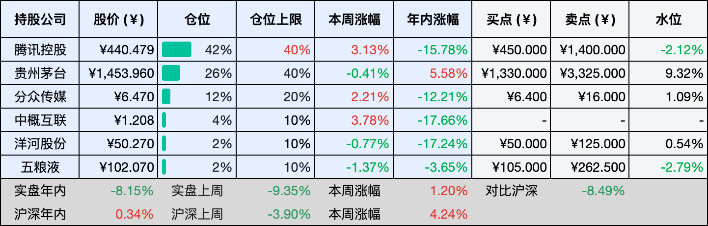
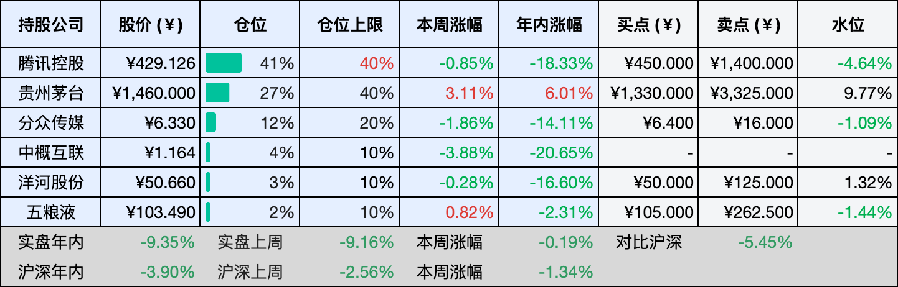

__微信公众号文章地址：[老罗投资周记-20260411](https://mp.weixin.qq.com/s/-nu7VlsrLjuVr1roTT_LlA)__

```
老罗投资周记，每周六更新。专注于股权投资、阅读、学习与个人成长，知行合一、日拱一卒、投资人生。微信公众号【老罗投资】，文章均首发于公众号。
```

## 1. 本周交易

无

## 2. 目前持仓

当前持有的股票包括：腾讯控股 42%、贵州茅台 26%、分众传媒 12%、中概互联 4%、洋河股份 2%、五粮液 2%。

此外还有部分现金，加上少量的恒瑞医药、海康威视、粉笔等股票，其份额较少，仅作为观察仓不进行记录。

本周投资组合整体涨跌 <span class="red">+1.20%</span>，年内收益率 <span class="green">-8.15%</span>。

**注：**

1. 表格底部数据为老罗与沪深300指数年内收益率对比。
2. 港股持仓已按实时汇率换算为人民币。



## 3. 上周数据



## 4. 本周事项

+ 本周腾讯在回购力度上超预期加码
+ 五粮液大股东拟增持5-10亿元

==只对持股和交易感兴趣的朋友，读到这里就可以退出了。后面是对上述事件的展开，无新内容。==

### 4.1 本周腾讯在回购力度上超预期加码

三月底的业绩电话会上，腾讯总裁刘炽平说得很清楚，2026年要增加AI资本开支，回购规模可能会适当减少。这话当时听着逻辑很清晰，钱要往新方向流，回馈股东的力度自然要调一调。所以当本周腾讯连续两日单日回购达到10亿港元、创下近一年新高的时候，市场多少有些意外，不是说好了要减吗？怎么反而加码了？

自3月26日以来，腾讯已经连续八个交易日回购，累计金额约38亿港元，年内回购总额突破百亿，在港股市场排在第一。通常理解，回购是公司用真金白银表达对当前股价的判断，但腾讯这次的特殊之处在于，它是在一个表态收缩的时间窗口里，做出了扩张的动作。这意味着管理层对自身现金流的弹性比外界估计的更乐观，或者说，AI投入和股东回报在当前阶段并不是非此即彼的零和选择。

同时，马化腾的持股比例从8.72%微增至8.82%，幅度不大，但在大股东持续减持的行业背景下，这个方向本身就值得留意。每股派息从4.50港元提到5.30港元，增幅接近18%，分红和回购放在一起看，股东回报的整体力度是在提升的。

一家公司在转型期往往面临两难，既要为新业务储备弹药，又不能冷落老股东，腾讯这几周的操作，至少表明它暂时找到了一个平衡点。AI的故事还要讲很久，但市场的耐心需要真金白银来维系，回购超预期，说到底是在用最直接的方式告诉外界：账上的钱，非常够用。

### 4.2 五粮液大股东拟增持5-10亿元

五粮液的大股东出手了，4月8号晚上出了公告，未来半年要增持自家股票5到10个亿。这个数字并不算多吓人，但翻一翻24年的账，那时候已经增过一轮了，差不多5个亿，这次直接翻倍，如果是顶格买，加起来就是15个亿。这几年白酒行业里，单一大股东掏出这么多钱来买股票，还真不多见。

现在白酒板块什么光景大家心里都很清楚，价格跌跌不休，库存积压，市场情绪也说不上好。往大了说，白酒行业调整还没到头，但龙头一动，后面经常有人跟着，五粮液这一下没准也能带动其他酒企。毕竟大佬都拿钱投票了，市场的悲观多少能缓一缓。当然增持归增持，长期还得看生意本身，五粮液这几年在渠道和产品上一直在折腾，效果怎么样，最后得看财报。

增持的期限是半年，正好从春季的全国糖酒商品交易会跨到中秋，把白酒消费从淡季到旺季的转换期全包进去了。这几个月里，市场情绪会跟着销售数据起起伏伏，大股东选现在进来，既是给市场吃定心丸，也是在赌自己的判断。增持不是说能立马改变什么，而是它反映了内部人最真实的看法，毕竟没有谁比大股东更清楚自家企业经营的底细。

## 5. 本周读书

### 5.1 《你身体里的奥秘》

我们的身体，其实比想象中要神奇得多，借助医学知识去了解它，本身就是一件挺快乐的事，那种求知欲被满足的感觉，很难用别的东西替代。

评分四星⭐️⭐️⭐️⭐️

### 5.2 《救命之方：一本书教你解决全家人常见健康问题》

喜乐的心是良药，忧伤的灵使骨枯干，这话说得一点不假。心态对健康的影响，远比我们以为的要大，试着用积极的心态去面对这个世界吧，别让消极的情绪占据上风。

评分四星⭐️⭐️⭐️⭐️

## 6. 本周运动

本周运动两次，一次健身环大冒险，一次公园健走，下周继续。

如果觉得本文还不错，那就点个赞或者在看吧，祝大家周末愉快！

```
老罗投资周记，每周六更新。专注于股权投资、阅读、学习与个人成长，知行合一、日拱一卒、投资人生。微信公众号【老罗投资】，文章均首发于公众号。
免责声明：本公众号只作为本人的投资日志记录，本文中提及的个股都有腰斩或血本无归的风险，本人不做任何投资建议，投资请坚持独立思考。
```

__微信公众号文章地址：[老罗投资周记-20260411](https://mp.weixin.qq.com/s/-nu7VlsrLjuVr1roTT_LlA)__