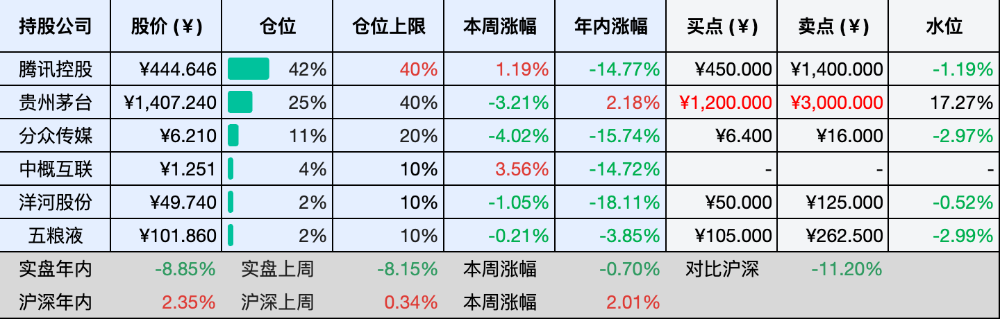

__微信公众号文章地址：[老罗投资周记-20260418](https://mp.weixin.qq.com/s/FxbTR-pQzRc2-kZ__n429A)__

```
老罗投资周记，每周六更新。专注于股权投资、阅读、学习与个人成长，知行合一、日拱一卒、投资人生。微信公众号【老罗投资】，文章均首发于公众号。
```

## 1. 本周交易

无

## 2. 目前持仓

当前持有的股票包括：腾讯控股 42%、贵州茅台 25%、分众传媒 11%、中概互联 4%、洋河股份 2%、五粮液 2%。

此外还有部分现金，加上少量的恒瑞医药、海康威视、粉笔等股票，其份额较少，仅作为观察仓不进行记录。

本周投资组合整体涨跌 <span class="green">-0.70%</span>，年内收益率 <span class="green">-8.85%</span>。

**注：**

1. 表格底部数据为老罗与沪深300指数年内收益率对比。
2. 港股持仓已按实时汇率换算为人民币。



## 3. 上周数据


## 4. 本周事项

+ 贵州茅台发布财报

==只对持股和交易感兴趣的朋友，读到这里就可以退出了。后面是对上述事件的展开，无新内容。==

### 4.1 贵州茅台发布财报

4月16日，贵州茅台发了2025年年报，全年营收1688.38亿元，同比下降1.21%；归母净利润823.20亿元，同比下降4.53%。这是茅台2001年上市以来，第一次出现营收和净利润双双负增长，对于一家习惯了两位数增长的公司来说，这份答卷确实有点拉垮。

但仔细拆开看，情况并没有表面那么悲观。茅台酒全年营收1465亿元，同比微增0.39%，销量约4.68万吨，基本盘还是稳的，拖后腿的主要是系列酒，营收222.75亿元，下滑9.76%。四季度的落差更大，营收同比降了19.43%，净利润降了30.34%，管理层的解释是酱香系列酒产品结构调整所致。茅台在四季度主动控货、梳理渠道，而不是为了保业绩继续压货，这算不算一次主动出清，见仁见智。

分渠道看，2025年发生了一个历史性的变化，直销收入845.43亿元，同比增长12.96%，首次超过批发代理渠道的842.32亿元。这意味着茅台的销售结构正在从依赖经销商转向更加多元化的直营体系，不过i茅台的表现不太理想，全年销售收入130.31亿元，同比下降34.92%。

面对业绩下滑，茅台在股东回报上拿出了最大的诚意，全年将分红650.33亿元，占归母净利润的79%，分红比例比上一年提高了4个百分点，创下了历史新高。同时茅台已经启动了第二轮注销式回购计划，截至3月底，累计回购约79.42万股，耗资11.12亿元。一边是利润下降，一边是真金白银的回购和分红，在业绩承压的背景下，茅台选择了用最直接的方式向市场传递信心。

接下来说估值，这是每个人自己的功课，以下只是我个人的思考框架：茅台2025年归母净利润823.20亿元。对于未来三年，我的假设并不算激进，茅台酒新增产能要到2026年才能释放，提价效应也需要时间体现，再加上渠道改革的阵痛期，三年后利润达到1000亿元是一个相对保守的预期。基于这个假设，估值的核心变量是无风险收益率，目前10年期国债收益率在1.8%左右，但更合适的参照是无风险理财产品的收益率水平。如果取30倍PE（对应约3.3%的无风险收益率），三年后合理市值约3万亿元，理想买点通常设在合理市值的一半左右，也就是1.5万亿元，折合每股约1200元（按12.56亿股计算），理想卖点调整为3000元。

如果从更保守的思路来看，当前茅台的市盈率在22倍左右，处于历史估值的中低区域。对于一家拥有深厚品牌护城河、现金流充沛、且持续通过分红和回购回馈股东的公司来说，这个价格是否具备吸引力，取决于你愿意为确定性支付多少溢价。关键不是具体的数字，而是你是否愿意在当前价格下买入，以及你为市场会给出更高估值的判断留了多少安全边际。

4月底茅台还会发布一季报，我对一季报抱有一些期待。i茅台今年大幅放量，飞天茅台春节需求回暖，叠加3月底的提价效应，多家机构预测一季度收入利润或实现5%以上的增长。一季度如果能实现正增长，那将是一个积极的信号，说明茅台最困难的阶段可能正在过去。

## 5. 本周读书

### 5.1 《家庭常见病中成药使用指南》

这本书里讨论的，都是中国家庭最常见也最让人头疼的健康问题：感冒、发热、咳嗽、鼻塞、胃胀、积食、湿热、便秘、失眠，还有女性经期不适、补气补血这些日常需求。这些问题几乎每个人都会遇到，但往往不知道怎么用药才准。

作者结合自己多年的临床经验，把复杂的辨证逻辑拆成了三个好记又好用的关键点：看症状表现、看发生阶段、看体质倾向。这样一来，人人都能掌握，也人人都用得上。

评分四星⭐️⭐️⭐️⭐️

## 6. 本周运动

本周运动五次，一次羽毛球，四次公园健走，下周继续。

如果觉得本文还不错，那就点个赞或者在看吧，祝大家周末愉快！

```
老罗投资周记，每周六更新。专注于股权投资、阅读、学习与个人成长，知行合一、日拱一卒、投资人生。微信公众号【老罗投资】，文章均首发于公众号。
免责声明：本公众号只作为本人的投资日志记录，本文中提及的个股都有腰斩或血本无归的风险，本人不做任何投资建议，投资请坚持独立思考。
```

__微信公众号文章地址：[老罗投资周记-20260418](https://mp.weixin.qq.com/s/FxbTR-pQzRc2-kZ__n429A)__