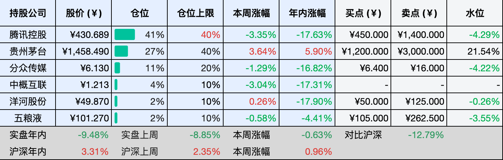

__微信公众号文章地址：[老罗投资周记-20260425](https://mp.weixin.qq.com/s/nlmZB_wHNlDZF_oro8RJBQ)__

```
老罗投资周记，每周六更新。专注于股权投资、阅读、学习与个人成长，知行合一、日拱一卒、投资人生。微信公众号【老罗投资】，文章均首发于公众号。
```

## 1. 本周交易

无

## 2. 目前持仓

当前持有的股票包括：腾讯控股 41%、贵州茅台 27%、分众传媒 11%、中概互联 4%、洋河股份 2%、五粮液 2%。

此外还有部分现金，加上少量的恒瑞医药、海康威视、粉笔等股票，其份额较少，仅作为观察仓不进行记录。

本周投资组合整体涨跌 <span class="green">-0.63%</span>，年内收益率 <span class="green">-9.48%</span>。

1. 表格底部数据为老罗与沪深300指数年内收益率对比。
2. 港股持仓已按实时汇率换算为人民币。



## 3. 上周数据


## 4. 本周事项

+ 贵州茅台一季报
+ 腾讯洽谈投资DeepSeek

==只对持股和交易感兴趣的朋友，读到这里就可以退出了。后面是对上述事件的展开，无新内容。==

### 4.1 贵州茅台一季报

茅台一季报出来了，营收547亿，涨了6.34%，净利272亿，微增1.47%。去年全年还在往下走，今年开年总算回到了正增长的轨道上，算是个还不错的开头。

核心产品依然稳，茅台酒一季度卖了460亿，同比增长5.6%，这个速度不算快，但放在眼下白酒行业整体偏冷的背景下，能稳住本身就不容易。系列酒延续了扩张势头，涨了12%。i茅台的提速倒是让人有些意外，一个季度卖了215亿，同比猛增267%，新增用户将近1400万。

价格方面，3月底飞天茅台自营零售价从1499提到了1539。往年提价都挑旺季，这次选在淡季，而且只调了自营渠道，其他暂时没动。整体看下来，不像急着多赚钱，更像是在给价格体系调整铺路。

渠道结构也还在变，一季度经销端收入少了近30亿，经销商净减了255家。传统渠道在缩，但i茅台这批直销力量把缺口接住了。以后经销商大概不再只是卖货那么简单，会更偏向做服务、维护圈层，帮着把东西真正送到消费者手上。

营收涨了6个多点，利润只涨了1.5%左右，这个差距确实有点明显。除了飞天提价在3月底对一季度利润贡献有限、i茅台占比上升影响毛利率之外，费用端的增加也是一个重要原因。

一季度销售费用16.06亿元，比去年同期的14.95亿元增长了7.39%，增速略高于营收增幅，主要投向了直销渠道建设和品牌推广。管理费用增长了5%左右，研发费用同比大增106%，接近翻倍。财务费用由盈转亏，从上年同期的净收益转为净支出，可能是银行存款利率下降导致利息收入减少。

这几项费用加起来，给利润带来了不小的压力，多种因素叠在一起，利润自然慢了一点。但这并不是茅台赚钱的能力出了毛病，更多是节奏和结构上的问题。

现金流依然扎实。现金净增加额同比涨了41%，账上趴着接近两千亿现金，怎么把这笔钱用好，不管是分红还是回购，选项都很多。

### 4.2 腾讯洽谈投资DeepSeek

腾讯和阿里巴巴正在洽谈投资DeepSeek，DeepSeek这轮估值开到了200亿美元以上，是它成立以来第一次对外融资。腾讯想要持有20%的股份，但DeepSeek对控制权很在意，还在谈。以前DeepSeek全靠母公司幻方输血，创始人梁文锋自己就持有超过八成，现在愿意开门融资，说明训练V4这种级别的模型，实在是太烧钱了。

同时，腾讯自己的大模型也更新了，混元Hy3 preview开源，总参数2950亿，激活210亿，支持256K上下文，最低输入1.2块/百万Tokens，输出4块，定价几乎是地板价。腾讯的思路很清晰，不卷参数，卷成本和应用。

本周DeepSeek V4终于来了，4月24号，V4预览版上线并开源，两个版本旗舰版V4-Pro，参数1.6万亿，激活490亿；性价比版V4-Flash，参数2840亿，激活130亿。两个都支持100万token超长上下文，还能在思考和非思考模式之间切换。技术上，V4在架构上做了大改，长上下文场景下的计算量只有上一代的不到三成，成本大幅降低。

DeepSeek的技术报告里同时提到了华为昇腾和英伟达，表示已经在两种芯片上跑通了训练和推理，V4-Pro当前服务能力还受限，但下半年昇腾950出来后，成本有望再降，这是国产大模型和国产芯片深度绑定的一个标志。

回到腾讯，它现在正尝试用两条腿走路，一边想投DeepSeek，补自己的短板，一边自研模型低价开源，完善自己的生态。DeepSeek的V4，证明了自己不仅能做技术，还能带动国产芯片。这场长跑才到中段，变量还很多，谁也不可能轻松突围。

## 5. 本周读书

### 5.1 《阴阳一调百病消》

阳虚久了，阴也会跟着虚；阴虚久了，阳同样会虚，很少有人是单纯的阳虚或阴虚，这是我最近才真正消化掉的一个认知。阴阳之间互根互用、对立制约，能把中医里的这一层关系活学活用，真的太重要了。

评分四星⭐️⭐️⭐️⭐️

## 6. 本周运动

本周运动七次，一次健身环大冒险，六次公园健走，下周继续。

如果觉得本文还不错，那就点个赞或者在看吧，祝大家周末愉快！

```
老罗投资周记，每周六更新。专注于股权投资、阅读、学习与个人成长，知行合一、日拱一卒、投资人生。微信公众号【老罗投资】，文章均首发于公众号。
免责声明：本公众号只作为本人的投资日志记录，本文中提及的个股都有腰斩或血本无归的风险，本人不做任何投资建议，投资请坚持独立思考。
```

__微信公众号文章地址：[老罗投资周记-20260425](https://mp.weixin.qq.com/s/nlmZB_wHNlDZF_oro8RJBQ)__