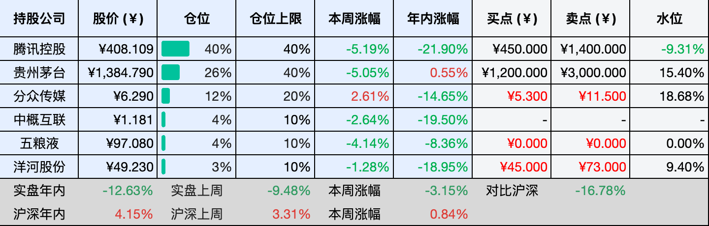

__微信公众号文章地址：[老罗投资周记-20260502](https://mp.weixin.qq.com/s/bIJuLhKGWaDj1qJqtgQHYA)__

```
老罗投资周记，每周六更新。专注于股权投资、阅读、学习与个人成长，知行合一、日拱一卒、投资人生。微信公众号【老罗投资】，文章均首发于公众号。
```

## 1. 本周交易

周一(04月27日)买入五粮液(000858)，买入价格为100.100元人民币。

## 2. 目前持仓

当前持有的股票包括：腾讯控股 40%、贵州茅台 26%、分众传媒 12%、中概互联 4%、五粮液 4%、洋河股份 3%。

此外还有部分现金，加上少量的恒瑞医药、海康威视、粉笔等股票，其份额较少，仅作为观察仓不进行记录。

本周投资组合整体涨跌 <span class="green">-3.15%</span>，年内收益率 <span class="green">-12.63%</span>。

1. 表格底部数据为老罗与沪深300指数年内收益率对比。
2. 港股持仓已按实时汇率换算为人民币。



## 3. 上周数据


## 4. 本周事项

+ 分众传媒年报
+ 洋河股份年报
+ 五粮液年报

==只对持股和交易感兴趣的朋友，读到这里就可以退出了。后面是对上述事件的展开，无新内容。==

### 4.1 分众传媒年报

分众传媒25年营业收入127.59亿元，同比增长4.05%，在广告市场整体承压的环境下，能维持正增长已属不易。但归属于上市公司股东的净利润只有29.46亿元，同比下滑了42.85%。营收微增，利润却几乎腰斩，利润下跌这么多，主要是非经常性因素的影响，并非主营业务的恶化。

利润大幅缩水，根源在于对参股的数禾科技计提了一次性资产减值。2025年，分众对联营企业数禾科技的长期股权投资计提减值准备21.53亿元，同时按权益法分担了数禾因行业监管变化产生的约3.76亿元亏损，两者合计减少了2025年四季度归母净利润约25.29亿元。

剔除这笔会计上的非经常性拖累，公司的核心楼宇媒体业务依然保持着稳定的盈利能力和现金流水平，分众此前并没有介入数禾科技的日常运营，退出后可以拿着7.91亿元的现金回笼，更加聚焦梯广主业。

25年分众经营性现金流净额仍然达到了72.09亿元，同比增长8.54%，主业血液循环依然通畅，应收账款规模也维持在比较健康的水平。分红方面，拟向全体股东每10股派发现金红利1.30元（含税），并叠加中期分红，延续了高比例回馈股东的惯例。

最后是估值，强周期公司使用席勒估值法，分众16至25这十年利润共计440亿，总股本144.42亿股，给分众合理估值25倍PE，买点约为5.3元，卖点约为10.7元。

### 4.2 洋河股份年报

2025年营收192.11亿元，同比下滑33.47%；归母净利润22.06亿元，同比下滑66.94%。扣非净利润21.35亿元，降幅接近七成。这是洋河近年来最差的一份成绩单，但这个业绩并非完全没有预期，白酒行业深度调整，洋河所处的价位带竞争尤其激烈，加上公司自身也在主动梳理渠道、消化库存。

拟每10股派发现金红利14.70元，合计分红22.14亿元，占当年归母净利润的100.38%，把去年赚的钱全部分掉了。在利润大幅下滑的年份，维持如此高的分红比例，管理层传递信心的意图很直白。不过也得看到，这与早几年承诺的每年不低于70亿元分红相比，实际到手的金额缩水了不少，那些冲着稳定高分红的投资者，需要好好算一算账。

盈利能力指标也在走弱：毛利率71.60%，同比下降1.55个百分点；净利率11.40%，同比下降11.68个百分点。加权平均净资产收益率4.62%，较上年下降7.45个百分点。这些数字说明，洋河正处在一个比较难受的阶段，收入下降了，费用却没办法同比例缩减，利润自然会被两头挤压。

估值方面，在26Q1扣非约24.25亿、后期旺季收入还有回流的节奏下，2026全年取约38亿（同比增长约78%，并非做不到，只是立足保守安全边际），2027年约46亿，2028年约55亿。三年后合理估值55亿×25=1375亿，合理估值的一半=688亿，总股本按年报口径15.06亿股，买点股价688亿÷15.06亿≈45元（向下取整）。三年后合理估值乘150%是1375×1.5=2063亿，对应股价约137元，当年50倍PE（用2025年归母净利润22.06亿为基准）=1103亿，对应股价约为73元。合理卖点取两者中较低的73元。

### 4.3 五粮液年报

4月30日晚，五粮液终于发布了涵盖2025年年报和2026年一季报的迟来财报，还附加了2025年一季报、中报以及三季报的修订版。

发布的三份修订版财报里，数据被改得面目全非。其中最离谱的是2025年一季报，原本五粮液一季度营收高达369.4亿元，净利润148.6亿元，而修订版中，营收被降至170.86亿元，净利润更是腰斩至44.16亿元。而在全部的修订版财报中，2025年前三季度总营收调整暴减了303.07亿元，净利润更是大幅缩水150.36亿元。

五粮液的三份修订版财报还没来得及消化完，2026年一季报又甩出一个王炸。一季报数据显示，五粮液实现归母净利润80.63亿元，同比增长82.57%；营收228.38亿元，同比增长33.67%。而这一亮眼成绩单完全是踩在修订版财报数据之上，是人为制造的伪增长，如果以未经修正的2025年一季度数据为基准，2026年一季度真实营收同比下滑38.2%，净利润同比下滑45.7%。

五粮液对业绩的大幅调整，官方解释为将公司2025年的部分业务收入确认，变更为更加谨慎的核算方式，并称之为会计差错更正及追溯调整。然而，这种解释投资者会信吗？这是对以往激进的收入确认政策的集中洗澡，与前任董事长曾从钦在2月底前后因涉嫌严重违纪违法被留置调查也有着密切的关系。

财务洗澡不仅让市场对公司的诚信产生动摇，也让投资者对白酒行业数据披露规范性产生了深深的担忧。如此大规模的会计调整都被允许，那A股还有没有不能修改的财报？作为市值数千亿的白酒龙头，如此轻率的修正，受损失的不仅是股东，更是整个资本市场的信心。

老罗节后会清仓五粮液，不要问为什么都要清仓了，还会在本周一会买入2%的五粮液。老罗最近发懒，在发财报前没有管理条件单，结果100.1元自动触发了买入五粮液，这算是花钱又买了个教训，在年报发布季要注意暂停条件单，避免类似黑天鹅事件的发生。五粮液清仓后预计会换到茅台或是保留现金。

## 5. 本周读书

### 5.1 《摸着自己学人体》

心跳让血液奔流不息，食物让躯体充满活力。小小的受精卵，终成强大的人体，襁褓中的新生命，继承双亲的特质。人体精巧无比，美丽，又神秘。

如此精巧的构造，让人不禁怀疑是否存在什么看不见的超自然力量在幕后操纵着一切。但事实上，所有现象都可以通过化学和物理规律加以解释。所谓医学，就是在漫长的岁月中，将这些神秘现象一一阐明的科学。

评分四星⭐️⭐️⭐️⭐️

## 6. 本周运动

本周运动五次，踢了一次足球，参加了一次亲子运动会，三次公园健走，下周继续。

如果觉得本文还不错，那就点个赞或者在看吧，祝大家周末愉快！

```
老罗投资周记，每周六更新。专注于股权投资、阅读、学习与个人成长，知行合一、日拱一卒、投资人生。微信公众号【老罗投资】，文章均首发于公众号。
免责声明：本公众号只作为本人的投资日志记录，本文中提及的个股都有腰斩或血本无归的风险，本人不做任何投资建议，投资请坚持独立思考。
```

__微信公众号文章地址：[老罗投资周记-20260502](https://mp.weixin.qq.com/s/bIJuLhKGWaDj1qJqtgQHYA)__