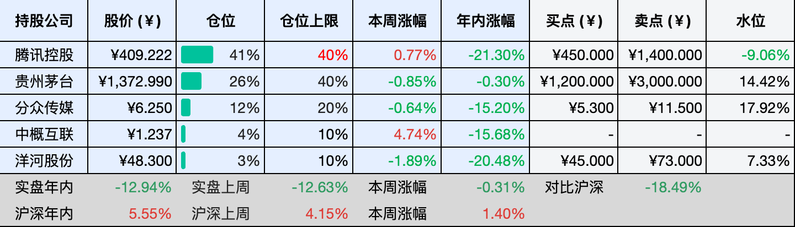
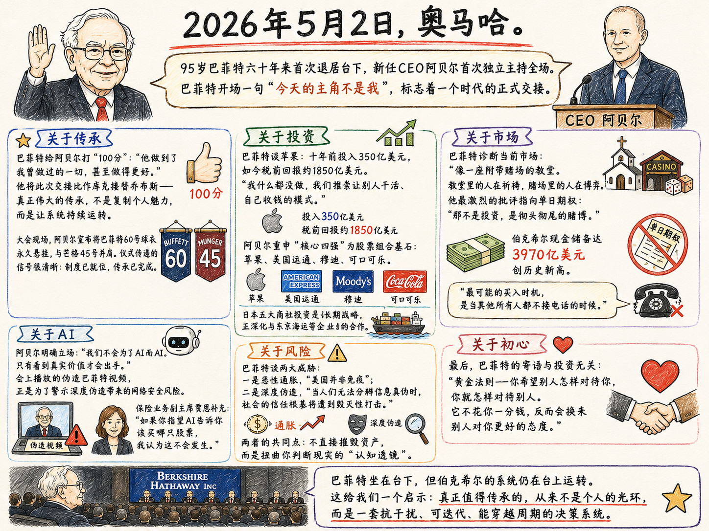

__微信公众号文章地址：[老罗投资周记-20260509](https://mp.weixin.qq.com/s/7y0yL4SOuG4SH7DOWz1tQg)__

```
老罗投资周记，每周六更新。专注于股权投资、阅读、学习与个人成长，知行合一、日拱一卒、投资人生。微信公众号【老罗投资】，文章均首发于公众号。
```

## 1. 本周交易

周三(05月06日)清仓卖出五粮液(000858)，卖出价格为90.99和91.01元人民币。

## 2. 目前持仓

当前持有的股票包括：腾讯控股 41%、贵州茅台 26%、分众传媒 12%、中概互联 4%、洋河股份 3%。

此外还有部分现金，加上少量的恒瑞医药、海康威视、粉笔等股票，其份额较少，仅作为观察仓不进行记录。

本周投资组合整体涨跌 <span class="green">-0.31%</span>，年内收益率 <span class="green">-12.94%</span>。

1. 表格底部数据为老罗与沪深300指数年内收益率对比。
2. 港股持仓已按实时汇率换算为人民币。



## 3. 上周数据


## 4. 本周事项

+ 清仓五粮液
+ 伯克希尔·哈撒韦年度股东大会

==只对持股和交易感兴趣的朋友，读到这里就可以退出了。后面是对上述事件的展开，无新内容。==

### 4.1 清仓五粮液

节后第一个交易日，按上期周记所计划的做了一笔操作，清仓了手里的五粮液，卖出价格在91元左右。这个价格比起买入成本，亏损不小，但有些亏损，拖得越久代价越大。

五粮液年报和一季报的事，这段时间真是沸沸扬扬。2025年全年营收同比下滑超过50%，净利润下滑超过70%，更让人难以接受的是，公司同时对2025年前三季度的财务数据做了大幅下调，一季度营收从369亿调到了170亿，净利润从148亿调到了44亿。这种“史诗”级别的会计更正，已经不是正常的误差范围，而是动摇了财务报表的可信度。

查理·芒格有句话，不要和猪摔跤。意思是有些烂摊子你不该去纠缠，越早抽身越好，一家公司如果连最基本的财务诚信都出了问题，那就是一条不可触碰的红线。你可以容忍业绩波动，可以容忍行业周期，但你不能容忍管理层在账本上动手脚，因为后者是不可修复的。

有人会说，五粮液还是那个品牌，酒还是那个酒，短期财务调整不影响长期价值。这个逻辑在一定程度上成立，但投资不只是算账，还要看人、看治理。当一家公司开始用会计手段修饰业绩，你很难判断下一次它会做出什么。信任这个东西，一旦打破，重建的成本太高。

止损从来不是一个愉快的决定，它会让人反复确认，是不是看错了？是不是还能再等等？但经验告诉我，当你已经开始质疑持有逻辑的基石时，往往已经晚了。这次清仓，算是对自己当初判断失误的一个交代，损失已经发生，能做的只是让损失停在现在，而不是继续放大。

市场里永远不缺机会，缺的是能让你安心持有的理由，五粮液这个事，就到此为止吧。


### 4.2 伯克希尔·哈撒韦年度股东大会

2026年伯克希尔股东大会依旧在奥马哈举办，今年有些不同，巴菲特没有上台，而是坐在了台下，这是他六十年来第一次将全场交给了另一个人，伯克希尔新任的CEO阿贝尔。巴菲特只说了一句开场白：今天的主角不是我。台下安静了一会，所有的人的心里都很清楚，一个时代正在完成交接。

阿贝尔此前已经在逐步接手公司的事务，这次算是第一次独立主持股东大会，巴菲特给他的表现打了满分，评价他做得比自己还好，并用了库克接替乔布斯来类比。真正的传承，从来不是复制个人魅力，而是一套能够持续运转的制度。

现场还有一个细节，阿贝尔将巴菲特的60号球衣永久悬挂，和查理芒格的45号并肩，仪式本身传递的信号很明确：制度已经就位，传承已经完成。

谈到投资，巴菲特再次提到了苹果，十年前伯克希尔投入了350亿美元，如今这笔投资的税前回报约为1850亿美元。他的评价很简洁，我们推崇让别人干活、自己收钱的模式。阿贝尔则重点介绍了伯克希尔股票组合的四块基石：苹果、美国运通、穆迪和可口可乐。还有对日本五大商社的投资属于伯克希尔的长期战略，它们之间的合作正在逐步深化。

目前伯克希尔的现金储备已经高达3970亿美元，创下了历史新高，有人问什么时候是买入的时机，巴菲特的回答是等其他人都不接电话的时候。

关于人工智能，阿贝尔的态度很务实，不会为了AI而AI，只有看到真实价值才会出手。会上还播放了一段AI伪造的巴菲特视频，用来提醒大家AI伪造所带来的安全风险。

巴菲特还谈到了两大威胁，一是恶性通胀，美国并不能够免疫；二是AI的深度伪造，当人们无法分辨信息真伪时，信任的根基将会被侵蚀。它们不直接摧毁资产，而是扭曲你判断现实的“认知透镜”。

对于当前市场，巴菲特给出了一个比喻，现在的市场就像一座附带赌场的教堂，教堂里的人在祈祷，赌场里的人在博弈。他批评最激烈的是单日期权，认为那不是投资，而是彻头彻尾的赌博。

巴菲特如今已经坐在了台下，但伯克希尔的系统仍在台上运转，真正值得传承的，从来不是个人的光环，而是一套能够抗干扰、可迭代、穿越周期的决策方式。



## 5. 本周读书

### 5.1 《半小时讲透第一性原理》

用第一性原理去思考，并不意味着你真能找到一个永恒不变的绝对真理，更为实际的态度是：基于我目前知道的信息，这已经是最接近真实的理解了，但如果哪天看到更靠谱的证据，我也随时准备改主意。

这种观点可以很坚定，但持有不必太固执的心态，可能才是第一性原理思维真正教会我们的事。

评分四星⭐️⭐️⭐️⭐️

### 5.2 《30分钟中老年力量训练》

健康是你所拥有的最宝贵的东西，一旦失去，要想重新获得是件很难，甚至不可能的事情。

评分四星⭐️⭐️⭐️⭐️

## 6. 本周运动

本周运动六次，在其他城市旅行暴走了两天，回来后又有四次公园健走，下周继续。

如果觉得本文还不错，那就点个赞或者在看吧，祝大家周末愉快！

```
老罗投资周记，每周六更新。专注于股权投资、阅读、学习与个人成长，知行合一、日拱一卒、投资人生。微信公众号【老罗投资】，文章均首发于公众号。
免责声明：本公众号只作为本人的投资日志记录，本文中提及的个股都有腰斩或血本无归的风险，本人不做任何投资建议，投资请坚持独立思考。
```

__微信公众号文章地址：[老罗投资周记-20260509](https://mp.weixin.qq.com/s/7y0yL4SOuG4SH7DOWz1tQg)__