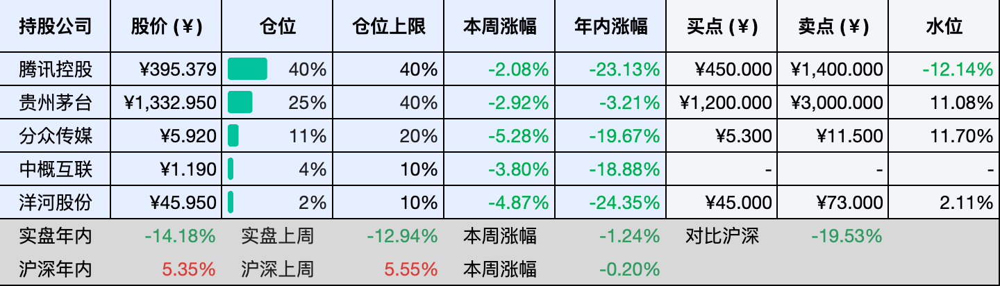
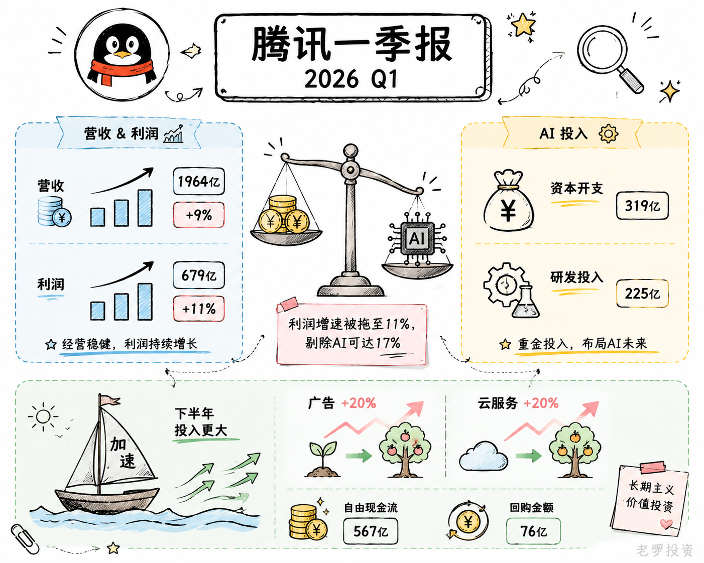
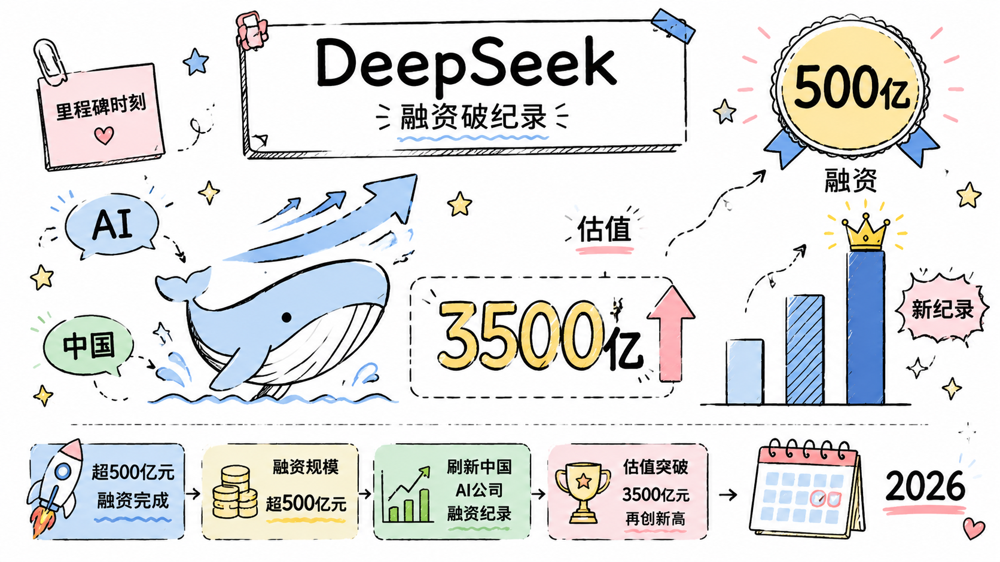
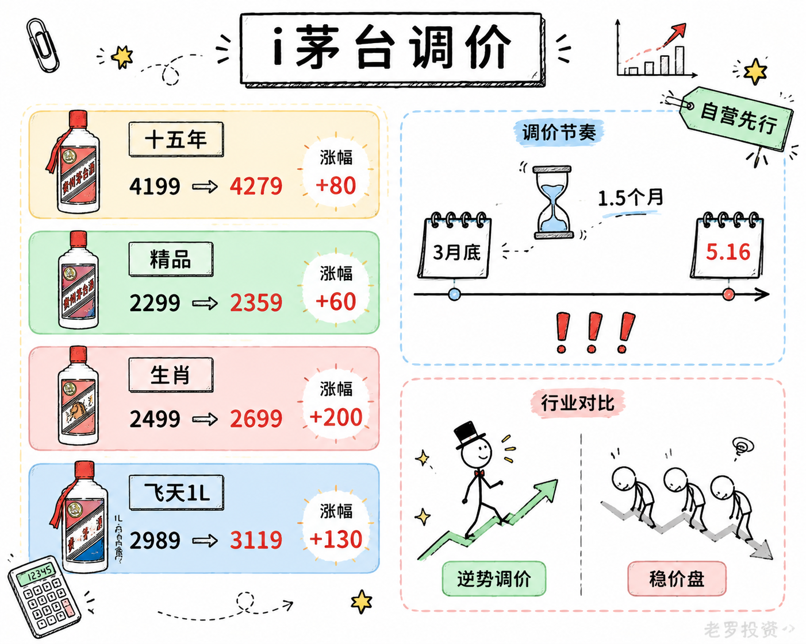

__微信公众号文章地址：[老罗投资周记-20260516](https://mp.weixin.qq.com/s/Az4kKj-rzwzraBVQaDSOmA)__

```
老罗投资周记，每周六更新。专注于股权投资、阅读、学习与个人成长，知行合一、日拱一卒、投资人生。微信公众号【老罗投资】，文章均首发于公众号。
```

## 1. 本周交易

无

## 2. 目前持仓

当前持有的股票包括：腾讯控股 40%、贵州茅台 25%、分众传媒 11%、中概互联 4%、洋河股份 2%。

此外还有部分现金，加上少量的恒瑞医药、海康威视、粉笔等股票，其份额较少，仅作为观察仓不进行记录。

本周投资组合整体涨跌 <span class="green">-1.24%</span>，年内收益率 <span class="green">-14.18%</span>。

1. 表格底部数据为老罗与沪深300指数年内收益率对比。
2. 港股持仓已按实时汇率换算为人民币。



## 3. 上周数据


## 4. 本周事项

+ 腾讯一季报
+ DeepSeek被曝融资500亿
+ i茅台调价

==只对持股和交易感兴趣的朋友，读到这里就可以退出了。后面是对上述事件的展开，无新内容。==

### 4.1 腾讯一季报

腾讯本周发布了第一季度的成绩单：营收1964亿，增涨9%；非国际净利润679亿，增涨11%。营收和利润还在增涨，但增速并不算很快。

最值得关注的是，AI花了多少钱，花得值不值，一季度资本开支319亿，研发225亿，比去年多了将近两成，腾讯在AI上的投入确实不小。如果不算新AI产品的投入，利润涨幅能达到17%，也就是说，账面上的增长是被这些投入拖慢的。

不过钱花出去也开始看到一些回报，广告收入增涨了20%，靠的就是AI推荐模型的升级，企业服务也涨了20%，AI相关的云需求在增涨。腾讯现在做的事，说白了就是用眼下的利润去赌未来的方向，至少广告和云服务这两部分，已经有些起色了。

游戏方面还是非常稳定的，本土游戏收入454亿，增涨6%，看着不是很快，但流水增涨了十几个点，只是春节的时间点比较差，致使收入确认滞后了；国际游戏增涨了13%，海外的势头还行。

现金流还是很扎实，自由现金流567亿，在一季度还花了76亿回购注销。手里有钱，一边砸AI一边回馈股东，腾讯的底气还是有的。

马化腾在股东会上说了句实在话，一年前以为上了AI这艘船，后来发现船在漏水，现在站上去了，还是希望船速能快一点。腾讯在AI上走过一些弯路，但现在正在加速追，一季度319亿只是开始，下半年资本开支可能还会更大。



### 4.2 DeepSeek被曝融资500亿

DeepSeek正在谈一笔大额融资，500亿元。如果成交，这会是中国AI公司单轮融资的新纪录，DeepSeek的估值也会跟着上到3500亿元。

过去DeepSeek一直跟资本保持距离，不融资、不商业化，主要靠幻方量化的利润输血。2025年幻方平均收益率不错，账上并不缺钱，但大模型的竞争，不再是几个人在实验室里比参数，而是算力、人才、商业化三条线同时烧钱，单靠一家私募基金的盈利，已经跟不上这个节奏。

据传腾讯准备在这个轮次里出资60亿元，获得大约2%的股份，另一家互联网巨头暂时还没入局。梁文锋自己打算以个人身份拿出200亿元参与，占募资总额的四成，创始人用自己的钱重注，既是给市场一个信号，也是对公司控制权的一种保护，战略方向还是自己说了算，资本只是助推。

500亿元的融资目标不小，能不能最终落定还有变数，但这件事本身已经说明，AI赛道的竞争进入了一个新阶段。不再是谁能先做出好模型，而是谁能在算力、人才和商业落地之间找到可持续的平衡。至于这500亿值不值，还得看DeepSeek V4.1推出来后，市场认不认可。



### 4.3 i茅台调价

茅台的调价节奏，比预想的要快得多，3月底飞天茅台自营价刚涨过，这才一个半月，5月16日i茅台又发了一份调价公告。

这次动的不是飞天，是几款非标产品：十五年陈酿从4199涨到4279，精品茅台从2299涨到2359，马年生肖珍享版从2499涨到2699，1升装飞天从2989涨到3119。每瓶涨了80到200元不等，幅度不大，但指向很清楚。

眼下白酒行业并不景气，终端动销一般，渠道库存还在消化，不少酒企还在为稳住价格发愁。茅台在这个节点连续调价，而且是自营渠道先动，多少有点特立独行。

茅台大概率是在按自己的节奏推进价格体系的市场化改革，3月底飞天涨价时，采取的是自营先行、渠道暂缓的分步策略。这次非标产品调价，同样是先在i茅台这个自营平台动刀，经销商渠道暂时没跟进。

从产品结构看，这次调价集中在非标产品上，这类产品的消费群体对价格敏感度相对较低，小幅上调对需求影响有限。更重要的是，i茅台作为直营渠道，它的定价有风向标意义，自营价格上去后，经销渠道的批价和市场预期也会慢慢被带动。

过去茅台的非标产品在不同渠道之间价格落差较大，容易滋生套利和囤货，通过自营渠道逐步调价。茅台试图缩小渠道间的价差，把定价权更多收回到自己手里，这与去年开始的代售制改革是一脉相承的。

虽然非标产品销量占比不高，但每瓶几十到两百元的涨幅，累积起来对收入和利润也能起到一定的增厚作用，在行业整体承压的背景下，这种增量确定性高，哪怕不大，也算是一笔稳定的入账。



## 5. 本周读书

### 5.1 《红星照耀中国》

红军不怕远征难，万水千山只等闲。
五岭逶迤腾细浪，乌蒙磅礴走泥丸。
金沙水拍云崖暖，大渡桥横铁索寒。
更喜岷山千里雪，三军过后尽开颜。

评分五星⭐️⭐️⭐️⭐️⭐️

## 6. 本周运动

本周运动六次，健走五次，周末踢足球一次，下周继续。

如果觉得本文还不错，那就点个赞或者在看吧，祝大家周末愉快！

```
老罗投资周记，每周六更新。专注于股权投资、阅读、学习与个人成长，知行合一、日拱一卒、投资人生。微信公众号【老罗投资】，文章均首发于公众号。
免责声明：本公众号只作为本人的投资日志记录，本文中提及的个股都有腰斩或血本无归的风险，本人不做任何投资建议，投资请坚持独立思考。
```

__微信公众号文章地址：[老罗投资周记-20260516](https://mp.weixin.qq.com/s/Az4kKj-rzwzraBVQaDSOmA)__