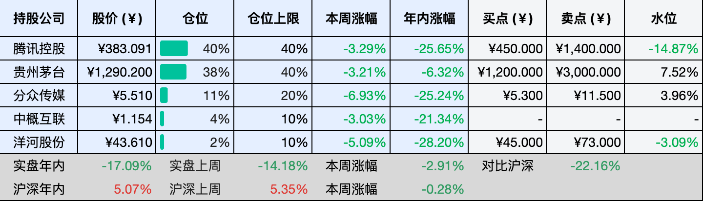
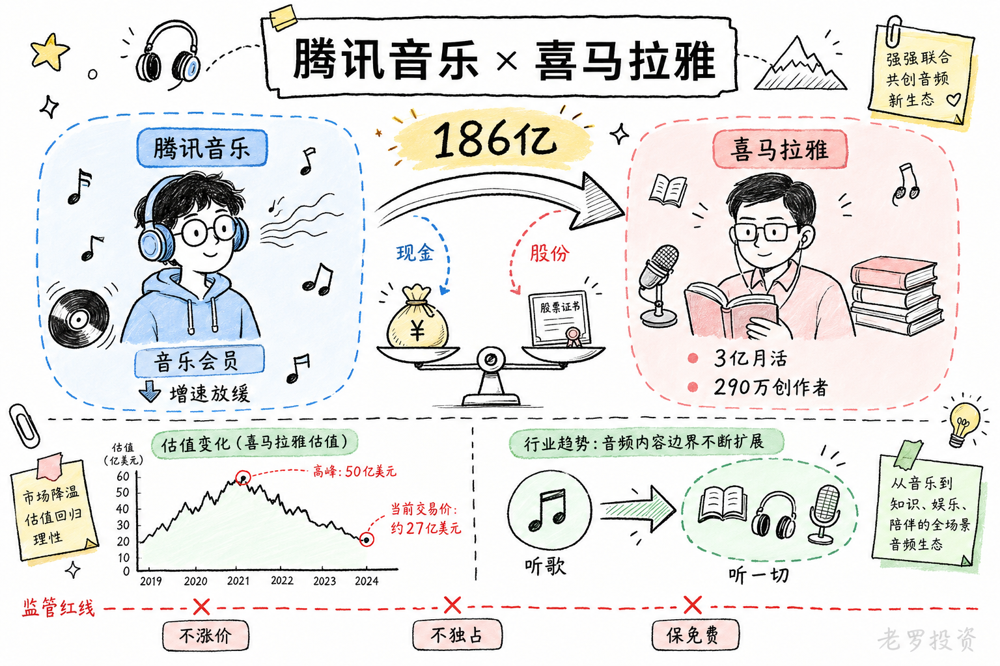
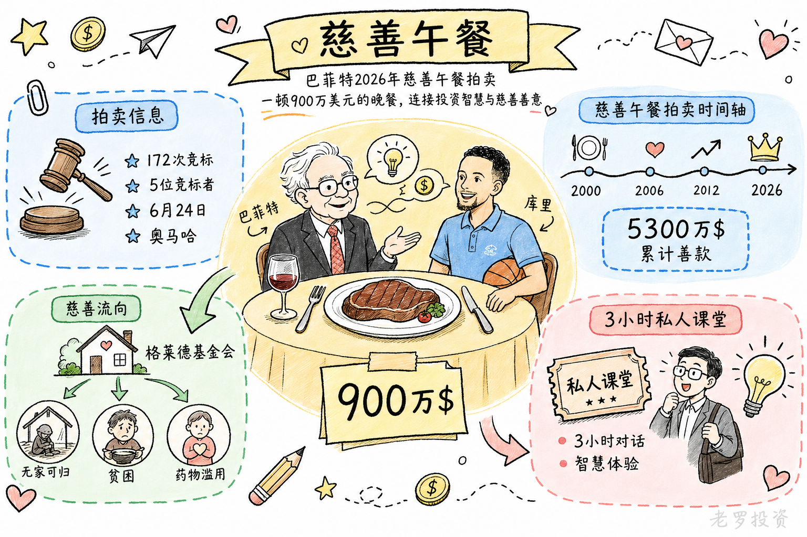

__微信公众号文章地址：[老罗投资周记-20260523](https://mp.weixin.qq.com/s/OSBZ98N0_Wn-LqTd8ERvoA)__

```
老罗投资周记，每周六更新。专注于股权投资、阅读、学习与个人成长，知行合一、日拱一卒、投资人生。微信公众号【老罗投资】，文章均首发于公众号。
```

## 1. 本周交易

周一(05月18日)买入贵州茅台(600519)，买入价格为1323.89元人民币。

周五(05月22日)买入贵州茅台(600519)，买入价格为1293.01元人民币。

## 2. 目前持仓

当前持有的股票包括：腾讯控股 40%、贵州茅台 38%、分众传媒 11%、中概互联 4%、洋河股份 2%。

此外还有部分现金，加上少量的恒瑞医药、海康威视、粉笔等股票，其份额较少，仅作为观察仓不进行记录。

本周投资组合整体涨跌 <span class="green">-2.91%</span>，年内收益率 <span class="green">-17.09%</span>。

1. 表格底部数据为老罗与沪深300指数年内收益率对比。
2. 港股持仓已按实时汇率换算为人民币。



## 3. 上周数据


## 4. 本周事项

+ 腾讯完成收购喜马拉雅
+ 巴菲特900万美元午餐

==只对持股和交易感兴趣的朋友，读到这里就可以退出了。后面是对上述事件的展开，无新内容。==

### 4.1 腾讯完成收购喜马拉雅

5月18日，腾讯音乐发布公告，收购喜马拉雅的事项正式完成交割，喜马拉雅成为腾讯音乐的全资附属公司。从2025年6月签署并购协议算起，这笔交易走过了将近11个月的漫长审批周期。

交易的构成方式是现金加股份，腾讯音乐支付总额最高12.6亿美元现金，外加最多约1.75亿股腾讯音乐A类普通股。按照5月18日前最后一个交易日腾讯音乐每股8.47美元的收盘价计算，股权部分约值14.82亿美元，折合人民币约101亿元，整个交易的总对价大约186亿元人民币。这个价格，比起喜马拉雅当年最高峰时超过40亿美元的估值，缩水了不少。

从腾讯音乐2026年一季报来看，在线音乐会员收入的增速在逐步放缓，单纯靠音乐付费的路已经走到了一个阶段性的天花板。喜马拉雅手里握着的则是另一笔资产，3.03亿全场景月活用户、459个内容品类、290万创作者，在有声书、播客、知识付费这些长音频领域都有深厚的积累。

收购喜马拉雅，等于是把音乐的触角从听歌延伸到了听一切，把用户的时间从听音乐的场景拓宽到听书、听课、听故事的更大范围。从音乐会员到音频会员的转变，是腾讯音乐当下最需要的增长方向。

从喜马拉雅当前的处境来看，被收购或许也是当前最不坏的选择，这家在线音频赛道的头部公司，曾经被视为耳朵经济的代表，估值一度冲到过50亿美元的高位，但上市之路走得异常坎坷。四次递表港交所，一次冲击美股，都没能走通IPO的门，背后的投资机构也需要一个退出的渠道。再加上2023年以来营收增速大幅放缓，音频赛道的天花板越发明显，靠独立上市这条路变得越来越难走。

这次收购获得批准时，监管层面附加了五项限制性条件，其中包括不得提高服务价格、不得降低免费内容比例、不得与版权方达成独家授权等要求。这几条红线，划出了这次并购的边界，腾讯可以通过整合实现生态协同，但不能靠垄断来挤压竞争空间。

交易的双方各有各的盘算，腾讯音乐找到了新的增长空间，喜马拉雅找到了一个稳定的靠山，算是皆大欢喜了。



### 4.2 巴菲特900万美元午餐

巴菲特今年的慈善午餐，本周落了槌，最终成交价为900万零100美元，约合人民币6400多万元。比起前几年动辄上千万美元的价格，这个价格并不算高，但依然是一个普通人难以想象的数字。

这次拍卖有些特殊，以往中标者可以邀请最多七位朋友与巴菲特共进晚餐，今年多了一个人，篮球巨星斯蒂芬·库里，中标者将同时见到投资界的传奇和篮球界的传奇。晚餐定在6月24日，地点还是老地方，内布拉斯加州的奥马哈。此次慈善午餐拍卖共经过了172次竞标，一共有5位竞标者出价，最终中标的买家的信息目前还没有公开。

巴菲特从2000年开始拍卖午餐，二十多年来筹集的善款已经超过5300万美元，全部捐给了旧金山的格莱德基金会，这家基金会主要帮助无家可归者、贫困人群和药物滥用者。一顿饭能卖出天价，靠的当然不是牛排和红酒，而是巴菲特三个小时的谈话，那三小时的价值，可能无法用金钱来衡量。

过去的中标者中，有人是为了当面请教投资智慧，有人是为了和偶像合影，也有人是为了给自己的公司增加曝光，无论出于什么目的，这笔钱最终会流向慈善。



## 5. 本周读书

### 5.1 《慢即是快：一个投资者20年的思考与实践》

价值投资的核心就是在有安全边际的低估区域买入护城河深、商业模式好、成长确定性强的优秀企业，耐心持有，通过陪伴优秀企业成长获取企业增长的回报。

作者有着20年的投资经验，也是从技术分析开始，再转向价值投资，最终选择了基金投资，对普通投资者有一定的参考意义。

评分三星半⭐️⭐️⭐️✨

## 6. 本周运动

本周运动五次，全部是健走，下周继续。

如果觉得本文还不错，那就点个赞或者在看吧，祝大家周末愉快！

```
老罗投资周记，每周六更新。专注于股权投资、阅读、学习与个人成长，知行合一、日拱一卒、投资人生。微信公众号【老罗投资】，文章均首发于公众号。
免责声明：本公众号只作为本人的投资日志记录，本文中提及的个股都有腰斩或血本无归的风险，本人不做任何投资建议，投资请坚持独立思考。
```

__微信公众号文章地址：[老罗投资周记-20260523](https://mp.weixin.qq.com/s/OSBZ98N0_Wn-LqTd8ERvoA)__