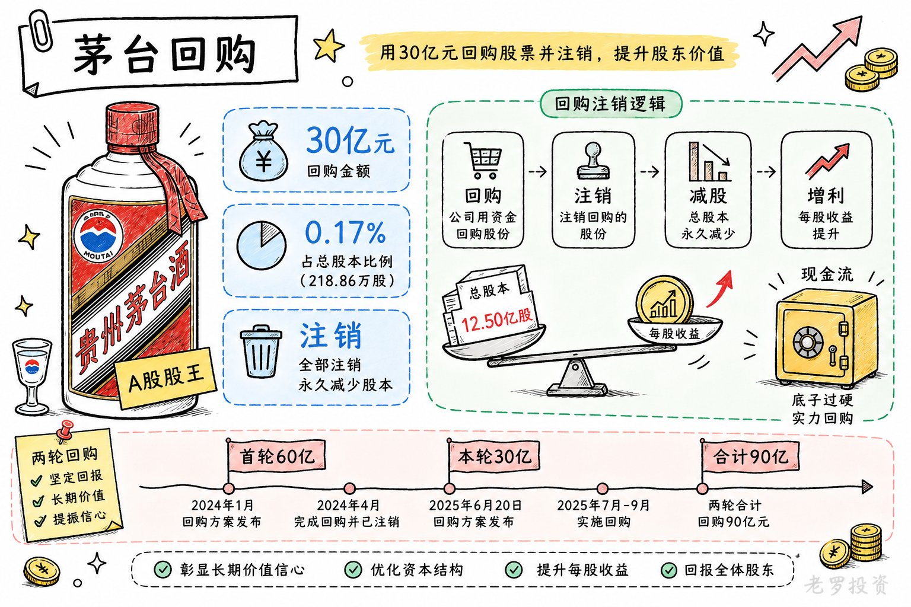
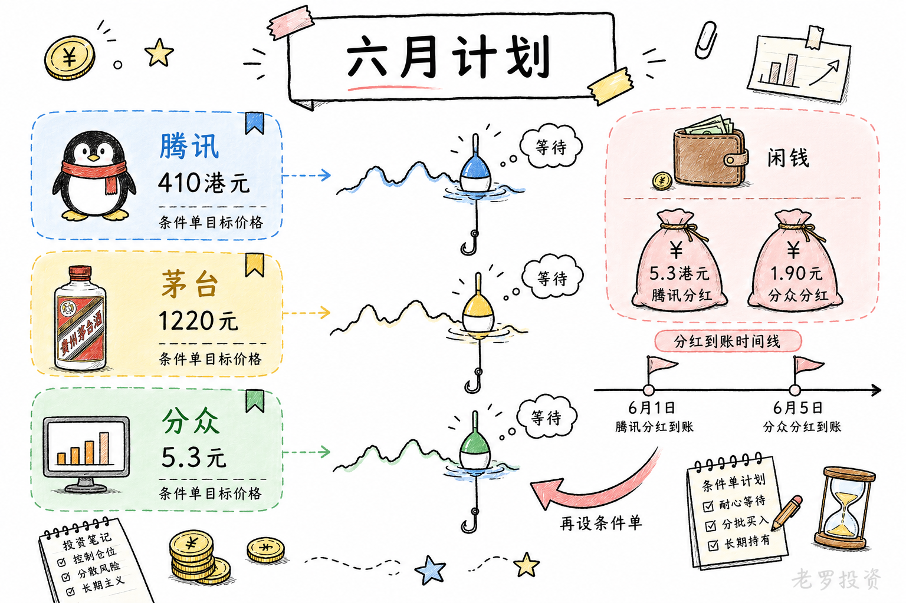

__微信公众号文章地址：[老罗投资周记-20260530](https://mp.weixin.qq.com/s/zL2zH539iDvamFDhvZN_hQ)__

```
老罗投资周记，每周六更新。专注于股权投资、阅读、学习与个人成长，知行合一、日拱一卒、投资人生。微信公众号【老罗投资】，文章均首发于公众号。
```

## 1. 本周交易

周三(05月27日)买入贵州茅台(600519)，买入价格为1266.26元人民币。

## 2. 目前持仓

当前持有的股票包括：贵州茅台 41%、腾讯控股 34%、分众传媒 10%、中概互联 3%、洋河股份 2%。

此外还有部分现金，加上少量的恒瑞医药、海康威视、粉笔等股票，其份额较少，仅作为观察仓不进行记录。

本周投资组合整体涨跌 <span class="red">+10.10%</span>，年内收益率 <span class="green">-6.99%</span>。

本周投资组合的涨幅较大，主要是运气比较好中了一个肉签，猛回了一口老血（坚持的人运气一般不会太差）。

1. 表格底部数据为老罗与沪深300指数年内收益率对比。
2. 港股持仓已按实时汇率换算为人民币。


## 3. 上周数据


## 4. 本周事项

+ 贵州茅台回购
+ 六月份的买入计划

==只对持股和交易感兴趣的朋友，读到这里就可以退出了。后面是对上述事件的展开，无新内容。==

### 4.1 贵州茅台回购

5月27日晚间，贵州茅台发布公告，回购股份实施完成，实际回购218.86万股，占公司总股本的0.17%，使用资金总额约30亿元，刚好用满了此前披露的回购方案上限。

5月28日，这批股份全部申请注销，公司总股本变更为12.50亿股，从去年12月31日首次出手算起，将近五个月的节奏稳稳当当，没有拖拉，也算干脆。

跟很多公司把回购来的股份拿去做股权激励或员工持股不同，茅台明确选择了注销，注销意味着总股本减少，每股收益和每股净资产都会随之提高。在业绩承压的年份做这样的操作，对长期持有的股东来说，是实实在在的好处。

这次回购之所以受到关注，还有一个背景，2025年是茅台自2001年上市以来头一回出现营收和净利润双双下滑，与此同时，白酒行业的调整还在继续，茅台自己也没能躲过股价的波动。在这样的节点上掏出30亿真金白银，更像是一种态度，即便短期业绩不好看，公司的底子和现金流依然过硬，股东利益还是排在前面。

最近几年，茅台在市值管理上的动作越来越多，除分红之外，回购注销成了另一个常规选项。2024年9月，茅台就曾披露过一轮30亿至60亿元的回购方案，于2025年8月完成，实际回购392.76万股，使用资金60亿元，同样全部注销减资。如今这30亿是上市以来的第二轮注销式回购，两轮加起来近90亿的资金被用来买回自己的股票然后注销，在A股消费类公司里并不多见。

不过，回购注销是长期行为，不是短期冲刺，能持续、系统地做下去，比单次规模有多大更重要。茅台两轮注销式回购已经给出了一个方向，后面怎么走，还得看它能不能把这套工具箱常态化地用好。



### 4.2 六月份的买入计划

六月份，账户上会多出一笔现金，一部分是手头本来就没用完的闲钱，另一部分是两家公司派发的股息。

先说说已经设好的条件单，腾讯股价如果能回到410港元，就会自动买入一笔，茅台的条件单设在1220元人民币，分众传媒设在5.3元。这三个价格都不是拍脑袋定的，基本落在自己觉得有吸引力的区间。设条件单的好处是省心，不用时刻盯盘，到了就成交，不到就继续等着。

再说分红，腾讯2025年度的末期股息是每股5.3港元，股权登记日5月20日，6月1日正式派发，通过港股通持有的账户，钱大概在6月2日或3日到账。分众传媒的分红方案是每10股派1.90元，股权登记日6月4日，6月5日当天钱就能到。两笔分红加起来不算多，但也是一份额外的现金流。

这些分红到账后，同样会设置成条件单，继续挂在想买的价格上，至于具体买哪只，看哪个先触发，腾讯、茅台、分众，三者之中谁先跌到预设的价位，钱就放到哪家公司。

市场最近涨涨跌跌，很多人忙着做波段、猜方向，有的人站在光里，有的人坚守“老登”，自己反倒觉得，六月份和以往一样，并没什么特别值得激动的事。该定的计划早就定了，该设的条件单也设了，剩下的就是等待，等价格，等股息到账，等条件单成交。如果一直等不到，那就继续拿着现金，反正现金也不咬人。



## 5. 本周读书

### 5.1 《费曼思考法：像学习高手一样思考》

当你能从探索的过程中感受到纯粹的乐趣时，你就已经掌握了费曼思考法最核心的精髓。

评分四星⭐️⭐️⭐️⭐️

### 5.2 《小亮老师的博物课：不可思议的花草树木》

如果首次得到的是错误答案，以后就要花很大精力更正它。如果第一次得到的是正确的知识，并由此引发兴趣，能够探究、学习下去，将受益终生。

评分四星⭐️⭐️⭐️⭐️

## 6. 本周运动

本周运动五次，五次全部是健走，下周继续。

如果觉得本文还不错，那就点个赞或者在看吧，祝大家周末愉快！

```
老罗投资周记，每周六更新。专注于股权投资、阅读、学习与个人成长，知行合一、日拱一卒、投资人生。微信公众号【老罗投资】，文章均首发于公众号。
免责声明：本公众号只作为本人的投资日志记录，本文中提及的个股都有腰斩或血本无归的风险，本人不做任何投资建议，投资请坚持独立思考。
```

__微信公众号文章地址：[老罗投资周记-20260530](https://mp.weixin.qq.com/s/zL2zH539iDvamFDhvZN_hQ)__