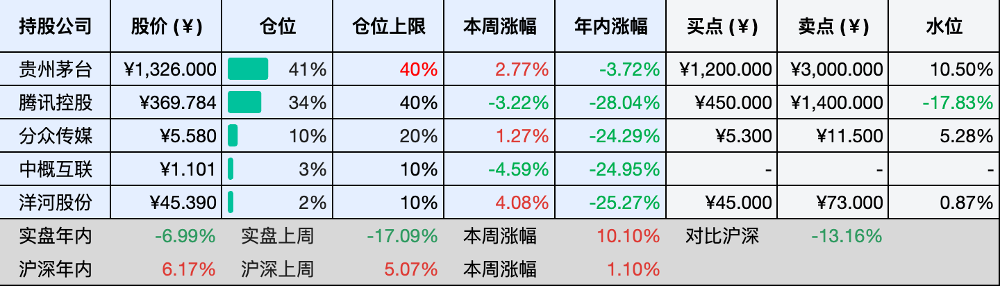
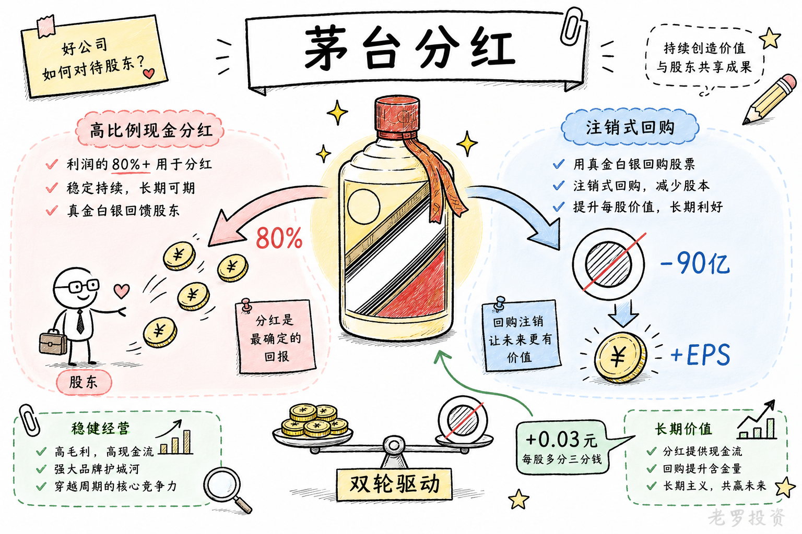

__微信公众号文章地址：[老罗投资周记-20260606](https://mp.weixin.qq.com/s/GS-vrIIRursL2U1rhzKbMw)__

```
老罗投资周记，每周六更新。专注于股权投资、阅读、学习与个人成长，知行合一、日拱一卒、投资人生。微信公众号【老罗投资】，文章均首发于公众号。
```

## 1. 本周交易

无

## 2. 目前持仓

当前持有的股票包括：贵州茅台 39%、腾讯控股 36%、分众传媒 9%、中概互联 3%、洋河股份 2%。

此外还有部分现金，加上少量的恒瑞医药、海康威视、粉笔等股票，其份额较少，仅作为观察仓不进行记录。

本周投资组合整体涨跌 <span class="red">+0.33%</span>，年内收益率 <span class="green">-6.66%</span>。

1. 表格底部数据为老罗与沪深300指数年内收益率对比。
2. 港股持仓已按实时汇率换算为人民币。


## 3. 上周数据



## 4. 本周事项

+ 微信将推出一款AI智能体
+ 茅台提升分红金额

==只对持股和交易感兴趣的朋友，读到这里就可以退出了。后面是对上述事件的展开，无新内容。==

### 4.1 微信将推出一款AI智能体

6月2日，有消息称腾讯正在内测一款内嵌于微信的AI智能体，用户可以通过微信主界面向右滑动，呼出对话框，让智能体自动调用数百万小程序完成找咖啡、订电影票甚至组合式出行规划等操作。消息一出，腾讯股价当天大涨超过10%，创下了近三年来的最大单日涨幅。

但如果以为这只是把元宝塞进微信，那可能就理解错了，腾讯对这件事的定位完全不同。刘炽平在上月的财报电话会上就有表态，AI智能体已显现出突破性应用价值，微信平台天然具备承载它的多重优势。马化腾在5月的股东大会上给出了更具体化的描述，微信生态本身就拥有大量的小程序，这是一个很好的入口，它们的定位不是深入替代每一个行业，而是提供平台、工具和连接能力，让现有开发者在已有的小程序生态基础上，结合智能体能力，自发打造适配各自行业的智能化应用。

这套逻辑可以追溯到今年3月马化腾公开谈论的去中心化理念，当时他提到，龙虾类应用在办公等场景下打造了新的去中心化入口，也为正在规划中的微信AI开发带来了启发。小程序本身就是去中心化的，未来也可以被智能化和龙虾化，供智能体调用，在设计生态时要兼顾中心化与去中心化，避免服务商被管道化。这意味着微信AI智能体不会造一个中心化入口去钳制渠道，而是依托现有数千万小程序商家，让它们在腾讯自己的土壤上提供服务。

从产品形态看，这次推出的AI智能体与腾讯现有的元宝有着本质上的不同。元宝仅限于搜索问答，而新智能体可以直接执行跨应用操作，深度接入以小程序为核心的服务生态。腾讯已经将推出AI智能体列为最高战略优先级，但高管层对各项细节要求严格，可能导致测试周期延长、上线前经历多轮修改。

算力挑战和合规审查是摆在面前的两大现实问题，尽管AI智能体原型已经能够流畅地完成任务，但为支撑全量用户使用所需要的算力仍然存在着缺口，而微信14亿的用户体量，也可能意味着微信智能体的合规流程，会比其他的产品更加严苛。


### 4.2 茅台提升分红金额

茅台本周发了份公告，把2025年的利润分配方案调了一下，每股分红从27.993元变成了28.02423元，涨了大概三分钱。幅度很小，原因也并不复杂：5月28日公司刚完成了一笔近30亿元的回购注销，总股本少了，每股分到的钱自然就多了那么一丢丢。这不是公司突然大方了，纯粹是股本变小后的被动调整。

不过，比起这三分钱，茅台在分红这件事上的态度更值得看看。2025年年报出来的时候，公司已经拿出了650亿的现金分红，占了当年净利润的近八成，再加上这次调整后的末期分红，全年的总额还会更高。在白酒行业整体不太景气、茅台自己业绩也下滑的年份里，这个分红力度不算小。

把回购和分红放一块看，茅台的股东回报思路其实挺清楚，一边是高比例分红，赚到的钱实打实分给股东；另一边是适时搞注销式回购，通过减少股本直接拉高每股收益。两轮回购加起来快90亿了，全部进行了注销。

茅台分红的历史一向不错，这次每股涨的三分钱虽然微不足道，但至少说明公司在股本管理上还挺细致。对长期拿着的人来说，多几分少几分影响不大，重要的是这种愿意分钱的习惯能不能一直保持下去。看一家公司好不好，不光看它赚了多少，还得看它怎么对待股东利益。



## 5. 本周读书

### 5.1 《防风氏传奇》

防风氏并不是那种高高在上的神，他更像一个被责任和牵挂拖住的普通人，有自己的私心，也有对部落、对族人的不舍。

但最后，他还是放下了安稳，走上了那场治水的漫漫长路。他的勇敢，不在口号里，而在洪水中的每一次托举、勘察河道时的每一步跋涉里。明知前路凶险，还是愿意为苍生走一遭。

这书很好看，应该还会有续作。

评分四星⭐️⭐️⭐️⭐️

### 5.2 《别让运动要了命：中年人最容易犯的10个健身错误》

这本书，非常推荐。它几乎是运动前的必读手册。

不仅适合刚准备开始锻炼的新手，对那些已经坚持运动十几年、自认为经验丰富的老手来说，同样值得翻一翻。

全书从头到尾都在讲运动风险，读下来可能会觉得哪里都有隐患，但别忘了，最大的风险，其实是不运动。

评分四星⭐️⭐️⭐️⭐️

## 6. 本周运动

本周运动四次，四次全部是公园健走，下周继续。

如果觉得本文还不错，那就点个赞或者在看吧，祝大家周末愉快！

```
老罗投资周记，每周六更新。专注于股权投资、阅读、学习与个人成长，知行合一、日拱一卒、投资人生。微信公众号【老罗投资】，文章均首发于公众号。
免责声明：本公众号只作为本人的投资日志记录，本文中提及的个股都有腰斩或血本无归的风险，本人不做任何投资建议，投资请坚持独立思考。
```

__微信公众号文章地址：[老罗投资周记-20260606](https://mp.weixin.qq.com/s/GS-vrIIRursL2U1rhzKbMw)__