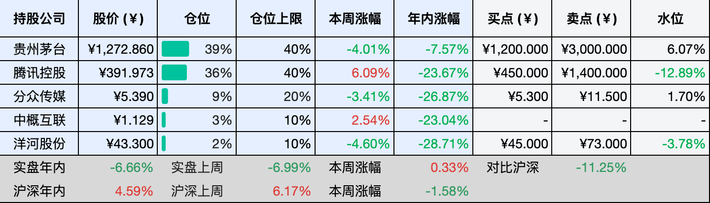
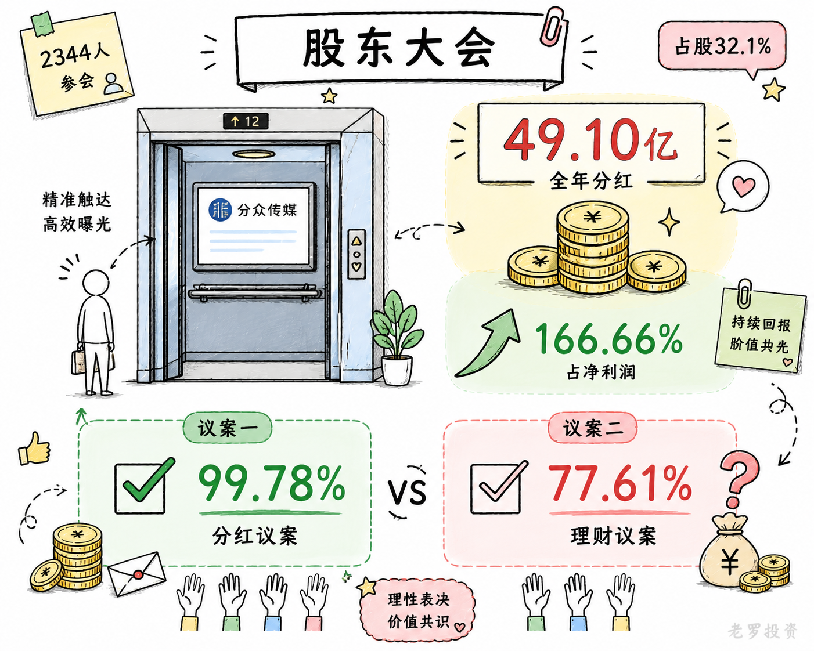
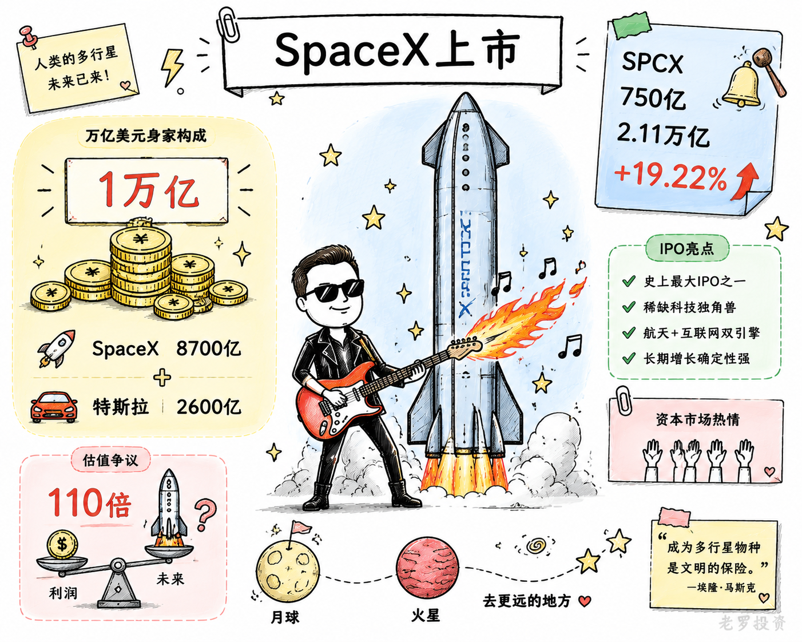

__微信公众号文章地址：[老罗投资周记-20260613](https://mp.weixin.qq.com/s/GS-vrIIRursL2U1rhzKbMw)__

```
老罗投资周记，每周六更新。专注于股权投资、阅读、学习与个人成长，知行合一、日拱一卒、投资人生。微信公众号【老罗投资】，文章均首发于公众号。
```

## 1. 本周交易

周一(6月8日)买入分众传媒(002027)，买入价格为5.320元人民币。

## 2. 目前持仓

当前持有的股票包括：贵州茅台 39%、腾讯控股 37%、分众传媒 10%、中概互联 3%、洋河股份 2%。

此外还有部分现金，加上少量的恒瑞医药、海康威视、粉笔等股票，其份额较少，仅作为观察仓不进行记录。

本周投资组合整体涨跌 <span class="red">+1.27%</span>，年内收益率 <span class="green">-5.39%</span>。

1. 表格底部数据为老罗与沪深300指数年内收益率对比。
2. 港股持仓已按实时汇率换算为人民币。


## 3. 上周数据



## 4. 本周事项

+ 贵州茅台股东大会
+ 分众传媒股东大会
+ 马斯克成为全球首个身价超万亿美元人类

==只对持股和交易感兴趣的朋友，读到这里就可以退出了。后面是对上述事件的展开，无新内容。==

### 4.1 贵州茅台股东大会

茅台一年一度的股东大会，本周在茅台镇如期举行。会议定在6月11日下午两点半，地点仍是熟悉的茅台会议中心。现场来了1000多人，整体气氛平稳，各项议案也都顺利通过，没有出现意外情况。

每年的股东大会，大家关注的重点都很集中：价格怎么走、渠道怎么调、分红力度如何。今年也依旧如此。

过去这几年，茅台在非标产品调价、自营渠道改革，以及连续两轮注销式回购等方面持续有动作。在白酒行业整体承压的大环境下，公司业绩虽然有波动，但在现金安排上一直比较清晰：该分红的分红，该回购的回购，账面资金并没有躺平。这一点，股东还是比较认可的。

当然，担忧也始终存在，白酒行业仍处在调整周期，即便是茅台这样的头部企业，也很难完全置身事外。管理层在回应中提到，公司会坚持长期主义，不会为了短期业绩去牺牲渠道健康和品牌价值。


### 4.2 分众传媒股东大会

分众传媒这次股东大会的现场参会股东共有58位，加上通过网络投票的股东，合计共有2344人参与本次会议，代表股份46.36亿股，占公司总股本的32.1%。

从表决结果来看，本次提交的所有议案均高票通过，没有出现一票否决，也未有临时提案提出修改，整体过程较为顺畅。

其中最受关注的利润分配方案显示，公司以总股本144.42亿股为基数，向全体股东每10股派发现金红利1.90元，合计拟派发现金红利约27.44亿元。再加上已在年中完成的半年度及第三季度分红，2025年全年现金分红总额达到49.10亿元。

这一分红规模占2025年归母净利润的166.66%。换句话说，公司不仅将当年利润基本全部用于分红，还动用了部分以往年度的未分配利润。在去年净利润同比下滑超过四成的背景下，仍然维持如此力度的分红，也从侧面反映出管理层对现金流稳定性的信心。

从投票结果看，利润分配预案的同意率高达99.78%，中小股东同意率也达到99.15%，是本次所有议案中支持度最高的一项。

相比之下，《关于使用自有闲置资金购买理财产品额度的议案》争议相对更大，同意率为77.61%。部分投资者对将闲置资金用于理财的收益预期和必要性仍持更谨慎的态度。



### 4.3 马斯克成为全球首个身价超万亿美元人类

6月12日，SpaceX在纳斯达克正式挂牌，股票代码SPCX，发行价135美元，募资规模达到750亿美元，一举刷新全球IPO纪录。上市首日股价上涨19.22%，按收盘价计算，公司市值约2.11万亿美元。

SpaceX这次把敲钟仪式放在了得克萨斯州的星际基地Starbase，一台星舰原型机静静矗立在远处，而画面前方站着的，除了54岁的马斯克，还有他那把标志性的喷火吉他。马斯克一贯的风格还是没变，科技发布会，总能被他做成一场带点摇滚气质的show。

敲钟仪式上，有人问马斯克积累这么多财富的意义是什么。他的回答很简单：“无论你们是谁，SpaceX希望能够带你们去月球，带你们去火星，去更远的地方。”

随着SpaceX上市，马斯克也成为了人类历史上首位身家突破1万亿美元的个人财富持有者。他持有约41%–42%的SpaceX股份，仅这一部分按首日市值计算，纸面财富就接近8700亿美元，再加上其在特斯拉超过2600亿美元的持股，总规模正式跨过万亿美元门槛。他也因此成为同时掌控两家万亿美元级公司的企业家。

一家2025年营收约187亿美元、净亏损49亿美元的航天公司，为什么能撑起两万亿美元市值？如果只看财务数据，这个市值/营收=110倍的比例，确实很难用传统估值框架解释。

但也正是在这里，这次定价显得不太一样，它本身就不是一份按财务报表推导出来的结果。某种程度上，SpaceX的估值，回答的可能不是现在赚多少钱，而是另一个更长期的问题，资本市场到底是在给利润定价，还是在给人类未来的路径定价。



## 5. 本周读书

### 5.1 《我的珠宝人生》

珠宝消费就是“多看少买”，其实股票投资也是如此。

评分四星⭐️⭐️⭐️⭐️

## 6. 本周运动

本周运动六天，三次公园健走，四次抗阻训练，下周继续。

如果觉得本文还不错，那就点个赞或者在看吧，祝大家周末愉快！

```
老罗投资周记，每周六更新。专注于股权投资、阅读、学习与个人成长，知行合一、日拱一卒、投资人生。微信公众号【老罗投资】，文章均首发于公众号。
免责声明：本公众号只作为本人的投资日志记录，本文中提及的个股都有腰斩或血本无归的风险，本人不做任何投资建议，投资请坚持独立思考。
```

__微信公众号文章地址：[老罗投资周记-20260613](https://mp.weixin.qq.com/s/GS-vrIIRursL2U1rhzKbMw)__