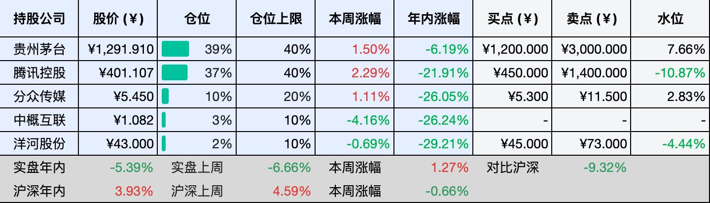
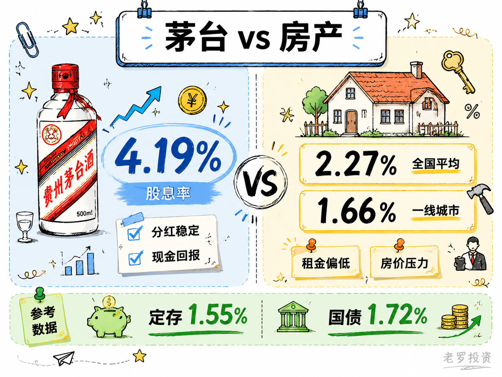
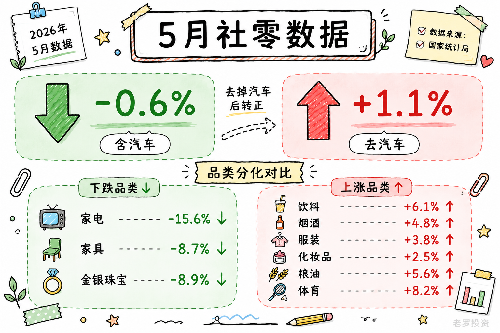

__微信公众号文章地址：[老罗投资周记-20260620](https://mp.weixin.qq.com/s/tvN4_H-i7n_BL4sQSYAMJA)__

```
老罗投资周记，每周六更新。专注于股权投资、阅读、学习与个人成长，知行合一、日拱一卒、投资人生。微信公众号【老罗投资】，文章均首发于公众号。
```

## 1. 本周交易

周二(6月16日)买入贵州茅台(600519)，买入价格为1258.500元人民币。

周二(6月16日)买入腾讯控股(00700)，买入价格为398.003元人民币。

周三(6月17日)买入分众传媒(002027)，买入价格为5.120和5.110元人民币。

周四(6月18日)买入分众传媒(002027)，买入价格为5.030和4.990元人民币。

## 2. 目前持仓

当前持有的股票包括：贵州茅台 44%、腾讯控股 38%、分众传媒 10%、中概互联 3%、洋河股份 2%。

此外还有部分现金，加上少量的恒瑞医药、海康威视、粉笔等股票，其份额较少，仅作为观察仓不进行记录。

本周投资组合整体涨跌 <span class="green">-5.23%</span>，年内收益率 <span class="green">-10.62%</span>。

1. 表格底部数据为老罗与沪深300指数年内收益率对比。
2. 港股持仓已按实时汇率换算为人民币。


## 3. 上周数据



## 4. 本周事项

+ 买茅台比买房好吗？
+ 2026年5月社零同比下降0.6%

==只对持股和交易感兴趣的朋友，读到这里就可以退出了。后面是对上述事件的展开，无新内容。==

### 4.1 买茅台比买房好吗？

最近老罗做了个对比，把茅台的股息率和房子的租售比放在一起看，差距比想象中大不少。

先看茅台这边，贵州茅台2025年年度利润分配方案已经定了，每股派发现金红利28.02423元（含税）。加上2025年中期分红的23.957元（含税），合计每股年度股息约51.98元。以2026年6月17日的收盘价1240元计算，股息率约为4.19%。

再看房子那边，据中指研究院数据，2026年4月全国50个重点城市的平均租金房价比为2.27%。分城市看，一线城市普通住宅平均租金房价比只有1.66%，北上广深均在1.8%以下；二线城市约2.36%，三四线城市约2.17%。即便表现较好的成都、武汉等城市，租售比也刚过2.3%，北京一套600万元的房产，月租大约7000元，租售比仅为1:857。一套房子如果租售比能达到5%，就已经能算非常优质的资产了。

两组数据放在一起，差异很明显，茅台4.19%的股息率，几乎是全国重点城市平均租售比2.27%的两倍，更是一线城市1.66%的两倍半。买一手茅台约需12.4万元，按年度股息计算，一年能拿到约5200元分红，而一套总价130万的房子，按全国平均租售比算，年租金不到3万。同样的本金投入，茅台在现金回报这个维度上高出将近一倍，130万买10手茅台，一年分红就有5.2万元。

如果把参照系再放宽一些，差距更直观，目前国内五年期定期存款平均利率已降至1.55%左右，十年期国债收益率约1.72%。茅台4.19%的股息率，已经明显高于这些无风险收益率，也大幅跑赢了房产租售比。

背后的逻辑其实很简单，房子的租金回报率被房价压得太低，过去十几年房价大幅上涨，租金涨幅远远跟不上，租售比长期处于低位，虽然这两年房价回调让租售比被动回升了一些，但距离合理的投资回报水平还有不小的距离。而茅台的分红率在过去几年持续提升，2024至2026年现金分红不低于当年净利润的75%，分红比例稳定在高位。

不过，两者的风险属性完全不同，房子的租金相对稳定，但空置、维修、中介费这些麻烦少不了，而且房价本身还在调整周期里。茅台的分红取决于公司利润，白酒行业仍在调整期，去年利润已经下滑，未来分红能不能维持这个水平存在不确定性。但从目前的静态数据看，茅台在现金回报这个维度上确实更有优势，如果企业业绩能够修复，还大概率能赚到股价上涨的钱。

说到底，买茅台和买房是两种不同性质的投资。一个是股权，回报看企业赚不赚钱，一个是物权，回报看租金和以后卖出的差价，只不过当下看，茅台的分红回报已经明显高出一截，至于是选4.19%的分红还是选2.27%的租金，就看你更愿意相信茅台还是相信房子了。



### 4.2 2026年5月社零同比下降0.6%

5月份的社零数据出来了，-0.6%，当时刷到这条新闻，我的第一反应也是：“这么差”？但仔细拆开看了一下，感觉与直观感受又不太一样。

拖后腿的只有汽车行业，去掉汽车类之后，社零增速变成了正的1.1%，汽车一个品类把整个大盘拖成了负数。汽车类零售额同比增速1.1%，比整体低了1.7个百分点，而且这不是这个月才有的情况，4月就已经很弱了，5月只是没有继续恶化。

卖不动的原因很简单，前两年的国补力度太大了，购置税减免、以旧换新补贴、地方消费券，这些措施已经把购车的需求都集中释放掉了，现在政策在退坡，自然就没人接盘。同时，燃油车份额还在往下掉，今年1-5月燃油车销量同比下滑超过15%。电动车的价格战从2024年打到2026年，还没打完，消费者心态变成了早买早享受，晚买享折扣，再等等。所以整体看下来，消费没崩，只是钱没往车上花。

如果所有品类都在跌，那是系统性问题，如果只有一个大品类在跌，其他品类正常甚至上涨，那是结构性问题。

仔细看了一下各品类增速，分化的痕迹很清楚。涨的分项：饮料6.1%，烟酒4.8%，服装鞋帽3.8%，化妆品2.5%，粮油食品5.6%，体育娱乐用品8.2%。跌的分项：家电-15.6%，家具-8.7%，金银珠宝-8.9%。

建材这个品类5月数据是正的5.8%，但主要靠基建和工程端撑着，居民端的装修需求其实很弱。跟房子有关的，除了建材在硬撑，基本都趴着。跟让自己舒服点有关的，全在涨。

家电跌了15.6%，一方面是去年以旧换新政策把今年的需求提前消耗掉了，另一方面是房子卖不动，装修需求自然也少。家电和家具都是典型的后周期品类，先有房，才有家电，房子不卖，这些就起不来。

而饮料、烟酒、服装、化妆品、体育用品，都是即时满足和日常享受，花小钱让自己高兴的东西。大家不买电视了，但奶茶照喝、烟酒照买、出门还得穿得体面点，与其说消费降级，不如说消费在转移。做地产链生意的还得熬，做饮料、美妆、户外、体育用品的，至少数据上看还不错。

常有人说年轻人没钱了，消费起不来，前半句对，后半句我存疑。年轻人收入确实偏弱，高校毕业生规模还在创新高，就业市场的供需没有根本性改善，AI对白领岗位的替代效应还在发酵。这个群体的消费力被压制，是真的。

但消费的主力盘可能根本不在年轻人手里，谁手里有钱？50到65岁这批刚退休或者正在退休边缘的人。有房，大概率没有房贷了，有车，该换的也换过了，有积蓄，退休金不低于在职时的七八成，身体还行，心态比实际年龄年轻十岁，子女大部分已经独立，不需要他们贴补了。

这批人的消费画像和年轻人完全不同，他们不太买潮玩，但会买高品质的食品和酒水，不太追新品牌，但认老牌子，不太冲动消费，但该花的一分不少。如果市场还在用年轻人的消费力来推断整体趋势，可能会不太准确。



## 5. 本周读书

### 5.1 《从荆漂到蜀汉顶流：诸葛亮的逆袭人生》

诸葛亮是中国历史上一个标签式的人物，聪明、公正、忠义、简朴、廉洁，几乎所有的传统美德，都可以作为标签贴在他身上。

评分四星半⭐️⭐️⭐️⭐️✨

### 5.2 《久坐族的身体重启方案》

对于久坐族来说，运动的核心就在于一个稳字。白天尽量找机会打断久坐的状态，晚上或周末再安排系统的训练。

别总抱着平时不动、周末猛练的补偿心理，要把运动看成一项长期的投资。

你练的不仅仅是那几百大卡的燃脂量，更是为了给自己未来几十年的身体打下一个结实的底盘。

评分四星⭐️⭐️⭐️⭐️

### 5.3 《屁是肛门的叹息：肛肠科医生科普故事集》

身体属于你自己，而非他人或社会的附属。疼痛、不适、疾病，都是身体在发声，一味忽视或羞于面对，小问题可能拖成大隐患。

及时就医、认真调理，本身就是对自我价值的承认。当你敢于觉察并表达身体感受，便能更清晰地认识自己的需求，建立起与他人的平等关系。

身体像一个长期的伙伴，你尊重它、照顾它，它便以稳定的状态回报你，你漠视它，它以疲惫和疾病回应。尊重身体，是对自己最诚实的负责。

评分四星⭐️⭐️⭐️⭐️

## 6. 本周运动

本周运动六天，四次健走，两次抗阻训练，下周继续。

如果觉得本文还不错，那就点个赞或者在看吧，祝大家周末愉快！

```
老罗投资周记，每周六更新。专注于股权投资、阅读、学习与个人成长，知行合一、日拱一卒、投资人生。微信公众号【老罗投资】，文章均首发于公众号。
免责声明：本公众号只作为本人的投资日志记录，本文中提及的个股都有腰斩或血本无归的风险，本人不做任何投资建议，投资请坚持独立思考。
```

__微信公众号文章地址：[老罗投资周记-20260620](https://mp.weixin.qq.com/s/tvN4_H-i7n_BL4sQSYAMJA)__